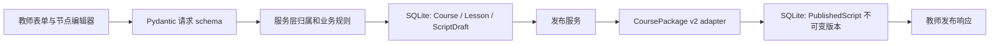
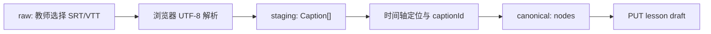
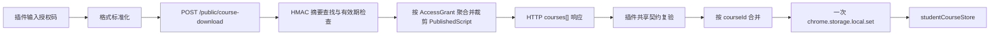
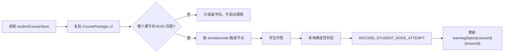
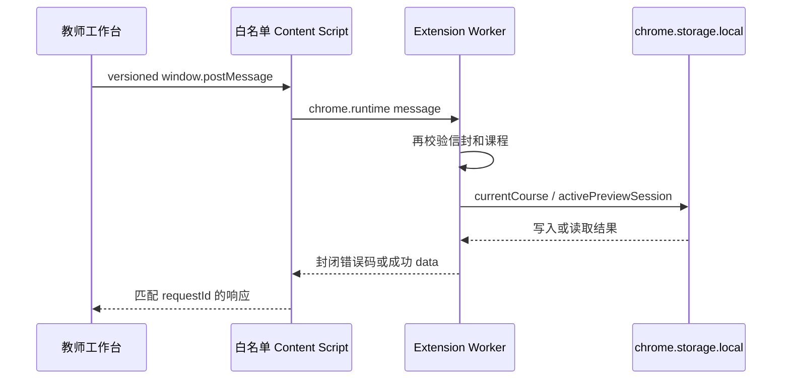
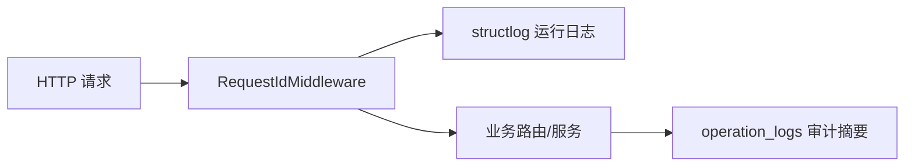
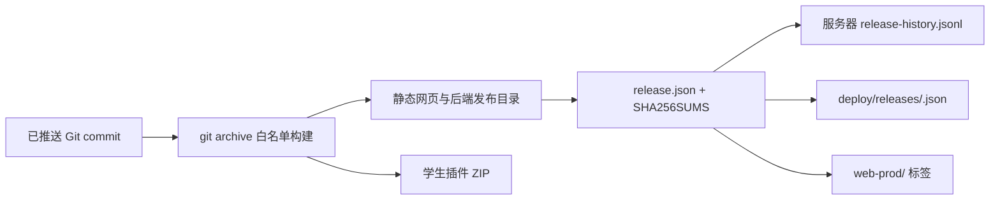
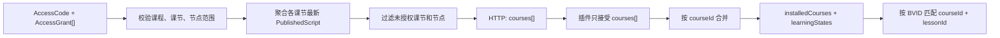
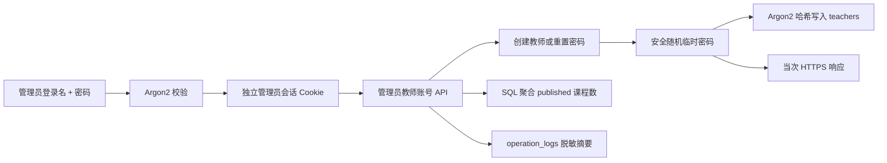

# KnownMap 数据流

更新时间：2026-08-20

状态：当前 v2-only 多课程、多课节和多范围授权数据流。

上级入口：[`../data-spec.md`](../data-spec.md)

## 1. 教师创建、保存与发布

| 步骤 | 输入 | 处理 | 输出 | 校验位置 | 失败处理 |
| --- | --- | --- | --- | --- | --- |
| 登录 | 登录名、密码 | 账号查询、慢哈希验证 | HttpOnly 会话 Cookie | Pydantic + AuthService | 统一 `AUTH_INVALID_CREDENTIALS` |
| 创建课程 | 标题、描述 | 自动创建工作空间，生成 UUID | `Course` | Pydantic + 资源归属 | 请求失败不提交 |
| 创建课节 | 标题、BVID | 计算下一 `sort_order` | `Lesson` | Pydantic + 归属 + DB 外键 | 请求失败不提交 |
| 保存草稿 | `schema_version`、nodes | 严格节点校验，整份替换 | `ScriptDraft` | Pydantic 节点 union | 校验失败不写库 |
| 发布课程 | `course_id` | 聚合全部课节草稿、构造 v2 课程包 | 每课节新 `PublishedScript` | 归属、非空草稿、adapter | 事务失败不产生新版本 |
| 创建授权码 | 授权范围、码类型 | 生成高熵码和摘要 | `AccessCode` + `AccessGrant[]` + 一次性原文 | 范围归属、已发布检查、唯一摘要 | 最多 5 次碰撞重试 |

草稿保存不覆盖发布版本。发布版本的 `config_json` 是当时的插件输出快照。

## 2. 字幕输入

- 原始字幕文件不上传；
- `Caption[]` 只在页面内存中保存；
- 解析器丢弃无时间戳、非法时间、空正文和结束时间不晚于开始时间的 block；
- HTML 标签从字幕正文中移除；
- 动态字幕使用 `textContent` 渲染；
- 草稿只保存节点上的 `captionId`，不保存字幕正文；
- 页面刷新后字幕不会从后端恢复，需要重新导入。

## 3. 授权码下载与插件安装

当前端点和环境：

| 消费方 | 当前 URL |
| --- | --- |
| 教师网页，本地 | `http://localhost:8000/api/v1` 或 `127.0.0.1` 同主机 |
| 教师网页，生产 | `https://knownmap.com/api/v1` |
| 学生插件课程下载 | **固定** `http://127.0.0.1:8000/api/v1/public/course-download` |
| 学生插件 ZIP 下载 | 代码目标为 `https://knownmap.com/downloads/student-plugin/knownmapplugin.zip`，生产待验证 |

生产 FastAPI 的公开下载端点已经人工探针验证，但当前插件代码尚未切换到生产 API。

下载失败、HTTP 错误、超大响应、畸形 JSON、未知包装字段、课程契约失败或存储失败，都不得
覆盖当前 `studentCourseStore`。

## 4. B 站运行与学习状态

- `notice` 和 `free_text` 当前都按完成处理；
- `choice` 和 `blank` 使用本地确定性答案；
- `lastAnswer` 最长 2000 字符；
- 完成节点在刷新后不会再次触发；
- B 站 SPA 离开匹配视频时销毁课程 UI 和监听器；
- 学习状态不上传后端，不创建学生身份或领取记录。

## 5. 教师预览消息桥

五个开放操作是 `PING`、`GET_CURRENT_COURSE`、`SAVE_CURRENT_COURSE`、
`CLEAR_CURRENT_COURSE`、`START_PREVIEW_SESSION`。该桥是历史教师预览边界，不是学生授权码
下载通道。

## 6. 运行日志与操作日志

- 请求入口生成或复用 `X-Request-Id`；
- 生产运行日志输出 JSON 到标准输出；
- `operation_logs` 保存业务动作摘要；
- 运行日志和操作日志都不得包含密码、Cookie、token、授权码原文、字幕正文、节点正文或学生答案；
- 插件 service worker 只记录操作名、课程 ID、节点数、结果和错误码。

## 7. 生产发布记录流

当前已验证的生产 release 是 `20260820T142243Z-ec1454ed2f31`。该 release 的仓库记录不包含
学生插件 ZIP；ZIP 打包和固定地址代码位于当前工作区，仍需新的精确 commit 发布后验证。

## 8. 数据血缘

| 最终数据 | 上游来源 | 转换规则 | 追踪字段 | 输出位置 |
| --- | --- | --- | --- | --- |
| `Admin` / `AdminSession` | 显式 bootstrap、管理员登录 | Argon2 哈希、HMAC token 摘要 | `admin_id/session_id/request_id` | SQLite |
| 教师账号与临时密码响应 | 管理员创建/重置 | 登录名 trim、随机密码、Argon2 哈希 | `teacher_id/request_id` | SQLite + 当次 HTTPS 响应 |
| `Course` | 教师课程表单 | trim、长度校验 | `Course.id`、时间 | SQLite |
| `Lesson` | 课节表单、B 站 URL | BVID 提取/校验 | `Lesson.id/course_id` | SQLite |
| `ScriptDraft.config_json` | 可视化节点编辑器 | 排序、严格节点 schema | `lesson_id/updated_at` | SQLite |
| `PublishedScript.config_json` | Course + 全部课节草稿 | adapter 转 `CoursePackage` v2 | `lesson_id/version/published_at` | SQLite |
| 插件 `installedCourses` | 公开下载响应 + 内置示例 | 共享契约复验 | `courseId/lessonId/installedAt` | Chrome local storage |
| 插件 `learningStates` | 学生节点作答 | 状态清洗和迁移 | `courseId/lessonId/nodeId` | Chrome local storage |
| 发布 JSON | Git commit 与构建结果 | 文件哈希和线上验证 | `releaseId/gitCommit/tag` | Git + 服务器 |

## 9. 重试、回滚和人工复核

| 场景 | 当前策略 |
| --- | --- |
| 授权码随机碰撞 | 最多重新生成 5 次 |
| 插件网络失败 | 不自动重试写操作，保留已保存课程 |
| 插件并发领取 | downloader 串行执行课程库读改写，按 `courseId` 合并 |
| 草稿保存失败 | 页面保留当前编辑状态 |
| 发布失败 | 事务不提交新版本 |
| Web 发布验证失败 | 原子回滚前一发布目录 |
| 数据库 schema 迁移 | Alembic；代码回滚不自动回滚生产数据库 |
| 字幕质量 | 教师在浏览器人工复核，不进入后端 |

## 10. 多课程主链路

- 后端响应固定使用 `{ "courses": [...] }`；
- 课程包使用后台 UUID `courseId`、UUID `lessonId` 和 `lessons[]`；
- store 按 `courseId` 合并课程，学习状态按 `courseId + lessonId` 清洗；
- 内置示例课程首次读取自动加入且只读，不覆盖教师授权课程；
- 示例课程与授权课程匹配同一 BVID 时，授权课程优先；
- 旧 `{ "course": ... }`、`installedCourse` 和 `learningState` 不兼容、不迁移。

详细步骤见
[`2026-08-20-multi-course-authorization-and-example-course.md`](../../docs/superpowers/plans/2026-08-20-multi-course-authorization-and-example-course.md)。
真实 Chrome 边界和公网下载端点仍需单独验收。

## 11. 管理员与教师账号管理

- 管理员与教师使用独立账号表、会话表、Cookie 和认证依赖；
- 管理员 bootstrap 只能由显式 seed 路径触发，已有管理员不会被后续发布重置；
- 创建教师时同时建立 workspace；重复登录名拒绝且不修改既有账号；
- 重置密码只修改 `password_hash`，不改变昵称或 `active` / `disabled` 状态；
- 临时密码只在当前 HTTPS 响应和页面内存中存在，刷新、退出或会话失效后清除；
- 教师列表使用数据库聚合，只统计 `courses.status = 'published'`，草稿不计入；
- 日志不得包含管理员密码、教师临时密码、密码哈希、Cookie、原始 token 或请求体。
