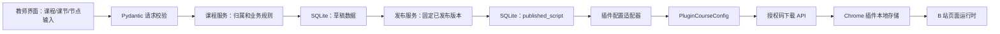
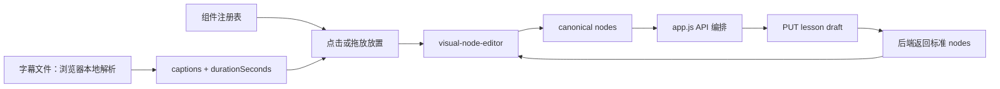

# KnownMap 教师平台与学生插件当前架构

版本：0.5

更新时间：2026-08-20

状态：当前实现架构。教师工作台、FastAPI 和 SQLite 已部署到阿里云 ECS 并完成生产探针；
独立超级管理员认证、教师账号创建/重置和发布课程统计已在当前工作区实现，尚待生产部署；
当前工作区的后端多课节持久化、v2 课程包契约和 v2 插件 store adapter 已实现并通过聚焦
测试，但尚未串入同一发布/下载/运行链路，也尚未部署生产。插件 `0.9.1` 的生效路径仍是
单课程，下载地址仍固定为本机 API，完整真实 Chrome 和公网闭环待收口。

## 1. 架构目标

当前架构把教师工作台和 FastAPI 部署为同源生产服务，同时保留本地开发入口；Chrome 插件
负责授权码领取、本地课程和学习状态，以及 B 站页面运行。

```text
teacher-web/
  ├─ 教师登录、课程编辑和发布
  ├─ admin.html 超级管理员与教师账号管理
  └─ HTTP JSON API
       ↓
backend/app/
  ├─ FastAPI 路由
  ├─ 业务服务
  ├─ Pydantic schema
  ├─ SQLAlchemy 数据访问
  └─ SQLite
       ↑
Chrome 插件
  ├─ 工具栏首页与 B 站页面书包授权码输入
  ├─ 后台下载并重新校验课程配置
  ├─ chrome.storage.local 旧单课程主链路
  ├─ studentCourseStore v2 迁移/合并 adapter（待接入）
  └─ 只在匹配 BVID 页面启动的课程运行时
```

前端只负责页面、交互和请求编排。后端负责认证、课程归属、草稿/发布状态、授权码校验、配置转换和数据访问。插件只接收已经通过服务端校验的插件课程配置，不直接读取教师数据库。

## 2. 技术选型

### 2.1 应用技术栈

- Python 3；
- FastAPI；
- Pydantic；
- SQLAlchemy 2；
- Alembic；
- SQLite；
- pytest、pytest-asyncio、httpx；
- structlog；
- `uv` 管理 Python 依赖和锁文件。

采用 SQLAlchemy 和 Alembic 的原因是保持 SQLite 与未来 PostgreSQL 的迁移边界，不把数据库访问写成只能在本机文件上工作的实现。

### 2.2 当前运行环境

| 环境 | 教师网页 | FastAPI | SQLite |
| --- | --- | --- | --- |
| 本地 | 仓库根目录 `4173` 端口 | `127.0.0.1:8000` | `backend/knownmap.db`，Git 忽略 |
| 生产 | `https://knownmap.com/teacher-web/editor.html` | Nginx 同源代理 `/api/` 和 `/health` | `/var/lib/knownmap/knownmap.db` |

生产 FastAPI 由 systemd 运行，只监听服务器本机 `127.0.0.1:8000`。代码位于不可变发布
目录，数据库独立于代码版本。数据库 URL、CORS、会话密钥、授权码摘要密钥和日志级别都从
环境变量读取。

当前教师网页会按页面 origin 选择本地或生产 API。学生插件的课程下载端点仍在
`src/shared/api-config.js` 中固定为本机 `127.0.0.1:8000`，这是公网学生闭环的未完成边界。

## 3. 目录边界

当前后端目录：

```text
backend/
  pyproject.toml
  uv.lock
  .env.example
  app/
    main.py
    config.py
    db.py
    logging.py
    middleware.py
    models/
      admin.py
      admin_session.py
      teacher.py
      teacher_session.py
      course.py
      lesson.py
      operation_log.py
      script_draft.py
      published_script.py
      access_code.py
      workspace.py
    schemas/
      admin.py
      auth.py
      course.py
      lesson.py
      script.py
      access_code.py
    api/
      deps.py
      v1/
        admin_auth.py
        admin_teachers.py
        auth.py
        teacher_courses.py
        teacher_lessons.py
        teacher_scripts.py
        access_codes.py
        public_courses.py
    services/
      admin_auth_service.py
      admin_teacher_service.py
      auth_service.py
      course_service.py
      script_service.py
      access_code_service.py
      operation_log_service.py
      publish_service.py
    repositories/
      admin_repository.py
      admin_session_repository.py
      admin_teacher_repository.py
      teacher_repository.py
      teacher_session_repository.py
      course_repository.py
      lesson_repository.py
      script_repository.py
      access_code_repository.py
      published_script_repository.py
      workspace_repository.py
    adapters/
      plugin_course_config.py
    migrations/versions/
  tests/
    unit/
    integration/
```

现有目录继续承担：

- `teacher-web/`：教师界面。当前可视化节点编辑器由 `node-plugin-registry.js`、`timeline-model.js`、
  `visual-node-editor.js` 和 `editor-logger.js` 分别承担组件注册、纯时间轴计算、DOM 交互和前端诊断日志；
- `src/shared/`：v1 单课节契约、v2 UUID 多课节课程包契约和消息协议；
- `src/background/`：插件课程下载、契约复验、旧单课程存储，以及待接入的 v2 store adapter；
- `src/content/`：B 站页面书包、匹配 BVID 的课程运行时和学习交互；
- `src/popup/`：Chrome 工具栏学生入口、当前课程记录和教师登录入口。
- `deploy/teacher-platform/`：生产 Nginx、systemd 和部署说明；
- `deploy/releases/`：已验证生产 release JSON；
- `tools/teacher-platform-release.sh`：同一 Git commit 的网页和后端发布；
- `tools/web-release.sh`：静态白名单、插件 ZIP、release JSON 和回滚。

## 4. 后端模块职责

### 4.1 路由层

路由层只做：

- 接收 HTTP 参数；
- 调用认证依赖；
- 调用服务层；
- 映射业务异常为稳定 HTTP 错误；
- 返回 Pydantic response model。

路由层不直接写 SQL，不生成密码哈希，不拼装课程节点。

### 4.2 服务层

服务层负责一个可验收的业务动作：

- `login_teacher`；
- `authenticate_admin`、`create_admin_session`；
- `create_teacher_for_admin`、`reset_teacher_password_for_admin`、`list_teachers_for_admin`；
- `create_course`；
- `create_lesson`；
- `save_lesson_draft`；
- `publish_lesson`；
- `create_access_code`；
- `download_published_course`。

每个动作要有明确输入、输出、失败条件和结构化日志事件。

### 4.3 数据访问层

Repository 只负责所属实体的查询、写入和事务边界：

- 教师 repository 只读写教师账号；
- 管理员 repository 只读写管理员账号和管理员会话；
- 管理员教师聚合 repository 只返回教师公开摘要和已发布课程数量；
- 课程 repository 只读写课程；
- 课节 repository 只读写课节；
- 脚本 repository 只读写草稿和发布版本；
- 授权码 repository 只读写授权码摘要和课程关联。

服务层负责跨实体业务规则，例如“发布脚本前课程和课节必须存在”。

## 5. 业务数据归属

```text
Admin
  └─ AdminSession[]

Teacher
  └─ Workspace（当前每个教师自动拥有一个）
       └─ Course
            └─ Lesson[]
                 ├─ Draft Script
                 └─ Published Script

AccessCode
  └─ Course
```

当前不创建 Student、Redemption、LearningEvent 或 Attempt 数据表。

课程配置的领域数据归属于后端数据库；插件运行配置归属于 `PluginCourseConfig` 输出适配器和插件本地存储。两者不能通过共享数据库表耦合。

## 6. 认证和权限

### 6.1 教师认证

- 登录名和密码；
- 密码使用 Argon2id 或 bcrypt 慢哈希；
- 登录成功后创建服务端会话，浏览器只保存 HttpOnly、SameSite 的随机会话 token；
- 数据库只保存会话 token 摘要、教师 ID、过期时间和撤销时间；
- 测试账号通过 seed 命令从环境变量读取，不把测试密码写入代码；
- 会话密钥从环境变量读取；
- 受保护教师 API 必须从服务端会话推导教师 ID；
- 前端传入的 `teacher_id`、`workspace_id` 或角色字段不参与授权判断。

当前只实现教师 Owner 权限。手工预建账号直接绑定一个工作空间。

### 6.2 超级管理员认证与教师账号管理

- 管理员与教师使用独立数据库表、会话表、Cookie 和 API 前缀；
- 管理员密码与教师密码只保存 Argon2 哈希；
- 浏览器只保存 `knownmap_admin_session` HttpOnly Cookie，数据库只保存 HMAC-SHA256 摘要；
- `require_admin` 拒绝缺失、伪造、过期、撤销、停用管理员和教师 Cookie；
- 管理员 bootstrap 只能通过显式 seed 路径执行，已有管理员不会被普通发布重置；
- 创建教师时服务端生成高熵临时密码、写入哈希并建立 workspace；
- 重置教师密码只更新哈希，不自动恢复 `disabled` 状态；
- 临时密码只返回给当前 HTTPS 调用方，前端只保存在当前页面内存；
- 教师列表通过 SQL 聚合已发布课程数，不加载课程正文或密码字段。

### 6.3 插件下载权限

插件下载端点使用授权码作为当前阶段的唯一业务凭证：

- 授权码标准化后计算摘要；
- 服务端按摘要查找授权码；
- 授权码必须绑定已发布课程；
- 不接受客户端传入的课程 ID 作为最终授权依据；
- 失败默认拒绝；
- 返回课程配置时只返回插件需要的字段。

## 7. 课程发布数据流



关键规则：

1. 草稿保存不改变已发布内容。
2. 当前外部只提供课程发布端点；该端点仍通过兼容属性发布课程排序后的第一课节草稿。
3. 未发布脚本不能通过下载端点返回。
4. 插件配置适配器删除数据库内部字段，只输出运行所需结构。
5. 节点结构先通过服务端 schema 校验，再转换为插件契约。

教师编辑器内部的数据流：



`visual-node-editor.js` 不直接访问 FastAPI。点击和拖放都调用同一创建动作，组件来源只作为
前端诊断字段；后端仍只接收既有 `config.nodes` schema。字幕是本地 raw 输入和前端 context，
不进入 `ScriptDraft.config_json`。

## 8. 错误和日志

错误响应统一为：

```json
{
  "error": {
    "code": "COURSE_NOT_FOUND",
    "message": "课程不存在或不可访问。",
    "request_id": "..."
  }
}
```

不向客户端返回 SQL、堆栈、文件路径、密码哈希、授权码摘要或数据库原文。

关键日志动作：

- `admin-auth.login.success/failure`
- `admin.teachers.list/create/password_reset`
- `auth.login.start/success/failure`
- `course.create.start/success/failure`
- `lesson.draft.save.start/success/failure`
- `script.publish.start/success/failure`
- `access_code.create.start/success/failure`
- `course.download.start/success/failure`

日志必须包含 `request_id`、模块、动作、事件、耗时和脱敏输入摘要。授权码原文、密码、课程正文和节点正文不写入日志。

教师编辑器的未提交操作使用浏览器端分级诊断日志：

- 本地开发/测试默认 `debug`：组件选择、放置、拖动、弹窗打开和取消；
- 正常运行默认 `info`：草稿保存、发布和失败；
- 不记录字幕正文、节点正文、密码、cookie、会话 token 或授权码原文；
- 前端诊断日志不替代后端 `OperationLog`，也不新增每次临时拖动的持久化审计端点。

## 9. 运行和部署形态

本地：

```bash
cd backend
uv sync
cp .env.example .env
uv run alembic upgrade head
uv run uvicorn app.main:app --reload --port 8000
```

教师网页会按页面主机名选择 `http://localhost:8000` 或 `http://127.0.0.1:8000`，保证
SameSite 会话 Cookie 主机一致。插件通过 `src/shared/api-config.js` 固定连接本机公开下载
端点，仍按 MV3 方式加载解压目录；代码更新后必须在扩展管理页重新加载 service worker。

生产：

```bash
tools/teacher-platform-release.sh deploy <git-ref>
tools/teacher-platform-release.sh status
```

生产发布绑定已推送的精确 Git commit，并用同一 release ID 关联网页目录、后端目录、
GitHub 标签和仓库 release JSON。学生插件 ZIP 打包代码已进入工作区，但当前生产 release
`20260820T142243Z-ec1454ed2f31` 尚未验证包含该文件。

日志配置：

```text
development/test: LOG_LEVEL=DEBUG，控制台可读格式
production:       LOG_LEVEL=INFO，结构化 JSON 格式
```

运行日志输出到标准输出；业务操作另外写入 SQLite 的 `operation_logs` 表，便于后续后台查询。

## 10. 主要风险

| 风险 | 处理 |
| --- | --- |
| 当前插件课程 API 写死本机地址 | 公网闭环前必须决定并验证环境选择方式 |
| v2 课程包契约未接入发布/下载 | 保留 v1 主链路，完成聚合、兼容响应和端到端测试后再切换 |
| 授权码是敏感凭证 | 只存摘要，原文只在创建响应中返回 |
| 管理员和教师临时密码是敏感凭证 | 只保存 Argon2 哈希；原文仅在 bootstrap 或即时响应出现一次 |
| 教师 Cookie 访问管理员 API | 使用独立 Cookie、会话表和 `require_admin` 默认拒绝 |
| 本地 cookie 跨端口联调 | 明确 CORS、SameSite 和本地 origin；集成测试覆盖 |
| 本机 SQLite migration 状态可能漂移 | 使用 Alembic 作为升级入口，不依赖 `create_all()` 修改已有表 |
| 生产 SQLite 与代码回滚分离 | schema 变更前补充备份、恢复和数据库迁移回滚计划 |
| 教师 API 已返回 `lessons[]`，页面仍读 `lesson` | 接入前补前端多课节选择或显式第一课节兼容 |
| 授权范围仍是单课程 | 按 D-025 实现 `AccessGrant` migration、服务校验和响应过滤 |

详细数据结构、数据流和已知漂移见 [`data-spec.md`](data-spec.md)。
