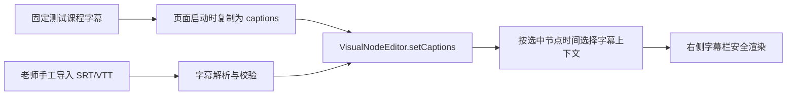

# 教师时间线参考样式对齐设计

版本：0.1

更新时间：2026-08-20

状态：已实现；自动化验证通过，浏览器刷新后的视觉复核待完成

关联需求：`doc/requirements/teacher-platform-local-stage.md`

视觉参照：`teacher-web/forsales.html` 与 KnownMap 官网“完整课程示例”

## 1. 目标

把正式教师编辑器的时间线改成与官网示例同一种视觉和信息结构，同时保留现有节点创建、
拖动、编辑、保存和发布能力：

- 开始和结束使用独立边界胶囊，结束固定在有效轴线右端；
- 节点图标复用官网四种 SVG 图标，不再使用字体符号代替；
- 节点摘要在轴线上下交错，并由连续竖线连接到节点图标；
- 固定测试视频默认加载仓库中已有的 177 条匹配字幕，右栏显示选中节点附近的真实字幕；
- 手工导入 SRT/VTT 仍可覆盖默认字幕，不改变字幕只在浏览器内处理的边界。

## 2. 字幕数据流

当前固定测试视频为 `BV1WW4y1e7GL`。其匹配字幕已经以 canonical caption 数组保存在
`teacher-web/demo-captions.js`，数据源来自仓库内老师提供的完整 SRT。

默认字幕只适用于当前固定测试视频。后续开放任意教师课程时，必须由课节数据显式指向匹配的
字幕来源，不能按 BVID 猜测或把同一份字幕套到其它课程。

## 3. 时间线结构

时间线只有一套水平坐标：节点层、主轴、开始/结束边界与刻度均使用轨道左右安全边距。
开始位于 `0%`，结束位于 `100%`，`08:33` 只作为刻度和课节时长显示，不再覆盖“结束”。

节点按 lane 奇偶分为上、下两组：

- 上方摘要的连接线从卡片底部延伸到节点图标上沿；
- 下方摘要的连接线从节点图标下沿延伸到卡片顶部；
- 图标中心落在同一条主轴上，不再因 lane 改变上下位置；
- lane 只负责横向碰撞分配和摘要上下位置，不改变节点的时间语义。

## 4. 小图标

四种节点沿用官网 SVG：

| 节点 | 图形 |
|---|---|
| 重点标注 | 铅笔 |
| 选择题 | 勾选列表 |
| 填空题 | 文本空位 |
| 问答题 | 对话气泡与问号 |

组件栏和时间线 marker 调用同一个安全 SVG 构造函数，图标由注册表中的稳定 `iconId` 选择，
不使用动态 HTML 字符串。

## 5. 验收

1. “开始”和“结束”均可见，结束胶囊中心位于有效轴线右端。
2. 最后刻度和课节时长仍显示 `08:33`。
3. 四种节点在组件栏与时间线上都显示官网同款 SVG 小图标。
4. 每张节点摘要卡片的竖线连接到对应节点图标，节点图标中心共用主轴。
5. 打开已有固定测试课程时自动显示 177 条字幕来源状态；选择任一节点后右栏有字幕上下文和中心句高亮。
6. 手工导入合法字幕后覆盖默认字幕；导入失败保留原字幕。
7. Node 自动化测试通过；浏览器刷新后完成控制台检查和桌面截图对比。

## 6. 实施结果

- 固定课程启动时复制 177 条内置字幕进入编辑器；合法 SRT/VTT 导入仍可覆盖。
- “结束”恢复为独立语义边界，`08:33` 只出现在课程时长和刻度中。
- 组件栏与 marker 共享四个 SVG symbol，摘要连接线与 marker 共用一条轴线。
- 自动化验证：Node `288 pass / 0 fail`；后端 `40 pass`，覆盖率 `87%`；前端脚本语法与差异格式检查纳入收口。
- 当前应用内浏览器拒绝自动刷新本地 URL，因此修改后的视觉截图和控制台复核需在现有标签页手动刷新后完成；不能把这项未执行检查记录为已通过。
