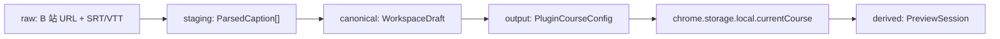

# KnownMap 第一阶段数据规范

版本：1.0

更新时间：2026-08-15

状态：当前数据契约权威。实现前必须先以测试固定本文件的 schema 和样例。

## 1. 数据边界

第一阶段没有后端。数据只在两个本地存储边界中流动：

| 数据 | 位置 | 生命周期 |
| --- | --- | --- |
| 视频 URL、完整字幕、工作台草稿 | 教师工作台 `localStorage` | 单一当前课程，用户确认后覆盖 |
| 当前课程节点配置 | 插件 `chrome.storage.local` | 单一当前课程，完整替换 |
| 当前预览会话和答案 | 插件 `chrome.storage.local` | 新预览会话覆盖旧 active session |

完整字幕不得通过消息桥发送给插件。插件只接收运行学生互动所需的课程引用和节点。

## 2. 数据分层



- `raw`：老师提供的 URL 和原始字幕文件；
- `staging`：解析并校验后的字幕段落；
- `canonical`：工作台唯一当前草稿；
- `output`：去除完整字幕后的插件课程配置；
- `derived`：插件运行时产生的预览会话和答案。

## 3. 公共约定

- 时间统一使用有限的非负秒数；
- ISO 时间使用 UTC `YYYY-MM-DDTHH:mm:ss.sssZ`；
- ID 是课程内稳定、非空、长度不超过 80 的 ASCII 字符串；
- 用户文案去除首尾空格后校验，不允许只含空白；
- 未知顶层字段在第一阶段拒绝，防止网页和插件 schema 漂移；
- 课程配置不得包含函数、DOM、HTML、CSS、JavaScript 或循环引用。

## 4. `VideoRef`

```js
{
  platform: 'bilibili',
  videoId: 'BV1WW4y1e7GL'
}
```

| 字段 | 类型 | 必填 | 校验 |
| --- | --- | --- | --- |
| `platform` | `'bilibili'` | 是 | 第一阶段封闭枚举 |
| `videoId` | `string` | 是 | `^BV[a-zA-Z0-9]+$` |

## 5. `ParsedCaption`

```js
{
  id: 'caption-0001',
  startSeconds: 39.0,
  endSeconds: 43.2,
  text: 'I am hard-working, diligent and loyal.'
}
```

规则：

- `startSeconds >= 0`；
- `endSeconds > startSeconds`；
- 数组按开始时间非递减；
- `text.trim()` 非空；
- `id` 在当前字幕内唯一；
- 字幕文本属于不可信输入，渲染时使用 `textContent`。

## 6. `WorkspaceDraft`

```js
{
  schemaVersion: 1,
  sourceUrl: 'https://www.bilibili.com/video/BV1WW4y1e7GL/',
  videoRef: { platform: 'bilibili', videoId: 'BV1WW4y1e7GL' },
  subtitlesConfirmed: true,
  captions: [],
  nodes: [],
  updatedAt: '2026-08-15T00:00:00.000Z'
}
```

存储键：`lessonpilot.workspaceDraft.v1`。

`subtitlesConfirmed` 只能由老师或协助者在人工核对后勾选。未确认时允许编辑，但禁止保存到插件。

## 7. `PluginCourseConfig`

```js
{
  schemaVersion: 1,
  courseId: 'bilibili:BV1WW4y1e7GL',
  videoRef: { platform: 'bilibili', videoId: 'BV1WW4y1e7GL' },
  nodes: [],
  updatedAt: '2026-08-15T00:00:00.000Z'
}
```

存储键：`currentCourse`。

规则：

- `courseId` 固定从 `platform:videoId` 派生；
- `nodes` 至少一个（按数组长度计，不看 `enabled`），按 `trigger.timeSeconds`、再按 `id` 升序；
- 所有节点 ID 唯一；
- 保存采用整对象替换，不做部分 patch；
- 完整字幕、网页草稿 UI 状态和未确认节点不得进入该对象；
- `updatedAt` 由工作台页面在构造课程时产生，插件后台原样存储、原样回显，不重写；后台只校验它是合法 UTC ISO 串。

## 8. 节点公共结构

```js
{
  id: 'node-1',
  enabled: true,
  family: 'attention',
  interaction: 'notice',
  trigger: {
    kind: 'time_cross',
    timeSeconds: 39,
    captionId: 'caption-0018'
  },
  display: {},
  evaluation: null,
  effects: { pause: true }
}
```

通用规则：

- `enabled` 第一阶段必须是布尔值；
- `trigger.kind` 只允许 `time_cross`；
- `timeSeconds` 是有限非负数；
- `captionId` 可为 `null`，非空时必须引用当前草稿字幕；
- `effects.pause` 固定为 `true`；
- 合法组合只有：`attention + notice`、`practice + choice`、`practice + blank`、`followup + free_text`。

`captionId` 有两级校验，见第 13 节：共享契约层只校验格式，「必须引用现有字幕」由 `WorkspaceDraft` 层执行。`enabled` 在第一阶段只校验类型，不参与「至少一个节点」的计数。

## 9. 节点分支

### 9.1 重点标注

```js
{
  family: 'attention',
  interaction: 'notice',
  display: {
    title: '能力词还需要证据',
    body: '这些词概括了优势，但还需要具体经历证明。',
    captionQuote: 'I am hard-working and loyal.',
    highlights: [{ text: 'hard-working' }, { text: 'loyal' }]
  },
  evaluation: null
}
```

`title`、`body` 必填；`captionQuote` 和 `highlights` 可选。每个 highlight 的 `text` 必须非空。

### 9.2 选择题

```js
{
  family: 'practice',
  interaction: 'choice',
  display: {
    title: '判断哪一句有证据',
    prompt: '下面哪一句给出了具体证据？',
    options: [
      { id: 'a', label: 'I am hard-working.' },
      { id: 'b', label: 'I finished the client deck before the deadline.' }
    ]
  },
  evaluation: {
    answer: 'b',
    explanation: '第二句说明了具体做过的事。'
  }
}
```

`title`、`prompt`、`explanation` 必填；至少两个选项；选项 ID 唯一；`answer` 必须引用现有选项。

### 9.3 填空题

```js
{
  family: 'practice',
  interaction: 'blank',
  display: {
    title: '补上动作动词',
    prompt: 'I ______ a different approach.'
  },
  evaluation: {
    acceptedAnswers: ['suggested'],
    normalize: ['trim', 'casefold'],
    explanation: '视频中的动作动词是 suggested。'
  }
}
```

`title`、`prompt`、`explanation` 必填；至少一个去重后的非空答案；`normalize` 第一阶段固定为 `['trim', 'casefold']`。

### 9.4 问答题

```js
{
  family: 'followup',
  interaction: 'free_text',
  display: {
    title: '用自己的经历回答',
    prompt: 'How do you handle stress?'
  },
  evaluation: {
    referenceFeedback: '可以按保持冷静、询问信息、评估选择、采取行动四步组织。'
  }
}
```

`title`、`prompt`、`referenceFeedback` 必填。学生提交空白答案时拒绝；不产生 `correct` 字段。

## 10. 消息协议

### 10.1 请求

```js
{
  channel: 'lessonpilot.workspace.v1',
  protocolVersion: 1,
  requestId: 'req-550e8400-e29b-41d4-a716-446655440000',
  type: 'SAVE_CURRENT_COURSE',
  payload: { course: {} }
}
```

### 10.2 响应

```js
{
  channel: 'lessonpilot.extension.v1',
  protocolVersion: 1,
  requestId: 'req-550e8400-e29b-41d4-a716-446655440000',
  ok: true,
  data: {}
}
```

失败响应：

```js
{
  channel: 'lessonpilot.extension.v1',
  protocolVersion: 1,
  requestId: 'req-550e8400-e29b-41d4-a716-446655440000',
  ok: false,
  error: {
    code: 'INVALID_COURSE',
    message: '课程配置未通过校验。'
  }
}
```

操作 payload：

| 操作 | payload | 成功 data |
| --- | --- | --- |
| `PING` | `{}` | `{ extensionVersion }` |
| `GET_CURRENT_COURSE` | `{}` | `{ course: PluginCourseConfig \| null }` |
| `SAVE_CURRENT_COURSE` | `{ course }` | `{ courseId, updatedAt }` |
| `CLEAR_CURRENT_COURSE` | `{ expectedCourseId }` | `{ cleared: true }` |
| `START_PREVIEW_SESSION` | `{ courseId }` | `{ sessionId, startedAt }` |

错误码封闭集合：

| 错误码 | 产生层 | 说明 |
| --- | --- | --- |
| `INVALID_CHANNEL` | background | 仅用于校验 content script 转发的信封，属内部一致性检查。content script 遇到 channel 不匹配时静默丢弃，不返回此码，见下。 |
| `UNSUPPORTED_VERSION` | content script、background | channel 匹配但 `protocolVersion` 不在支持集合内 |
| `UNKNOWN_OPERATION` | content script、background | `type` 不在五个开放操作内 |
| `INVALID_REQUEST` | content script、background | `requestId`、payload 形状或未知字段不合法 |
| `INVALID_COURSE` | background | 课程 schema 校验失败；错误体只含错误码与字段路径，不含课程正文 |
| `COURSE_MISMATCH` | background | `expectedCourseId` 与当前课程不一致，或预览会话 `courseId` 不一致 |
| `STORAGE_FAILURE` | background | `chrome.storage.local` 读写失败 |
| `EXTENSION_UNAVAILABLE` | 页面客户端 | 3000ms 超时后本地产生，非来自插件 |

**channel 不匹配为静默丢弃，不是错误响应。** 工作台页面上可能有其它脚本发送 `window.postMessage`；若对 channel 不匹配的消息回一个错误码，任意第三方脚本就能借此探测插件是否安装。channel 不匹配的消息在语义上不是发给本桥的，直接忽略。

页面等待响应 3000ms；超时后结束该请求并显示重试，不自动重复写操作。写操作超时后不得自动重试，避免重复副作用。

`requestId` 格式：`^req-[0-9a-f]{8}-[0-9a-f]{4}-[0-9a-f]{4}-[0-9a-f]{4}-[0-9a-f]{12}$`，由页面用 `crypto.randomUUID()` 生成并加 `req-` 前缀。`sessionId` 格式：`^session-[0-9a-f]{8}-[0-9a-f]{4}-[0-9a-f]{4}-[0-9a-f]{4}-[0-9a-f]{12}$`，由插件后台生成。

## 11. `PreviewSession`

```js
{
  schemaVersion: 1,
  sessionId: 'session-...',
  courseId: 'bilibili:BV1WW4y1e7GL',
  courseUpdatedAt: '2026-08-15T00:00:00.000Z',
  startedAt: '2026-08-15T00:00:00.000Z',
  nodeStates: {
    'node-1': { status: 'pending', attempts: 0, answer: null }
  }
}
```

存储键：`activePreviewSession`。

状态只允许 `pending`、`active`、`completed`、`skipped`。`courseUpdatedAt` 必须等于创建会话时当前课程的 `updatedAt`，用于区分同一课程的不同保存结果，不另建版本系统。选择题和填空题答案保存字符串；问答题保存原始文本；重点标注答案保持 `null`。新预览会话完整替换旧 active session。

## 12. 数据质量与安全验收

- 相同输入在网页和插件校验结果一致；
- 非有限数字、空字符串、重复 ID、未知字段和不合法枚举被拒绝；
- 从 WorkspaceDraft 转换到 PluginCourseConfig 时不包含 `captions` 和 `sourceUrl`；
- 保存后读取的课程与写入对象深度相等；
- 清除操作校验 `expectedCourseId`，防止清除错误课程；
- 所有动态文本安全渲染；
- 日志只记录操作、requestId、courseId、节点数量、结果和错误码；
- 日志不记录完整字幕、题目正文、学生原始回答或浏览历史；
- 每个会话状态可追溯到课程 ID、课程 `updatedAt` 和节点 ID。

## 13. 校验层分工

依据 D-011。同一条规则只能有一个执行层；下表让实现者和后续 Agent 能直接查到某条规则该由谁执行，避免网页与插件各写一份近似校验器。

| 规则 | 执行层 | 原因 |
| --- | --- | --- |
| 字段类型、枚举、ID 唯一、时间有限非负、节点组合合法、文案非空、选项与答案一致 | 共享契约（`src/shared/course-contract.js`） | 网页与插件必须得到相同结论，A-DATA-01 |
| `captionId` **格式**（`null` 或非空 ASCII、≤80） | 共享契约 | 插件侧可执行 |
| `captionId` **引用现有字幕** | `WorkspaceDraft` 层（1B 实现） | `PluginCourseConfig` 不含 `captions`，插件侧无字幕可比对；规则不放弃，只归位 |
| `subtitlesConfirmed` 为真才允许保存 | `WorkspaceDraft` 层（1B 实现） | 该字段不进入插件课程 |
| 节点排序 | `normalizeCourse()` | 表示形式整理，返回新对象，不修改入参 |
| 乱序拒绝 | `validateCourse()` | A-DATA-01 要求不静默修复语义错误 |
| `updatedAt` 生成 | 工作台页面 | 后台重写会使「保存后读取深度相等」永远失败 |
| `updatedAt` 格式校验 | 共享契约 | 两侧结论需一致 |
| `expectedCourseId` 匹配 | background | 只有后台掌握当前存量课程 |
| 存量数据重新校验 | background 读取路径 | A-STORAGE-01，损坏数据不得流入运行时 |
| origin、pathname、`event.source` | content script | 只有页面上下文能判断真实来源 |
| 信封（channel、版本、requestId、operation、payload） | 页面、content script、background 各一次 | A-BRIDGE-02 纵深防御，后台不因来自扩展内部而跳过 |

调用顺序：写入侧（1B 工作台）先 `normalizeCourse()` 再 `validateCourse()`；background 只 `validateCourse()`，不 normalize——插件不替网页修数据。

`enabled: false` 在第一阶段只校验类型，不赋予过滤语义，其运行时行为由 1C 定义。
