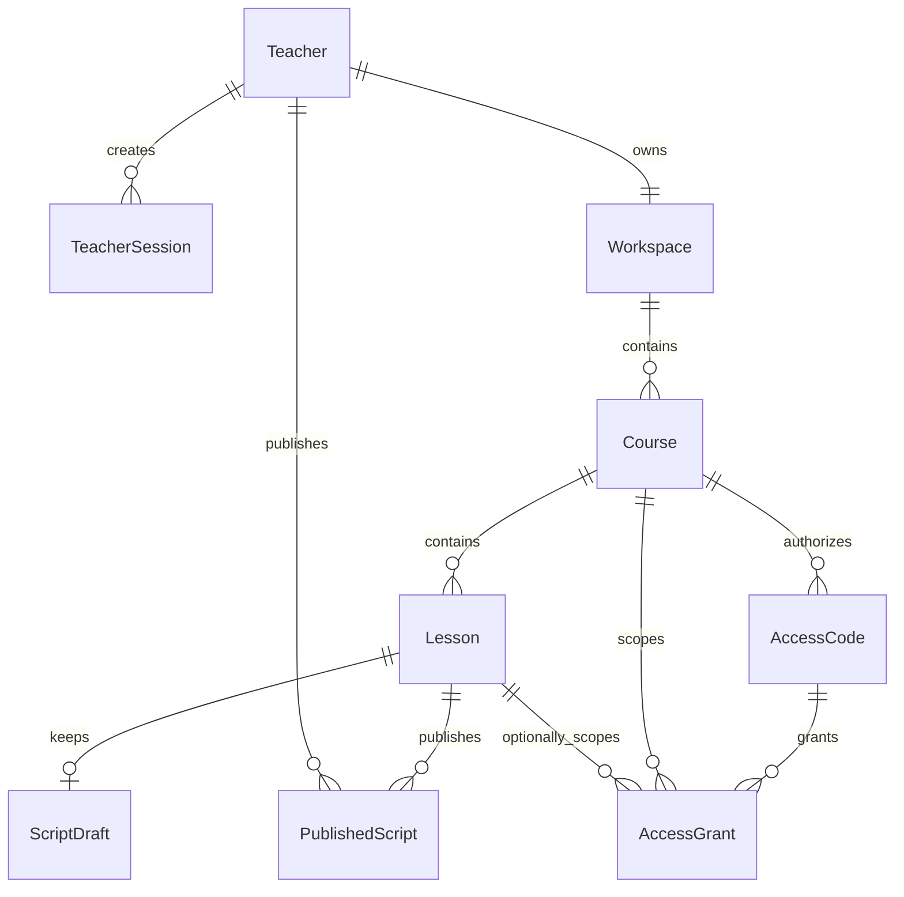
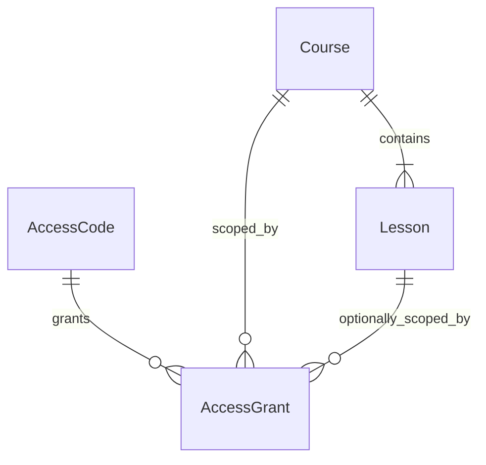

# KnownMap 数据模型

更新时间：2026-08-20

状态：当前实现模型与已接受目标模型的对照说明。

上级入口：[`../data-spec.md`](../data-spec.md)

## 1. 当前实现模型

当前持久化模型由 SQLAlchemy model 和 Alembic migration 共同定义。API schema、
插件契约和浏览器本地对象是独立的数据边界，不等同于数据库表。



`OperationLog` 使用 `actor_type`、`actor_id`、`target_type`、`target_id` 保存弱关联审计
信息，不使用外键连接所有业务表。

## 2. 当前实体与基数

| 实体 | 主键 | 当前基数 | 生命周期 | 实现位置 |
| --- | --- | --- | --- | --- |
| `Teacher` | UUID 字符串 | 一个教师可有多条会话 | seed 创建，状态控制可用性 | `backend/app/models/teacher.py` |
| `TeacherSession` | UUID 字符串 | 多条会话归属一个教师 | 登录创建，过期或退出撤销 | `backend/app/models/teacher_session.py` |
| `Workspace` | UUID 字符串 | 当前一个教师唯一一个工作空间 | 首次创建课程时自动建立 | `backend/app/models/workspace.py` |
| `Course` | UUID 字符串 | 一个工作空间可有多门课程 | `draft` 到 `published` | `backend/app/models/course.py` |
| `Lesson` | UUID 字符串 | 一门课程可有多个有序课节 | `draft` 到 `published` | `backend/app/models/lesson.py` |
| `ScriptDraft` | UUID 字符串 | 一个课节最多一个当前草稿 | 保存时整份替换 | `backend/app/models/script_draft.py` |
| `PublishedScript` | UUID 字符串 | 一个课节可有多个不可变版本 | 每次发布追加新版本 | `backend/app/models/published_script.py` |
| `AccessCode` | UUID 字符串 | 一门课程可有多条授权码 | 当前不可撤销；短期码可过期 | `backend/app/models/access_code.py` |
| `AccessGrant` | UUID 字符串 | 一个授权码可有多条课程/课节/节点范围 | 随授权码创建 | `backend/app/models/access_grant.py` |
| `OperationLog` | 自增整数 | 每个业务动作一条摘要 | 追加写入 | `backend/app/models/operation_log.py` |

## 3. 当前数据库约束

| 约束 | 当前实现 |
| --- | --- |
| 教师登录名唯一 | `teachers.login_name` 唯一索引 |
| 会话摘要唯一 | `teacher_sessions.token_digest` 唯一索引 |
| 一个教师一个工作空间 | `workspaces.owner_teacher_id` 唯一索引 |
| 一门课程多个课节 | `lessons.course_id` 普通索引；`0008_multi_lesson_courses` 移除唯一约束 |
| 课节顺序 | 创建时使用当前最大 `sort_order + 1`，读取按 `sort_order, created_at` |
| 一个课节一个当前草稿 | `script_drafts.lesson_id` 唯一约束 |
| 发布版本不重复 | `published_scripts(lesson_id, version)` 联合唯一约束 |
| 授权码摘要唯一 | `access_codes.code_digest` 唯一索引 |
| 授权范围去重 | `access_grants` 对授权码、课程、课节、节点和时间范围建立联合唯一约束 |

状态值、授权码类型和部分字符串枚举当前主要由服务层或 Pydantic 校验，数据库列本身仍是
普通字符串，不具备 `CHECK` 约束。

## 4. 当前领域模型与输出模型

数据库、发布包和插件统一使用后台 UUID：

| 层 | 当前身份 | 用途 |
| --- | --- | --- |
| 后端领域和 API | `Course.id` UUID | 数据库主键、教师 API、授权码关联 |
| 插件课程契约 | `Course.id` UUID | 多课程存储、授权范围和学习状态 |
| 课节 | `Lesson.id` UUID | 课节发布、BVID 绑定和课节学习状态 |

BVID 只用于匹配 B 站页面，不参与课程或课节 ID 生成。课程和课节创建统一调用后台
`generate_uuid()`；数据库主键约束是最终不重复边界。

## 5. 当前 JSON 聚合边界

### `ScriptDraft.config_json`

只保存：

```json
{
  "nodes": []
}
```

完整字幕、课程标题、课节标题、BVID、编辑器选中状态和授权码不进入该字段。

### `PublishedScript.config_json`

当前保存完整 `PluginCourseConfig` 快照，而不是保存一份通用领域脚本：

```json
{
  "schemaVersion": 1,
  "courseId": "bilibili:BV1WW4y1e7GL",
  "videoRef": {
    "platform": "bilibili",
    "videoId": "BV1WW4y1e7GL"
  },
  "nodes": [
    {
      "id": "node-1",
      "enabled": true,
      "family": "attention",
      "interaction": "notice",
      "trigger": {
        "kind": "time_cross",
        "timeSeconds": 39,
        "captionId": null
      },
      "display": {
        "title": "回答要具体",
        "body": "用一个真实例子支撑你的回答。"
      },
      "evaluation": null,
      "effects": {
        "pause": true
      }
    }
  ],
  "updatedAt": "2026-08-20T00:00:00.000Z"
}
```

每次发布追加一行，授权码下载读取对应课节的最新版本。

## 6. 当前多课程模型

以下内容来自 D-023、D-024、D-025，已经进入当前主链路。



### 6.1 稳定课程身份

- `courseId` 使用后台 `Course.id` UUID；
- 修改标题、目标、视频、节点或发布版本不改变 `courseId`；
- `lessonId` 使用后台 `Lesson.id` UUID；
- BVID 只负责匹配视频页面，不再承担课程身份；
- 插件、授权码、发布包和学习状态复用同一个后台课程 UUID。

### 6.2 多课节

- `Course.lessons`、`0008` migration、递增 `sort_order` 和 `CourseDetail.lessons[]` 已实现；
- 每个课节有独立 `lessonId`、标题、`videoRef`、节点和学习状态；
- v2 课程包使用 `lessons[]`；
- 发布聚合、授权过滤、下载器和 B 站运行时均按多个课节工作；
- 同一课程内不允许两个课节绑定同一 BVID。

### 6.3 多范围授权

`AccessGrant` 用多条关系表达一个授权码覆盖的课程、课节或节点范围：

| 字段 | 已确认语义 | 当前状态 |
| --- | --- | --- |
| `access_code_id` | 归属哪个授权凭证 | 已实施 |
| `course_id` | 课程级范围 | 已实施 |
| `lesson_id` | 可选的课节级范围 | 已实施 |
| `node_id` | 可选的节点级范围，引用稳定节点 ID | 已实施 |
| `valid_from` | 现实时间授权起点 | 已实施 |
| `valid_until` | 现实时间授权终点 | 已实施 |

2026-08-20 实施计划进一步约定：

- `AccessGrant.id` 为独立主键；
- `access_code_id`、`course_id`、`lesson_id` 使用外键；
- 按授权码和课程建立查询索引；
- `node_id` 非空时 `lesson_id` 必须非空；
- 创建范围前校验教师归属、课节属于课程、已有发布数据，并对完全相同的范围去重；
- `AccessCode.course_id` 暂作教师端列表锚点，公开下载以 `AccessGrant` 为准。

具体唯一约束、删除级联和数据库级 `CHECK` 仍应由 migration 实现和测试确认。

### 6.4 当前课程包

当前发布和下载格式为 `schemaVersion: 2`：

```json
{
  "schemaVersion": 2,
  "courseId": "7a0c4a42-91c8-4f4d-8a2e-17b89c4f6d21",
  "title": "英语面试表达：把答案说得具体",
  "lessons": [
    {
      "lessonId": "1f7b6b18-6b1e-4d2f-bb5e-b5f2a6d7150f",
      "title": "第一节：英文面试完整流程",
      "videoRef": {
        "platform": "bilibili",
        "videoId": "BV1WW4y1e7GL"
      },
      "nodes": [
        {
          "id": "node-1",
          "enabled": true,
          "family": "attention",
          "interaction": "notice",
          "trigger": {
            "kind": "time_cross",
            "timeSeconds": 39,
            "captionId": null
          },
          "display": {
            "title": "回答要具体",
            "body": "用一个真实例子支撑你的回答。"
          },
          "evaluation": null,
          "effects": {
            "pause": true
          }
        }
      ],
      "updatedAt": "2026-08-20T00:00:00.000Z"
    }
  ],
  "updatedAt": "2026-08-20T00:00:00.000Z"
}
```

公开下载响应固定为 `{ "courses": [...] }`。旧 `{ "course": ... }` 不提供 adapter，
插件直接拒绝。

### 6.5 当前插件本地仓库

```json
{
  "storageVersion": 2,
  "installedCourses": {
    "<courseId>": {
      "schemaVersion": 2,
      "courseId": "<courseId>",
      "title": "课程名称",
      "installedAt": "2026-08-20T00:00:00.000Z",
      "source": "authorization",
      "readOnly": false,
      "course": {}
    }
  },
  "learningStates": {
    "<courseId>": {
      "<lessonId>": {
        "nodeStates": {}
      }
    }
  }
}
```

`src/background/storage.js` 和 downloader 使用 `studentCourseStore`：

- 空存储首次读取时加入固定 UUID 的只读示例课程；
- 授权课程按 `courseId` 合并，不替换其他课程；
- 学习状态按 `courseId + lessonId` 保存；
- 整个 store 使用一次 storage set 提交；
- downloader 串行执行课程库读改写，避免并发覆盖；
- 不读取或迁移旧单课程 key。

下载器、运行时和 UI 会复验课程包。若示例课程与授权课程使用同一 BVID，授权课程优先。

## 7. 实施状态

1. `[已实现]` `0008` 去除单课节唯一约束；
2. `[已实现]` v2 JavaScript 与 Pydantic 课程包 schema；
3. `[已实现]` 后端发布聚合和 `{ "courses": [...] }` 下载响应；
4. `[已实现]` `0009`、`AccessGrant` 范围校验和过滤；
5. `[已实现]` downloader、运行时、UI 和只读示例课程；
6. `[已验证]` 插件只接受 v2，不保留旧发布包和旧本地状态兼容。

详细实施方案已经记录在
[`2026-08-20-multi-course-authorization-and-example-course.md`](../../docs/superpowers/plans/2026-08-20-multi-course-authorization-and-example-course.md)。
真实 Chrome 边界和公网插件下载端点仍需单独验收，不改变本节数据模型。
