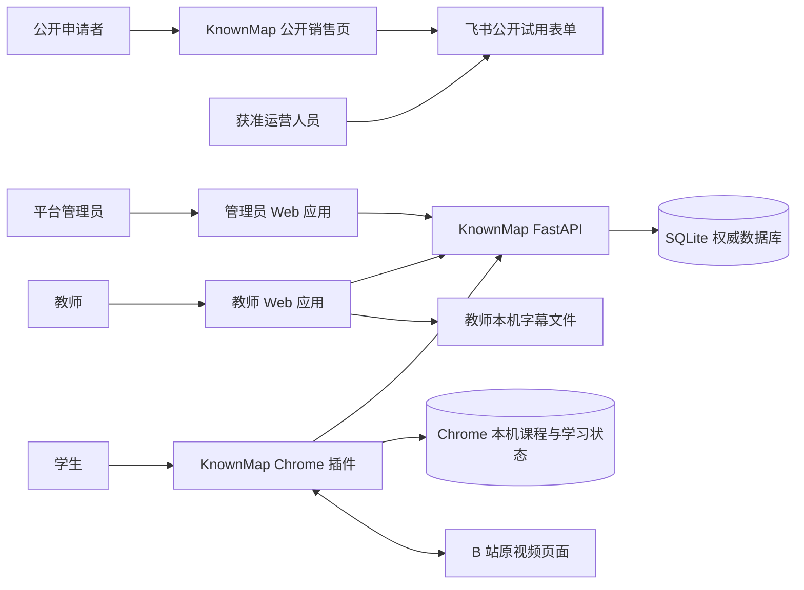
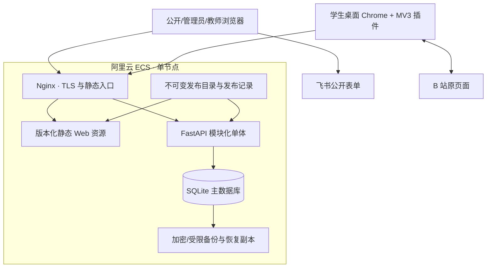

# 03 v1 系统架构

文档版本：`1.0.1`

状态：已于 2026-08-22 通过人工审核；第 14 节两个长期工程取舍均已采用；已同步 `D-V1-010`

上级索引：[`README.md`](README.md)

需求真源：[`../../requirements/v1/README.md`](../../requirements/v1/README.md)

现状证据：[`01-current-system-assessment.md`](01-current-system-assessment.md)

旧资料去向：[`02-legacy-document-register.md`](02-legacy-document-register.md)

## 1. 目的与边界

本文件定义 KnownMap v1 的目标系统组成、运行边界、模块职责、依赖方向和部署拓扑。它回答：

1. 哪些部分是独立客户端、服务端模块、外部系统和运行产物；
2. 哪些数据和业务决定由哪一侧拥有；
3. 请求、课程交付和学生运行跨越哪些信任边界；
4. v1 小规模交付采用什么部署形态；
5. 哪些复杂能力明确不进入当前架构。

本文件不定义数据库字段、状态机细节、API 路径、页面布局、迁移脚本或开发任务。它们分别由 04
至 09、测试计划和开发计划承接。

## 2. 架构目标

v1 架构优先保证以下结果：

1. 一套系统可以重复服务多位教师、多门课程和多个课节，不需要课程专用代码；
2. 管理员、教师、公开申请者和学生本机运行时具有明确且不可互换的边界；
3. 教师草稿、课程级发布版本、授权资格、学生已安装课程和本机学习状态各有唯一责任方；
4. Web、API、课程包、插件和 B 站宿主之间使用显式版本契约，失败不产生半写入或假成功；
5. 当前生产数据可以受控迁移、回退和恢复，重构不以清空数据换取简单；
6. 系统保持适合测试原型和小规模交付的复杂度，不预建规模化平台能力。

## 3. 已锁定的架构约束

以下内容已有冻结需求或已接受决定，不在本文件重新选择：

| 约束 | 架构结论 | 依据 |
| --- | --- | --- |
| 交付规模 | v1 是测试与小规模交付，不建设高可用、多节点或自动扩缩容 | `D-V1-007` |
| 服务端 | `knownmap.com`、阿里云 ECS、Nginx、FastAPI、SQLite | `D-V1-007`、`OPS-ENV-*` |
| 学生端 | 桌面 Chrome MV3 插件运行在 B 站原页面 | `SCOPE-05`、`D-V1-009` |
| 插件分发 | 精确提交构建固定 ZIP、SHA-256、手动安装和更新 | `D-V1-004` |
| 视频 | KnownMap 不下载、代理、托管或重新分发第三方视频 | `SCOPE-05`、产品长期边界 |
| 学生数据 | 课程、回答和学习状态默认只在学生当前机器 | `SCOPE-06`、`SEC-PRIV-001` |
| 字幕 | 原始字幕及解析全文只在教师浏览器临时处理 | `DATA-CONTENT-003`、`INT-FILE-001` |
| AI | v1 不接入 AI 制作、评分、追问或个性化路径 | `D-V1-002` |
| 公开申请 | 销售页跳转飞书公开表单，申请与教师身份分离 | `D-V1-001`、`INT-TRIAL-*` |
| 内容权利 | 接入和发布前确认，争议时暂停相关课程与授权 | `D-V1-008` |

## 4. 总体形态：单仓库、多个客户端、模块化单体服务

v1 使用以下总体形态：

```text
一个代码仓库
  ├─ 公开销售入口
  ├─ 教师 Web 应用
  ├─ 管理员 Web 应用
  ├─ FastAPI 模块化单体
  ├─ Chrome MV3 学生客户端
  ├─ 版本化跨边界契约
  └─ 构建、迁移、发布、备份与验证工具
```

FastAPI 是一个部署单元和一个数据库事务边界，不拆成微服务。内部按业务职责建立模块，禁止通过
共享数据库查询把模块重新耦合成一团。Web、API 和插件可以独立构建与发布，但一个发布候选必须有
同一份兼容矩阵和可追溯的源提交。

选择模块化单体的原因：

- 当前业务量和团队规模不支持微服务的部署、网络、追踪和一致性成本；
- 课程发布、授权建立和管理员创建教师等动作需要清楚的本地事务；
- SQLite 是单个可写数据库，拆服务不会得到真正的数据自治；
- 模块边界仍为未来拆分保留明确责任，但不为未知规模提前支付成本。

## 5. 系统上下文



上下文边界：

- 飞书保存原始试用申请，KnownMap 不复制完整表单正文到普通业务流；
- B 站拥有视频播放与宿主页面，KnownMap 只引用视频并在获准环境执行最小互动；
- SQLite 保存服务端业务权威，绝不保存学生个人学习状态；
- Chrome 本机存储保存学生课程、资格缓存和学习状态，不成为服务端教师报表来源；
- 教师字幕文件在浏览器会话内解析，关闭页面后不形成服务端字幕副本。

## 6. 目标部署拓扑



部署规则：

1. Nginx 是唯一公网入口，负责 TLS、静态资源、API 反向代理和明确的拒绝路径；
2. Web 静态资源和 API 可以分别构建，但必须记录兼容版本和精确源提交；
3. SQLite 只有一个权威可写副本；应用迁移、备份和恢复不得并发修改同一数据文件；
4. 数据库迁移作为独立、可识别、可回退或可恢复的发布步骤，不在普通请求中隐式执行；
5. 发布目录不可变，当前版本通过原子指针切换；失败时回到已验证版本并核对数据结构；
6. 备份保留 30 天，恢复副本核对后删除；备份与发布产物分开管理；
7. v1 不引入容器编排、服务发现、消息队列、分布式缓存或对象存储。

## 7. 服务端业务模块

FastAPI 内部按业务责任划分为六个模块。模块是代码和事务边界，不是六个独立进程。

| 模块 | 拥有的业务责任 | 不拥有 |
| --- | --- | --- |
| 身份与会话 | 管理员/教师认证、会话、密码重置、停用后的会话失效 | 课程授权、学生身份、页面导航 |
| 工作空间与课程 | 工作空间归属、课程、课节、顺序、归档和视频引用 | 节点正文、发布快照、授权资格 |
| 制作与发布 | 草稿、四类节点校验、预览版本、课程级原子发布和历史 | 学生本机进度、视频文件 |
| 授权与交付 | 授权码、领取窗口、授权项、来源并集、在线资格、课程包裁剪与下载 | 学生回答、本机安装删除 |
| 管理与支持 | 教师接入、必要状态摘要、高风险操作和受限诊断 | 默认读取课程正文、冒充教师操作 |
| 运行与审计 | 健康、版本、结构化日志、操作审计、保留任务和恢复探针 | 代替业务模块决定成功或权限 |

### 7.1 依赖方向

```text
HTTP 路由 / 中间件
  -> 应用服务（用例与事务）
      -> 领域规则与契约
          -> 仓储接口 / 外部接口
              -> SQLite、文件和运行环境适配器
```

约束：

- 路由只处理协议、认证入口、参数和错误映射；
- 应用服务定义完整业务动作及事务，不能由前端串联多个半完成写入冒充原子动作；
- 一个模块不能直接查询或修改另一个模块拥有的表；跨模块动作经显式应用服务组合；
- 仓储只负责持久化，不决定权限、发布或授权语义；
- 操作审计由业务动作显式提交，审计失败对高风险动作采用安全失败策略；
- 对外错误使用稳定代码和 `request_id`，内部异常、路径和堆栈不直接返回客户端。

### 7.2 事务边界

至少以下动作必须在单个服务端事务中形成明确结果：

- 管理员创建教师及其初始工作空间；
- 教师停用并终止现有教师会话；
- 保存一个带修订前置条件的课节草稿；
- 生成整门课程的原子发布版本及其课节快照；
- 建立授权来源、授权项和领取记录；
- 终止一个授权来源并重算在线资格；
- 应用数据库迁移的单个确定步骤。

跨服务端与学生机器的动作不伪装成分布式事务。课程下载、校验和本机安装由插件在本地使用暂存、
复验和原子替换完成；服务端只提供可验证的版本化结果。

## 8. Web 客户端边界

### 8.1 公开销售入口

- 公开、无需 KnownMap 登录，只展示已验收能力和试用入口；
- 不直接接收或保存飞书表单正文；
- 外部表单不可用时显示人工联系恢复路径，不伪造提交成功；
- 不加载教师、管理员或插件诊断能力。

### 8.2 教师应用

- 只使用教师会话，只访问当前教师有权使用的工作空间对象；
- 管理课程/课节、浏览器本机字幕、节点草稿、预览、发布、授权和导出；
- 页面状态不是业务真源，刷新后以服务端权威和明确的本机未保存状态恢复；
- 不持久化密码、授权码原文或完整字幕；
- 不复用学生本机学习状态生成教师报表。

### 8.3 管理员应用

- 使用独立管理员会话和入口，不接受教师 Cookie 作为管理员身份；
- 只展示接入、账号状态、必要业务摘要、操作记录和受限支持信息；
- 需要课程正文的异常处置必须有独立授权和审计，v1 不默认开放；
- 不把管理员页面和教师页面合并为一个靠隐藏菜单区分权限的客户端状态。

教师与管理员应用可以共享无业务权限的视觉组件、HTTP 基础设施和错误展示，但不能共享登录状态、
角色路由守卫或资源授权决定。

## 9. 学生插件边界

学生插件由五个逻辑部分组成：

| 部分 | 职责 |
| --- | --- |
| 课程库界面 | 领取、安装/更新确认、课程与课节浏览、删除、重置及错误恢复 |
| 后台服务 | 网络请求、包复验、串行写入、版本迁移和本机原子存储 |
| B 站内容运行时 | 精确页面匹配、学习会话、节点调度、窗口和页面生命周期 |
| B 站宿主适配器 | 可信 video 定位、当前时间、最小暂停/继续及 SPA 变化 |
| 本机存储层 | 本机学习标识、已安装课程、资格来源缓存、会话与学习状态 |

依赖规则：

- 内容脚本不直接调用 KnownMap API，也不直接修改课程库底层结构；
- 后台服务不信任页面消息、网络响应或已有本机存储，每次跨边界读取都复验；
- 宿主适配器只暴露运行所需最小播放能力，不把 B 站 DOM 选择器扩散到课程逻辑；
- 同一或不同课程的多个合法课节匹配同一视频时，由学生选择并由学习会话锁定，不能静默挑第一条；
- 课程库更新不热切换正在运行的学习会话；下次明确启动时再选择新发布版本；
- 插件更新失败、课程包无效或存储局部损坏时保留最近有效课程和不受影响的其它课程。

## 10. 契约层

不同边界使用不同契约，不能用一个“课程对象”贯穿所有层：

| 契约 | 参与方 | 核心责任 |
| --- | --- | --- |
| HTTP API | Web/插件与 FastAPI | 请求、响应、权限、错误和幂等语义 |
| 课程包 | FastAPI 与插件 | 已发布课程、范围裁剪、版本、禁止字段和完整性 |
| 插件内部消息 | popup/background/content | 固定 operation、来源、响应和超时 |
| 教师本机文件 | 教师浏览器 | 字幕与课程导入/导出格式、大小和失败保护 |
| 发布清单 | 构建、部署和运行环境 | 源提交、产物哈希、契约版本、迁移和回滚目标 |

所有契约必须：显式版本、封闭字段、大小上限、稳定身份、明确错误、未知版本安全拒绝、日志脱敏，
并在 06 中分别定义。契约兼容不等于业务数据兼容；04、05 和 09 继续决定身份、状态和迁移语义。

## 11. 数据所有权与信任边界

| 边界 | 权威数据 | 关键保护 |
| --- | --- | --- |
| 飞书 | 原始试用申请 | KnownMap 只由获准运营人员人工访问，不复制普通日志 |
| FastAPI + SQLite | 账号、工作空间、课程、草稿、发布、授权、审计 | 服务端授权、事务、迁移、备份和恢复 |
| 教师浏览器会话 | 原始字幕和未保存页面输入 | 不自动上传，失败不覆盖已保存草稿 |
| Chrome 本机存储 | 学生本机标识、课程、资格缓存、回答和学习状态 | 版本校验、原子写入、局部恢复、不上传 |
| B 站 | 视频、页面和播放器状态 | 精确匹配、最小干预、宿主变化时安全停止 |
| 发布环境 | Web/API/插件产物、哈希和部署记录 | 白名单、不可变产物、原子切换和可追溯回退 |

任何客户端展示的权限、角色、课程范围、版本或完成状态都必须由相应权威重新计算或验证，不能因
它来自 KnownMap 自己的另一个组件就跳过校验。

## 12. 可观测性与故障边界

v1 不引入集中日志平台、分布式追踪系统或复杂告警中心，但保留最低可运维能力：

- Nginx 和 FastAPI 使用同一请求关联标识；FastAPI 结构化记录 `request_id`、模块、动作、结果和耗时；
- 管理员/教师高风险业务动作进入独立操作审计，和诊断日志分开保留；
- 插件只记录固定诊断字段，不记录授权码、课程正文、字幕、学生回答或学习状态；
- 健康检查区分进程可达、数据库可用、版本可识别和核心只读探针；
- 当前错误率、耗时和容量可先从结构化日志汇总，取得真实基线后再定义指标与告警阈值；
- B 站宿主结构变化时停止受影响运行路径并显示可恢复错误，不无限观察、不猜测播放器；
- 飞书、B 站或网络不可用只降级依赖它们的路径，不破坏教师已保存数据或学生已安装课程；
- SQLite 写入、迁移、备份或恢复冲突时停止相关动作，不自动建立第二权威副本。

## 13. 明确不进入 v1 的架构复杂度

- 微服务、服务网格、消息队列、事件总线和分布式事务；
- 多节点数据库、读写分离、自动故障转移和异地容灾；
- Redis 会话/缓存、对象存储、CDN 必需依赖和全量集中监控平台；
- 学生账号、服务端学习事件、跨设备同步和教师学生报表；
- CRM、自动开户、支付、机构多租户和教师多人协作；
- AI 服务、向量数据库、内容生成管线和模型可观测性；
- 通用视频平台插件系统、B 站以外宿主适配器和手机端；
- Chrome Web Store、后台自动升级和远程删除学生本机内容。

重新讨论触发条件包括：SQLite 写入/恢复成为真实瓶颈、需要多节点可用性、出现必须异步执行的长任务、
新增已接受视频平台、学生数据获准上传、团队边界需要独立部署，或固定 ZIP 无法继续支持真实交付。

## 14. 已确认的两个工程取舍

### ARCH-DEC-01：Web 前端实现基线

状态：已于 2026-08-22 采用。

**决定：使用 TypeScript + Vite；教师和管理员应用使用 React，公开销售页保持独立轻量入口。**

理由：当前原生 JavaScript 已出现大型全局脚本、跨页面状态重复、复杂编辑器状态和低可执行覆盖；教师端的
课程/课节、时间线、草稿冲突、发布与授权状态适合组件化和类型检查。销售页不需要承担应用框架成本。学生
插件同样使用 TypeScript/构建工具，但 B 站内容运行时保持直接 DOM，不引入 React 运行时。

备选是继续原生 HTML/CSS/JavaScript。它减少依赖和迁移步骤，但会继续依赖人工约定维护复杂状态、契约类型
和模块加载；不建议作为整版重构基线。

### ARCH-DEC-02：跨语言契约真源

状态：已于 2026-08-22 采用。

**决定：HTTP 以 FastAPI/Pydantic 生成的 OpenAPI 为真源；课程包和插件消息使用仓库中的版本化
JSON Schema 为真源，再生成或校验 Python/TypeScript 适配层。**

理由：当前 JavaScript 共享校验器可以服务 Web 与插件，却不能自然成为 Python 数据模型的唯一真源；手工在
Pydantic 与 JavaScript 维护两份相似 schema 已产生字段和版本漂移。按边界选择 OpenAPI/JSON Schema 可以让
浏览器、插件和后端共享机器可检查的契约，同时不把数据库模型暴露为外部协议。

备选是继续手工维护 Pydantic 与 TypeScript/JavaScript 校验器，并靠契约测试对齐。它初期工具更少，但长期
仍有双真源风险；只有生成工具明显增加不可控复杂度时才建议采用。

## 15. 需求与旧资料承接

| 架构部分 | 主要需求 | 旧资料/现状输入 |
| --- | --- | --- |
| 系统上下文与角色 | `SCOPE-01` 至 `SCOPE-10` | `SRC-020`、`SRC-037`、`SRC-055` |
| 服务端模块化单体 | `FR-AUTH-*`、`FR-WS-*`、`FR-COURSE-*`、`FR-PUBLISH-*`、`FR-GRANT-*` | `SRC-021` 至 `SRC-028`、`SRC-036` |
| Web 客户端分离 | `FR-ADMIN-*`、`FR-AUTHOR-*`、`FR-INTAKE-*`、`SEC-ACCESS-*` | `SRC-038` 至 `SRC-042`、`SRC-047` 至 `SRC-050` |
| 插件与 B 站运行 | `FR-LIB-*`、`FR-RUNTIME-*`、`FR-LEARN-*`、`INT-BILI-*` | `SRC-034`、`SRC-035`、`SRC-043` 至 `SRC-046` |
| 部署与发布 | `OPS-ENV-*`、`OPS-RELEASE-*`、`OPS-DATA-*` | `SRC-029` 至 `SRC-033`、`SRC-063` |
| 迁移与兼容 | `MIG-*` | 01 现状评估、`SRC-065`、`SRC-066`、`SRC-070`、`SRC-073` |

## 16. 本文件完成条件

本文件只有在以下条件满足后才能从草案变为 `1.0.0`：

1. 第 14 节两个工程取舍已经完成人工确认；
2. 每个 v1 运行单元、外部系统、权威数据和信任边界都有唯一职责；
3. 模块化单体、Web 客户端和插件的依赖方向不存在循环或双重业务真源；
4. 部署拓扑符合 `D-V1-007`，且没有静默加入规模化组件；
5. 04 至 09 能在本架构边界内继续细化，不需要反向改写已冻结需求；
6. 文档链接、Mermaid、编号和 `SRC-*` 承接关系通过检查。
