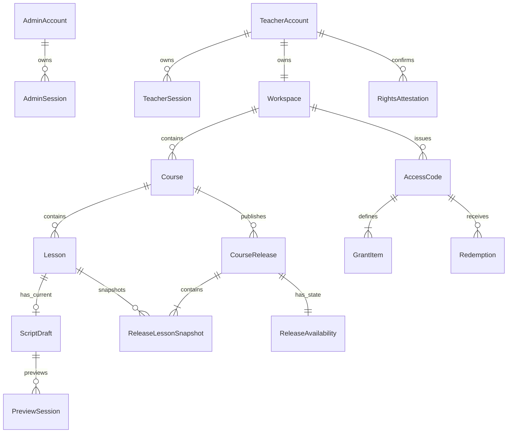
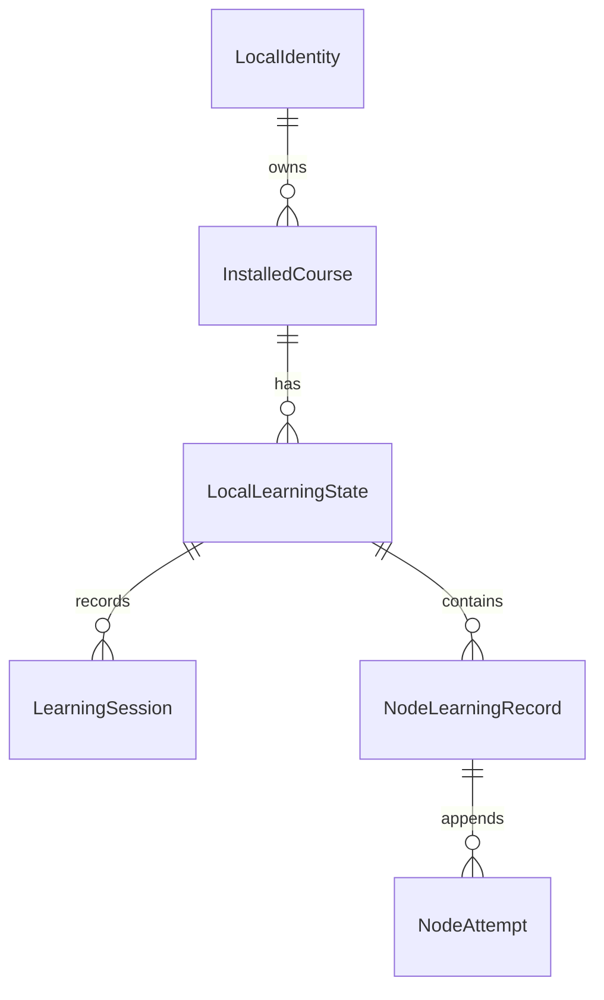

# 04 v1 领域与数据模型

文档版本：`1.0.0`

状态：已于 2026-08-22 通过人工审核；第 14 节两项工程取舍均已采用

上级索引：[`README.md`](README.md)

需求真源：[`../../requirements/v1/README.md`](../../requirements/v1/README.md)

系统架构：[`03-system-architecture.md`](03-system-architecture.md)

现状证据：[`01-current-system-assessment.md`](01-current-system-assessment.md)

旧资料去向：[`02-legacy-document-register.md`](02-legacy-document-register.md)

相关决策：[`D-V1-011 v1 数据持久化策略`](../../decisions/2026-08-22-v1-data-persistence-strategy.md)

## 1. 目的与边界

本文件定义 KnownMap v1 的领域对象、稳定身份、关系、聚合边界、数据所有权和关键约束。它回答：

1. 服务端、教师浏览器和学生设备分别拥有什么数据；
2. 哪些对象是可变真源、不可变事实或可重新计算的派生结果；
3. 课程制作、课程级发布、授权领取和本机学习使用什么身份连接；
4. 当前表、JSON 和 Chrome 存储中哪些经验保留，哪些模型必须重建；
5. 数据库和本机存储至少需要保证哪些完整性规则。

本文件不固定 SQL 表名、HTTP 字段、JSON Schema 全文、状态迁移步骤、保留任务或迁移脚本。对外契约由
06 定义，状态与数据流由 05 定义，删除/备份执行方式由 08 定义，旧数据转换由 09 定义。

## 2. 建模原则

1. **业务身份不借用外部引用**：课程、课节、发布和节点使用 KnownMap 稳定身份；BVID、标题和排序均可变。
2. **聚合边界服从业务原子动作**：一个课节草稿整体保存，一门课程整体发布，一个课程包整体安装。
3. **凭证、资格和本机内容分离**：授权码只证明领取请求；有效资格由仍有效来源合并；已安装课程不因在线
   来源失效被远程删除。
4. **事实与派生结果分离**：领取、尝试和发布是事实；有效资格、完成状态和进度由事实计算，可缓存但可重建。
5. **跨边界对象不共用同一模型**：数据库实体、领域对象、HTTP DTO、课程包和 Chrome 本机记录分别校验和转换。
6. **默认最少持久化**：服务端不保存学生回答或学习状态；字幕原文经教师明确保存草稿动作持久化到
   `ScriptDraft`/`ReleaseLessonSnapshot`（`DATA-CONTENT-005`），但不进入课程包或插件；客户端不把
   密码、会话令牌或授权码原文写入 Web Storage、课程包或业务记录，认证 Cookie 只按 08 的会话边界存在。
7. **历史不可反向改写**：发布快照、领取事实、正式尝试和高风险操作审计追加保存；显示名称和当前状态变化
   不改写历史对象当时的内容。
8. **v1 不采用全量事件溯源**：只有本来就是业务事实的记录追加保存；普通对象继续使用当前状态加明确修订号。

## 3. 数据位置与权威

| 位置 | 权威数据 | 临时或派生数据 | 明确禁止 |
| --- | --- | --- | --- |
| FastAPI + SQLite | 账号、会话、工作空间、课程、草稿（含教师保存的字幕原文）、课程发布快照（含字幕）、授权码、授权项、领取记录、操作审计 | 有效资格、状态摘要 | 字幕进入课程包、学生回答、学习进度、密码或授权码原文 |
| 教师浏览器会话 | 当前字幕解析结果、未保存表单状态 | 时间线索引、预览投影 | 未保存字幕自动上传、长期保存会话凭证 |
| Chrome 本机存储 | 本机学习标识、已安装课程、授权来源缓存、学习会话、回答和节点状态 | 课程/课节进度、可更新提示 | 教师密码、授权码原文、无关浏览历史 |
| 飞书 | 原始试用申请 | 飞书自身状态 | KnownMap 复制完整申请正文为第二真源 |
| B 站 | 视频与页面播放状态 | KnownMap 当前匹配结果 | 视频文件、字幕副本或播放器状态进入 KnownMap 服务端真源 |
| 发布/备份文件 | 构建清单、产物哈希、SQLite 备份 | 运行核对结果 | 与业务数据库混成可被普通请求修改的表 |

逻辑数据层不要求对应独立数据库：

```text
raw 输入
  -> staging 解析与校验
      -> canonical 权威业务对象
          -> derived 可重建结果
              -> output API / 课程包 / 导出文件 / 页面投影
```

每个跨层转换都必须重新校验。`raw` 或 `staging` 成功不表示 canonical 已写入；output 也不能被客户端回传后
直接当作服务端实体保存。

## 4. 服务端领域总览



`OperationAudit` 和 `TrialFollowup` 使用受控弱关联，避免在关系图中伪装成强外键；恢复执行记录的位置见第 10 节。
有效资格也不是独立权威实体，因此不在 ER 图中；它是
`Redemption + AccessCode + GrantItem + 当前时间/状态` 的查询结果。

## 5. 身份、会话与工作空间

| 对象 | 稳定身份与关键字段 | 基数与约束 | 生命周期/分类 |
| --- | --- | --- | --- |
| `AdminAccount` | `admin_id`、规范化登录名、密码摘要、账号状态、凭证版本、时间戳 | 登录名全局唯一；与教师身份不可互换 | 停用不删除历史审计；凭证为 secret |
| `AdminSession` | `session_id`、令牌摘要、`admin_id`、创建/到期/撤销时间 | 只归属一个管理员；摘要唯一 | 到期或撤销后不可恢复；secret |
| `TeacherAccount` | `teacher_id`、规范化登录名、密码摘要、账号状态、凭证版本、时间戳 | 登录名在教师域唯一；不充当工作空间 ID | 停用终止会话，不删除课程；凭证为 secret |
| `TeacherSession` | `session_id`、令牌摘要、`teacher_id`、创建/到期/撤销时间 | 只归属一个教师；摘要唯一 | 与管理员会话独立；secret |
| `Workspace` | `workspace_id`、`owner_teacher_id`、名称、状态、时间戳 | v1 一个教师恰有一个工作空间，所有者唯一且稳定 | 业务隔离边界；internal |

`credential_version` 用于在密码重置、账号停用等动作后使既有会话整体失效；它不代替每条会话的撤销和到期
事实。是否用列比较、批量撤销时间或其它物理实现由 08 决定。教师账号与工作空间必须在同一接入事务中建立；
缺失或重复工作空间属于数据损坏，登录时拒绝进入业务功能，不能临时新建第二个空间掩盖问题。

## 6. 课程、课节与视频引用

| 对象 | 稳定身份与关键字段 | 基数与约束 | 生命周期/分类 |
| --- | --- | --- | --- |
| `Course` | `course_id`、`workspace_id`、标题、说明/目标、修订、生命周期状态、交付暂停状态、时间戳 | 一个工作空间多门课程；每门课程是唯一根对象，直接拥有有序课节 | 身份不随标题或发布变化；归档与内容争议暂停分开 |
| `Lesson` | `lesson_id`、`course_id`、标题、`sequence`、视频引用、修订、状态、时间戳 | 一门课程多个有序课节；课节的视频、脚本或内容可与其它课节相同 | 每次课程内出现都有独立身份和学习状态 |
| `VideoReference` | 平台、平台视频 ID、可选分段/定位参数 | 课节拥有的结构化值对象，不使用为主键；v1 每课节一个受支持引用 | public/internal；不包含视频文件 |

关键约束：

- `course_id`、`lesson_id` 使用后端生成的不可猜测稳定 ID；导入课程必须生成新身份；
- 同一课程内 `(course_id, sequence)` 唯一；课节排序可显式调整，不依赖创建时间碰巧稳定；
- 课程信息、课节信息和多课节重排都带并发修订前置条件；整组重排是一个事务，不留下重复或部分顺序；
- 课节必须属于课程，所有写入还必须验证该课程属于当前教师工作空间；
- 系统不以标题、视频引用、脚本或节点内容判定课节重复，不拒绝老师在同一课程里多次安排相同或相近内容；
- 每次安排作为一个独立 `Lesson` 保存，由新 `lesson_id` 和唯一 `sequence` 区分；这不需要额外的共享课节模板层；
- 同一 BVID 可被同一课程或不同课程的多个课节复用；课节始终以 `lesson_id` 区分；
- 当前视频匹配多个课节时必须让学生按课程和课节名称选择，并由学习会话锁定，不能静默使用排序第一项；
- 归档使用状态和时间保存历史关联；物理删除不能破坏发布、授权或审计可追溯性。

## 7. 脚本草稿与互动节点

### 7.1 `ScriptDraft` 聚合

一个活动课节最多有一个当前草稿。草稿的服务端记录至少包含：

| 字段组 | 用途 |
| --- | --- |
| `draft_id`、`lesson_id` | 草稿稳定身份和唯一课节归属 |
| `schema_version` | 解释草稿内容结构，不等同于课程发布版本 |
| `revision` | 乐观并发前置条件；每次成功保存单调增加 |
| `content` | 经 Schema 校验的节点集合和脚本级必要设置 |
| `content_digest` | 识别内容、发布来源和重复写入，不代替 Schema 校验 |
| `saved_by_teacher_id`、`updated_at` | 变更责任和时间 |

字幕原文（文件名、格式、文本内容）随教师保存草稿动作进入 `content`，与 `nodes`、`assets` 并列
（`DATA-CONTENT-005`、`D-V1-014`）；课程/课节标题、BVID、页面选中项、缩放、弹窗位置和授权信息不进入
`content`。草稿保存是整份聚合替换：修订不匹配或任一节点无效时不写入；v1 不为每次键盘输入建立服务器
历史版本。

### 7.2 `InteractionNode`

互动节点是草稿或发布快照内部的领域对象，不因实现方便被等同为数据库行。公共字段至少包括：

- 稳定 `node_id`；同一课节草稿内唯一，编辑非身份字段时不改变；
- 节点类型和该类型的 Schema 版本；
- 启用状态、排序和触发规则；
- 展示内容、学生动作、预设反馈与完成规则；
- 发布后用于迁移判断的 `state_compatibility_key`；完成语义改变时必须改变，不能只凭节点 ID 迁移；
- 可选字幕句引用只用于编辑上下文，不携带完整字幕正文；
- 运行所需的最小效果设置；未知类型或未知版本必须安全拒绝或明确降级。

v1 只允许重点内容、选择题、填空题和问答题四类。类型专有字段由课程包 JSON Schema 定义，数据库层只保存
已经过共同领域校验的结构，不允许任意 JSON 绕过类型规则。

### 7.3 `PreviewSession`

每次真实预览建立一条短生命周期但可追溯的预览记录，至少包含：`preview_session_id`、教师、课程、课节、
`draft_id + revision + content_digest`、锁定的最小预览内容、运行契约/插件版本、开始/到期/结束时间、结果和安全
错误类别。

- 预览内容在启动时锁定，之后的草稿保存不能改变正在运行的会话；
- 预览中的回答、尝试和窗口状态只属于本次预览，不进入学生课程库或服务器学习数据；
- 只有学生正式运行路径确认成功、且对应当前最终草稿修订的记录才能满足发布门禁；
- 预览超时、视频不匹配、契约不兼容或草稿变化时记录为失败/过期，不能被静态示意替代；
- 普通审计只保存结果和关联标识，不复制草稿正文或预览回答。

锁定内容只为本次会话运行，不成为草稿历史或发布版本；会话到期后按短期保留规则清除正文，只保留满足发布
门禁和排障所需的修订、摘要、版本、结果与时间。

## 8. 课程级发布模型


| 对象 | 稳定身份与关键字段 | 关键规则 |
| --- | --- | --- |
| `CourseRelease` | `release_id`、`course_id`、课程内 `release_number`、发布意图 ID、课程级元数据快照、发布时间、发布教师、源修订摘要、预览记录、权利确认、Schema 版本 | 一门课程一次原子发布的父事实；创建成功后不可变 |
| `ReleaseLessonSnapshot` | `release_lesson_id`、`release_id`、原 `lesson_id`、排序、课节元数据、视频引用、节点内容、摘要 | 同一发布下每个课节实例恰有一份；内容相同也不合并；不可单独成为“发布版本” |
| `ReleaseAvailability` | `release_id`、可交付状态、原因码、状态修订、操作者与时间 | 与不可变内容分离；损坏、争议或受控暂停时阻止新交付，不改写快照 |

数据库必须保证 `(course_id, release_number)` 和 `(course_id, publish_intent_id)` 分别唯一，并在一个事务内写入
父发布及全部课节快照。任一草稿缺失、修订变化、当前修订未完成真实预览、内容权利门禁失败或快照写入失败时
不产生发布。发布后修改标题、视频或草稿不会改写旧快照。

课程包是最新可交付发布快照按有效授权范围形成的 output，不是第三份可编辑真源。相同
`release_id + 授权范围 + 契约版本` 必须生成语义相同的结果；裁剪不能生成跨发布混合课节。可用性未知、完整性
复验失败或已暂停的发布不能成为最新可交付结果，也不能回填猜测内容。

## 9. 授权、领取与有效资格

| 对象 | 稳定身份与关键字段 | 关键规则 |
| --- | --- | --- |
| `AccessCode` | `access_code_id`、工作空间/管理锚点、凭证摘要、显示尾号、领取起止时间、状态、创建者与时间 | 原文只在创建响应和学生输入瞬间出现；摘要唯一；到期与终止分开 |
| `GrantItem` | `grant_item_id`、`access_code_id`、课程/课节/节点范围、现实有效起止时间 | 范围层级必须自洽；课节属于课程，节点属于课节发布内容；重复范围受唯一约束；随授权码创建后不可原地改范围 |
| `Redemption` | `redemption_id`、`access_code_id`、本机学习标识摘要、首次/最近领取时间、领取时范围摘要 | `(本机学习标识摘要, access_code_id)` 唯一；只保存已成功建立的关系；重复请求返回同一业务结果 |
| `EffectiveEntitlement` | 本机学习标识、课程与允许范围、资格能力、计算时间 | **派生视图**，由全部有效领取来源求并集；不是可独立修改的表 |

“授权来源”在物理模型中由一条成功 `Redemption` 及其关联 `AccessCode + GrantItem` 共同表达，不再建立内容重复
的独立来源表。服务端只保存本机学习标识的最小摘要，不建立学生账号，不接收姓名、联系方式或学习状态。
授权码和授权项在创建事务完成后不允许普通编辑；范围或时间设错时终止原来源并新建授权，避免已领取设备的资格被静默扩大或缩小。

`Redemption` 只代表已经成功建立的领取关系。无效码、超时或拒绝请求不创建领取关系；为限速、安全排障和识别
响应丢失保留的失败摘要属于受限诊断/审计记录，并使用请求幂等标识，不能混入有效资格计算。

资格计算必须分别回答：是否可以首次领取、重新下载和更新。终止或到期只使对应来源不再贡献未来在线资格；
其它来源继续有效，已经安装在学生设备的课程也不被远程改写。

## 10. 权利确认、运营与操作审计

`RightsAttestation` 是追加式确认事实，至少包含确认 ID、声明版本、确认教师、适用对象（教师接入或具体课程
发布）、确认时间和结果。教师接入确认不能代替每次发布确认；`CourseRelease` 必须引用当次有效确认。内容争议
通过课程独立交付暂停状态阻止新发布、领取、更新和公开展示，不冒充课程归档、账号停用或授权来源终止；处置结果
进入操作审计。v1 只记录声明与处置，不伪造专业法律认证。

`OperationAudit` 是追加式安全/业务事实，至少包含：审计 ID、动作、操作者类型和 ID、目标类型和 ID、结果、
固定原因码、`request_id`、时间和经过脱敏的最小元数据。弱关联避免删除或迁移业务对象时丢失审计；它不保存
密码、会话令牌、授权码原文、字幕、课程正文或学生回答。

`TrialFollowup` 是满足管理员运营目录的最小独立对象，只保存跟进 ID、安全的飞书记录引用、封闭跟进状态、更新者与时间，以及可选 `teacher_id` 弱关联。
飞书仍是申请正文真源；KnownMap 不复制姓名、联系方式、教学问题或表单正文，不建设 CRM、线索评分或飞书自动同步。跟进状态不自动创建教师账号，也不随账号状态变化被重写。

恢复执行记录只保存批准范围、检查点、执行者、开始/结束时间、结果、验证结论和安全关联标识，不复制被恢复正文。
它优先是受限的不可变运维记录或审计事实，不默认要求独立 `RecoveryRecord` 业务表。部署版本与健康状态来自运行清单和实时检查；管理员目录中的发布课程数量、健康结果等均为可重算投影，来源不可用时显示未知而不是持久化伪造零值。

## 11. 教师浏览器与课程文件

### 11.1 教师浏览器临时模型

教师浏览器会话内可以存在：

- `SubtitleDocument`：文件格式、解析结果、字幕句集合和校验问题；
- `SubtitleCue`：会话内局部 ID、起止时间和文本；
- `EditorDraftState`：当前课节、选中节点、未保存输入、脏状态和最后已知服务端修订；
- `PreviewProjection`：把当前草稿投影为真实预览所需的临时版本。

这些对象关闭页面后可以消失，是导入后尚未保存这一刻的临时状态。教师明确执行保存草稿动作后，
`SubtitleDocument` 的文件名、格式和原始文本随草稿整体提交并持久化到服务端（`DATA-CONTENT-005`），
不再仅限于当前会话；未保存输入仍不因”恢复方便”成为未声明的长期数据真源。保存成功只以服务端返回的
新 `revision` 为准。

### 11.2 教师课程导入导出文件

`TeacherCourseFile` 是自描述的 input/output 契约，不是数据库实体。它包含文件格式版本、来源类型（已保存草稿或
发布版本）、来源课程/发布的参考信息、课程结构、课节、视频引用、节点教学语义和教师已保存的字幕原文
（`DATA-PORT-003`、`D-V1-014`）；不包含视频文件、密码、会话、授权、学生数据或页面未保存内容。

导入先在 staging 中校验文件版本、封闭字段、大小、结构、内容安全和摘要，再在一个服务端事务中创建新的课程、
课节、节点身份与草稿修订。来源 ID 只作可选追溯信息，不能成为目标主键；导入不覆盖现有课程、不复制发布历史、
不自动发布或创建授权。相同文件再次导入可以形成另一份独立草稿。

## 12. 学生本机领域模型



`NodeLearningRecord` 是同一课程、课节、发布版本和节点下的本机聚合，包含可选输入草稿、追加式正式尝试和一个
当前结果；它不是上传到服务端的节点表。从未打开、输入或提交的节点不预先创建空记录，缺席就表示未开始。

### 12.1 课程库根结构

| 对象 | 关键字段 | 规则 |
| --- | --- | --- |
| `LocalIdentity` | 随机本机 ID、创建时间、本地 Schema 版本 | 只在当前 Chrome 配置中有效；换机不恢复为同一身份 |
| `InstalledCourse` | `course_id`、`release_id`/发布号、已安装范围及摘要、包 Schema 版本、包摘要、安装时间、课程包 | 每门课程最多一个已安装版本；完整校验后原子替换 |
| `AuthorizationSourceCache` | 课程、来源安全引用、范围、在线核对时间和状态 | 只用于解释/更新资格；不保存授权码原文，不反向决定本机内容是否可运行 |
| `LocalLearningState` | 本机标识、`course_id`、`lesson_id`、`release_id`、安装范围摘要、继续位置、节点记录、时间戳 | 必须绑定整门课程发布版本；不跨版本静默复用不兼容状态 |
| `QuarantineEntry` | 受影响对象 ID/路径、Schema 版本、摘要、发现时间和固定错误码 | 只隔离无法解释的局部记录；不复制回答正文，不触发清空整库 |

本机存储根必须显式包含 `storage_schema_version`，并把已安装课程、授权来源缓存和学习状态按稳定 ID 分区。一次
课程安装/更新先写候选、校验并建立恢复点，再原子替换该课程；失败不能覆盖其它课程或最近有效版本。发现局部
损坏时记录最小隔离信息，并从仍可验证的对象继续运行；无法证明安全时只停用受影响范围。

### 12.2 学习会话与节点记录

| 对象 | 关键字段 | 规则 |
| --- | --- | --- |
| `LearningSession` | 会话 ID、课程/课节/发布 ID、开始/最后活动/结束时间、选择原因 | 多课程匹配同一视频时由学生选择并锁定；更新不热切换当前会话 |
| `ResumePosition` | 课节、发布版本、最近可信播放位置和记录时间 | 只用于继续学习，不等同于课节完成 |
| `NodeInputDraft` | 节点 ID、当前未正式提交输入、更新时间 | 与正式尝试分开；清空草稿不删除历史尝试 |
| `NodeAttempt` | 尝试 ID、业务提交 ID、单调序号、节点/学习会话 ID、提交时间、输入、判断结果、实际反馈 | 每次正式提交追加；同一提交重试幂等，不上传服务端 |
| `NodeOutcome` | 节点 ID、当前状态、完成依据、最后尝试引用、更新时间 | 状态可为未开始、进行中、完成、跳过、关闭、不支持等；不能从“有尝试”直接推导完成 |
| `Progress` | 统计范围、完成数、总数/未知、计算版本、计算时间 | 从当前发布范围和节点事实重算；允许缓存，但损坏时可重建 |

v1 不保存一条包罗全部播放器和 UI 行为的全量事件日志。正式尝试是不可变事实，继续位置、输入草稿和当前节点
结果是可变状态，进度是派生结果；三类职责不得压缩成单个 `completed` 字段。

## 13. 完整性、分类与删除约束

### 13.1 数据库与本机存储最低约束

- 所有外键、唯一性、非空、时间先后和范围层级尽可能由数据库约束或事务内一致性校验保证；
- 状态、平台、节点类型等封闭值使用数据库 `CHECK`/受控枚举与领域校验双层保护；
- 时间统一保存带时区 UTC，显示时再转换；排序使用显式稳定值；
- 幂等操作使用业务唯一键，不能只依赖客户端禁用按钮；
- JSON 聚合保存前与读出后均按明确 Schema 版本校验，未知版本安全失败；
- 摘要用于完整性、幂等或秘密比较时必须区分用途；不能把普通内容哈希当作密码或凭证摘要算法；
- 派生缓存必须保存计算输入版本，无法证明新鲜时返回“未知”或重算，不能显示伪造零值。

### 13.2 分类与删除

| 分类 | 代表数据 | 规则 |
| --- | --- | --- |
| public | 已公开销售内容、公开产品版本 | 仍需内容权利和发布门禁 |
| internal | 课程结构、发布元数据、操作摘要、构建记录 | 按角色和工作空间限制 |
| sensitive | 教师账号、课程正文、本机学习标识摘要、学生本机回答 | 最少访问、日志脱敏、导出受控 |
| secret | 密码/会话/授权码原文及其安全摘要、部署密钥 | 原文不持久化或仅在专用秘密设施中保存 |

账号停用、课程归档、授权终止、本机删除和物理清理是不同动作。业务对象默认使用状态和时间保留必要历史；只有
明确的保留策略或管理员高风险流程执行物理删除。学生删除某门课程时只删除该课程包和明确关联的本机学习状态，
不得影响其它课程；服务端无权远程删除学生设备数据。详细时序和 30 天备份边界由 05、08 定义。

## 14. 已接受的工程取舍

以下两项已于 2026-08-22 通过人工审核并采用，决策过程见 `D-V1-011`。

### DATA-DEC-01：脚本与发布内容的物理存储

**已采用：聚合 JSON。** 脚本草稿按课节保存经版本化 JSON Schema 校验的 `content`；课程发布使用父
`CourseRelease` 加每课节不可变 JSON 快照。不把四类节点拆成多张关系表。

理由：节点是随脚本整体校验、保存和发布的异构值对象，v1 没有跨课程按题型查询或服务器评分需求；JSON 聚合与
课程包契约接近，并能避免为每种节点复制表和迁移。代价是数据库无法单独约束每个节点字段，必须依靠共享 Schema、
读写双重校验和契约测试。

备选是把节点、公用字段和各类型内容规范化为关系表。它适合大量服务端统计和局部并发编辑，但显著增加表、联接、
类型迁移和发布快照复杂度；当前需求没有支付这项成本的业务价值。

### DATA-DEC-02：学生本机学习记录方式

**已采用：当前状态 + 追加式正式尝试，不做全量事件溯源。** 继续位置、未提交输入和节点结果保存当前值；每次
正式提交生成不可变 `NodeAttempt`；进度从这些事实重算。

理由：它能区分草稿、尝试、结果和完成事实，支持恢复与进度重算，同时不记录每次播放、DOM 和窗口变化。代价是
不能从零回放全部 UI 历史，但 v1 没有分析或上传这类事件的需求。

备选是保存完整学习事件日志并从事件重放所有状态。它提供最强审计和后续分析能力，但会扩大本机数据量、迁移、
隐私与损坏恢复成本，也容易把后续教师报表需求偷渡进当前单机阶段。

## 15. 当前实现到目标模型的映射

| 当前对象/结构 | 目标处理 | 原因 |
| --- | --- | --- |
| `Admin`、`AdminSession` | 保留语义，补齐账号/凭证整体失效约束 | 独立认证边界已验证 |
| `Teacher`、`TeacherSession`、`Workspace` | 保留稳定身份和 1:1 所有权，重建状态/约束 | 当前方向正确，字段与生命周期需收口 |
| `Course`、`Lesson` | 保留 UUID 和多课节关系，补齐显式排序、归档和视频引用约束 | 现有多课程经验有效 |
| `ScriptDraft.config_json` | 演化为版本化草稿聚合，增加 `revision`、Schema 和摘要 | 当前整份保存可复用，但契约与并发不足 |
| `PublishedScript` | 由 `CourseRelease + ReleaseLessonSnapshot` 替代 | 当前课节级版本不能表达整门课程原子发布 |
| `activePreviewSession` | 迁移为服务端可追溯 `PreviewSession`，预览活动仍隔离在本次会话 | 当前本机键不能证明最终草稿已走真实运行路径 |
| `AccessCode`、`AccessGrant` | 演化为凭证 + 授权项；补建 `Redemption` | 当前没有本机身份领取事实和来源并集 |
| 当前下载时临时判断 | 改为可重复计算的 `EffectiveEntitlement` | 避免把最后一个码或单条授权当最终资格 |
| `OperationLog` | 演化为字段受控、脱敏的追加审计 | 弱关联经验保留，内容边界加强 |
| `studentCourseStore` v2 | 原位迁移为显式本机身份、发布版本、课程库和学习记录模型 | 多课程方向正确，学习事实过于简化 |
| `currentCourse` | 作为旧预览兼容输入，切换后移除 | 不得成为学生课程或 v1 预览真源 |

这张表只决定语义去向，不授权原位修改生产数据库或直接丢弃 Chrome 存量；具体可迁移性和回滚见 09。

## 16. 需求与旧资料承接

| 数据部分 | 主要需求 | 旧资料/现状输入 |
| --- | --- | --- |
| 身份与工作空间 | `DATA-ID-*`、`SEC-ACCESS-*` | `SRC-023`、`SRC-024`、`SRC-036` |
| 课程、草稿、节点与预览 | `DATA-CONTENT-*`、`FR-PUBLISH-001` 至 `FR-PUBLISH-005` | `SRC-022` 至 `SRC-024`、`SRC-035`、`SRC-039`、`SRC-044`、`SRC-047` |
| 发布版本与课程包 | `DATA-DELIVERY-001`、`DATA-DELIVERY-002` | `SRC-022` 至 `SRC-026`、`SRC-034`、`SRC-035` |
| 授权与领取 | `DATA-DELIVERY-003` 至 `DATA-DELIVERY-005` | `SRC-023`、`SRC-024`、`SRC-028`、`SRC-035`、`SRC-049` |
| 学生本机状态 | `DATA-LOCAL-*` | `SRC-022` 至 `SRC-026`、`SRC-034`、`SRC-035`、`SRC-043` |
| 运维、导入导出与申请 | `DATA-OPS-*`、`DATA-PORT-*`、`DATA-INTAKE-*` | `SRC-025`、`SRC-026`、`SRC-029` 至 `SRC-032`、`SRC-041` |
| 分类、质量与生命周期 | `DATA-LIFE-*`、`DATA-QUALITY-*` | `SRC-022` 至 `SRC-026`、当前代码和迁移 |

## 17. 本文件完成结论

以下条件已满足，本文件冻结为 `1.0.0`：

1. 第 14 节两项工程取舍已完成人工确认；
2. 每个权威对象、临时对象和派生结果只有一个责任位置；
3. 课程级发布、授权来源并集和学生本机学习事实能够由模型无歧义表达；
4. 服务端模型可保存教师已保存的字幕原文（草稿与发布快照），但课程包和本机模型不包含字幕、不含学生学习数据，本机模型不形成跨设备同步承诺；
5. 当前模型的每个保留、替代或迁移对象都能在第 15 节找到去向；
6. 后续 05、06、08 和 09 可以继续定义流程、契约、安全和迁移，而无需新增第二套领域真源；
7. 文档链接、Mermaid、编号、术语和 `SRC-*` 承接关系通过检查。
