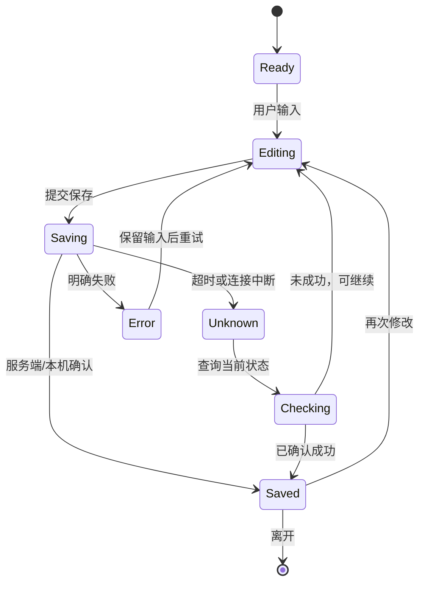
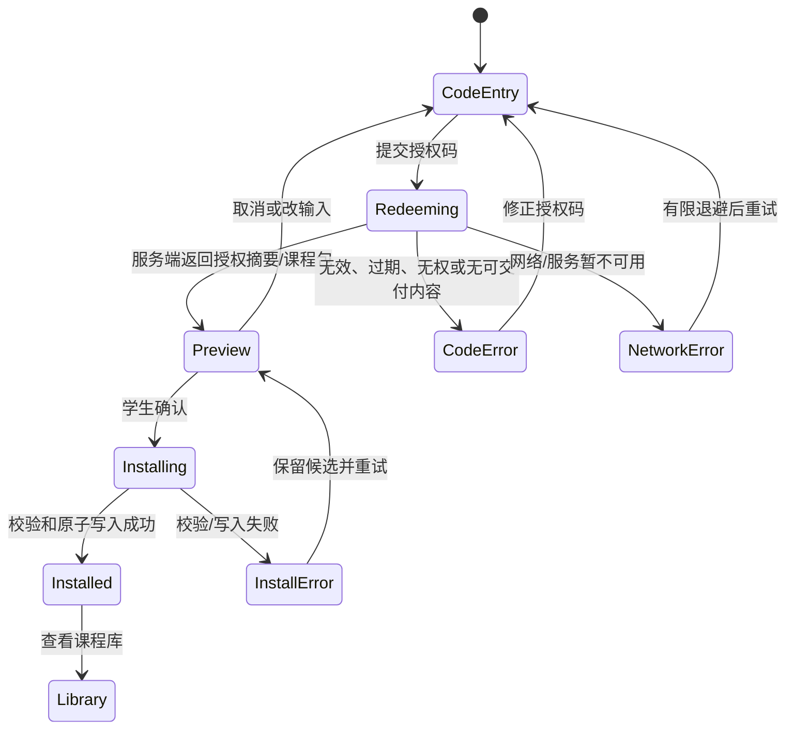

# 07 v1 产品交互与状态设计

文档版本：`1.1.0`

状态：已于 2026-08-22 通过人工审核；2026-08-24 按 `FR-LIB-014` 增补公开学生插件使用说明页及链接导航入口；2026-08-27 增补教师登录后课程总览及学生作答统计接口预留；按 `D-V1-018` 增补教师工作台课程版本操作和版本级授权码，不改变插件分发方式；2026-08-29 按 `D-V1-023` 记录学生陪伴形象后续候选，不改变当前 v1 交付范围

需求真源：[`../../requirements/v1/README.md`](../../requirements/v1/README.md)

前置设计：[`03-system-architecture.md`](03-system-architecture.md)、[`05-data-flow-lifecycle.md`](05-data-flow-lifecycle.md)、[`06-interface-contracts.md`](06-interface-contracts.md)

## 1. 目的与边界

本文件把已接受场景落为用户可理解、可恢复的交互流程，重点回答：

1. 每个角色从哪里开始，页面负责什么，不负责什么；
2. 教师如何从课程制作走到真实预览、发布和授权交付；
3. 学生输入授权码后先看到什么，何时确认，怎样进入课程；
4. 加载、保存、冲突、离线、宿主页面变化和失败时如何保持原状态。

本文件不冻结颜色、字体、组件库、逐像素布局或营销文案。视觉标准可以由当前设计参考承接，但不能改变这里
确定的角色边界、确认时机和状态含义。

## 2. 交互总原则

### 2.1 一个页面一个主要任务

页面必须有清晰的当前任务和下一步。销售页负责让目标老师提交试用申请；教师首页负责进入课程制作；学生
入口负责领取和打开课程。后台管理、课程编辑、预览、授权和运行时不能在同一页面互相抢夺主要操作。

### 2.2 事实状态与临时状态分开

界面分别标识：

- 已保存：服务端或本机已确认；
- 未保存：当前页面输入仍只在浏览器内；
- 已提交：请求已发出但最终结果未知；
- 已安装：课程包已经通过校验并写入本机；
- 可更新：服务端有新版本，但本机尚未替换；
- 不可用：当前操作依赖的服务、课程版本或宿主播放器无法安全使用。

“按钮点击过”不等于“保存完成”，“请求发出”不等于“课程已安装”。

### 2.3 高影响操作先说明再确认

发布、创建授权码、终止继续分发、归档课程、导入课程、删除本机课程、首次安装和更新，都必须在执行前
展示对象、版本、范围和影响。取消只取消当前候选动作，不清空之前已确认的数据。

### 2.4 失败要告诉用户下一步

错误显示至少包含：失败对象、当前状态、是否已保存、可以执行的动作。不要把请求超时显示成成功，也不要
把“暂时无法访问”显示成“课程已删除”。支持人员可用的 `requestId` 不应要求学生或老师复制敏感内容。

## 3. 页面与入口职责

| 入口 | 主要用户 | 主要任务 | 不负责 |
| --- | --- | --- | --- |
| 公开销售页 | 未登录目标老师 | 理解当前能力、打开批准的试用表单、获得人工入口 | 教师登录、课程编辑、读取申请正文 |
| 学生使用说明页 | 未登录学生 | 下载固定 ZIP、看图完成解压与 Chrome 手动安装、返回销售页 | 学生账号、课程兑换、读取本机课程库 |
| 管理员应用 | 平台管理员 | 创建/停用/恢复教师、受控支持和状态核对 | 代替教师编辑课程、查看教师密码、默认读取课程正文 |
| 教师应用 | 教师 | 管理自己的课程、课节、脚本、预览、发布和授权 | 学生本机学习、跨工作空间对象、远程删除学生课程 |
| 学生插件入口 | 学生 | 输入授权码、查看课程摘要、确认安装、查看本机课程 | 注册账号、进入教师工作台、选择服务端课程绕过授权 |
| B 站运行时 | 学生 | 选择匹配课节、按节点学习、保存本机状态 | 修改教师课程、上传回答、静默选择歧义课节 |

## 4. 通用交互状态机



所有领域动作都应映射到这组可理解状态；具体页面可以采用更短的文案，但不能省略状态事实。对于不可安全
查询的动作，界面显示“结果待确认”，提供 requestId/重试入口，而不是再次盲目提交。

## 5. 教师核心流程

### 5.1 登录与工作空间

1. 教师登录成功后自动进入自己的唯一工作空间；不显示工作空间选择、加入或切换入口。
2. 页面名称显示为“互动课程制作”，说明文字固定为“为视频课程增加互动能力，视频学习过程中加入互动环节，让学习更有趣，提升课程价值。”
3. 首页显示按“草稿 / 已发布 / 已归档”分组的课程列表。草稿卡片突出“继续制作”，课程标题区域也可点击，并进入与“修改课程”相同的课程修改页面。
   已发布课程版本同时展示已发布互动节点数、已发授权码数和已领取浏览器设备数；学生作答位置读取课程列表接口的
   `metrics.student_submission_count`。当前该字段为 `null`，位置显示为“当前未接入”，不得用领取数冒充学生作答数。
4. 会话失效时保留已经确认保存的课程数据，要求重新登录；未保存输入明确标记为临时，不能伪装成已保存。
5. 账号停用、网络不可用或服务故障时显示原因和恢复动作，不把课程列表空白显示成课程被删除。
6. 首页总览只展示服务端已确认的课程、发布和领取聚合；学生作答统计字段已在接口中预留但当前返回 `null`，学生回答与学习状态当前只保存在学生本机，不进入教师首页统计。

### 5.2 课程与课节制作

教师进入一门课程后，交互层保持课程、课节和脚本三个层次：

1. 课程页显示课程名称、状态和有序课节列表；课节使用稳定标识，允许同内容或同视频的多个独立课节。
2. 课节编辑页显示当前视频引用、字幕/时间依据、节点时间线和节点编辑区；未保存修改与服务端修订明显区分。
3. 新增、排序、编辑和删除课节或节点后，页面先更新临时状态，再提交明确保存操作；保存失败不覆盖最后一次确认版本。
4. 并发修订冲突显示“服务端已有更新”，保留本地输入供教师复制或重新合并，不静默以后写覆盖先写。
5. 视频链接、字幕文件或节点内容无效时，错误定位到具体输入；已有有效绑定和草稿保持不变。

节点属性弹窗中的窗口设置属于当前节点，而不是课程或播放器的全局设置。教师可以在预览下方选择窗口大小、
位置和卡片/文档样式；预览画布即时从同一份节点草稿读取这些值，同时显示结构化正文和已登记的节点媒体。
“预览确认”只确认当前界面状态，不提前保存服务端内容。

节点保存分两步完成：

```text
保存节点 -> 写入当前页面的 nodes 聚合并标记未保存
保存草稿 -> 以 lesson_id + revision 原子写入 v1_script_drafts
```

刷新、发布或离开页面前，只有第二步成功才算完成持久化。切换节点类型不会改变 `node.id`，也会保留已有
`presentationHints`；节点删除后不复用原 ID。

### 5.3 真实预览

1. 教师从明确的草稿修订启动预览，页面显示预览使用的课程、课节和修订提示。
2. 预览通过受信任会话绑定到插件运行时，使用学生实际的宿主页面和节点逻辑，但不写入学生课程库和学习记录；预览是制作辅助，不是当前发布前置条件。
3. 教师可以在真实视频中检查节点触发、反馈和继续播放；多个课节匹配同一视频时按学生端规则选择。
4. 返回教师应用后，页面显示“预览结束/仍在编辑”的当前状态；教师仍需明确点击“发布课程”，但当前不要求预览成功才能发布。
5. 预览绑定失效、视频不匹配或播放器不可信时停止运行并显示恢复入口，不留下旧窗口或继续控制错误视频。

### 5.4 发布

发布动作至少确认：课程名、将纳入的课节及顺序和发布后影响；当前只检查课程至少有一节课节，不要求先完成测试预览或互动草稿。

```text
编辑中 -> 课程有课节 -> 教师确认 -> 发布中 -> 已发布
       \-> 空课程
发布中 -> 结果待确认 -> 查询结果 -> 已发布 / 保持原状态
发布中 -> 明确失败 -> 返回编辑，原发布仍可用
```

发布成功后，课程卡片从草稿区移到已发布区并显示服务端确认的发布结果；不自动创建授权码。

课程详情页和教师工作台草稿卡片都提供“发布课程”入口；发布按钮在没有课节时禁用，服务端同时拒绝空课程发布。

已发布课程卡片与草稿卡片使用相同宽度和基本布局，底部固定提供“修改本版本”“增加版本”“授权码管理”三个操作：修改本版本明确提示原发布不保留；增加版本明确提示原发布保留并产生新草稿；授权码管理进入独立页面。版本事务、权限和幂等均由服务端完成。

### 5.5 创建与交付授权码

1. 教师从已发布课程卡片点击“授权码管理”；页面展示当前课程、已有授权码、状态和使用摘要。
2. 创建栏默认选中当前课程，可添加当前教师自己的其它已发布课程，并选择整门课程或指定课节。
3. 教师可单个生成，也可输入 1–100 的数量批量生成；接收人和备注可留空，并可在生成后补记。
4. 范围、时间和发布状态错误时留在当前页，不产生半个授权来源或半批记录。
5. 所属教师可在管理页查看并复制每条完整授权码；服务端不在数据库或普通日志保存明文，其他教师、管理员和学生不能通过管理接口读取。
6. 每条记录展示领取设备数、首次领取和最近领取时间，不展示本机标识摘要、学生本机学习状态或学生回答。
7. 列表支持复选框、全选和批量冻结/恢复/作废；批量作废前显示不可恢复和不删除记录的影响。
8. 授权记录明确显示对应 `course_id`；兑换/更新仍由服务端解析实际 `releaseId`。冻结或作废前显示对首次领取、
   重新下载和更新的影响。
9. 冻结可恢复，作废不可恢复；作废只改变服务端状态，不删除授权码、接收人、范围或领取历史。

## 6. 学生兑换与课程库流程

### 6.0 插件下载与手动安装

销售页的低优先级学生入口显示为“学生使用步骤”，不再直接触发 ZIP 下载。`link.html` 的本站正式入口也提供同名链接；两个入口都进入同站点的独立说明页，避免学生在没有安装上下文时只拿到一个压缩包。

说明页遵守以下结构：

1. 顶部明确只支持 PC Chrome，并同时提供“返回销售页”和固定 ZIP 下载入口；
2. 依次说明下载、解压到稳定目录、打开 `chrome://extensions/`、开启开发者模式、加载已解压扩展；
3. 解压和 Chrome 安装关键动作使用带说明文字的截图，截图有替代文本，图片无法加载时不影响文字流程；
4. 下载地址继续使用 `/downloads/student-plugin/knownmapplugin.zip`，不建立第二个插件分发入口；
5. 页面不要求登录、不执行课程兑换，也不读取插件或学生本机状态；
6. 页面底部再次提供下载入口和返回销售页入口，窄屏下按单列顺序展示。

这是 `D-V1-004` 固定 ZIP 手动分发决定的操作说明，不新增商店安装、自动升级、`.crx` 或移动端承诺。

### 6.1 首次进入

学生打开插件入口时，页面只要求完成当前机器的本机初始化和课程领取：

1. 显示“在此浏览器保存课程和学习状态”的本机说明；不要求注册、登录或填写真实身份。
2. 若本机已有课程，先显示课程库和“输入新授权码”入口，不因输入新码覆盖已有课程。
3. 若本机证明不可用或存储被清除，说明这是新的本机状态；不承诺换机恢复原学习记录。

### 6.2 输入授权码后的交互



服务端返回后，确认页面至少展示：

- 课程名称和课程数量；
- 每门课程的发布版本；
- 整门课程或指定课节/节点范围；
- 首次安装还是更新；
- 将保存到当前浏览器本机及可能覆盖的同课程版本；
- 当前授权不能得到的内容不列入“已取得”。

学生确认前不写入当前课程库。取消或修改授权码不删除已安装课程；安装失败保留旧版本和其它课程。

### 6.3 课程库与更新

课程库按课程名称、课节数量、当前发布版本、授权范围和本机学习状态摘要展示。当前同一课程的更新由服务端自动解析最新可交付版本；选择一门课程后，学生可以：

- 打开匹配视频并进入学习；
- 查看当前版本和本机状态；
- 检查同一课程的最新可交付版本；跨独立课程升级待后续升级关系能力提供；
- 明确删除本机课程及其学习状态。

升级确认页（后续能力）显示旧/新课程身份、课节顺序变化、范围变化和可迁移/不能迁移的本机状态。确认后再原子替换，
升级过程中不热切换已经进行的学习会话。

### 6.4 随插件提供的示例课程

插件首次读取课程库时原子写入一门固定的只读示例课程。它使用独立课程身份和 `example` 来源标记，不创建授权来源，
可以保存本机学习进度但不能被删除或更新。课程库明确显示“示例课”；如果同一 BVID 已有真实授权课程，运行时排除示例，
避免示例数据进入真实领取、完成或市场验证证据。授权码兑换仍走服务端课程包链路，用于验证真实交付，不把固定授权码写入插件。

## 7. 学生运行时流程

### 7.1 视频匹配

1. 插件识别当前受支持的 B 站页面和可信主播放器。
2. 用完整视频引用查找本机课程候选；无匹配时保持静默。
3. 只有一个候选时显示该课程/课节；多个候选时显示课程名、课节名和版本供学生选择。
4. 学生选择后，当前学习会话锁定课程、课节和 `releaseId`；页面刷新或播放器重建不自动改选另一个候选。
5. 没有选择、视频引用不完整或播放器不可信时不触发节点。

### 7.2 学习窗口和节点

节点到达时，运行时按统一状态处理：

```text
等待播放 -> 到达触发点 -> 暂停/显示学习窗口 -> 学生查看或作答
      ^                                  |
      |                                  v
      +-----------继续播放 <----- 完成/跳过/关闭/不支持
```

播放事实、窗口交互、正式提交和完成结果分别保存；窗口关闭、错误答案或只播放到结尾不能自动等同于完成。
同一节点在同一会话中只按契约触发一次；刷新、前后跳转和播放器重绑不得重复计入正式结果。

运行时只对可信主播放器执行所需的最小暂停/恢复。宿主页面改变、播放器消失或适配器无法确认状态时，关闭
学习窗口并显示可恢复提示，不继续控制旧页面。

### 7.3 离线和本机恢复

已安装课程可离线打开和写入本机学习状态。网络不可用时：

- 课程库和已安装课程仍可查看；
- 需要在线的兑换、更新或资格检查显示“暂不可用”；
- 本机状态写入失败时保留最后一个可确认状态，并说明是否可以重试；
- 不显示“已上传”“已同步”或“换机可恢复”等未提供的承诺。

## 8. 交互失败与恢复矩阵

| 场景 | 用户看到的事实 | 可执行动作 | 保留内容 |
| --- | --- | --- | --- |
| 登录/会话失效 | 需要重新登录；已保存数据仍在 | 重新登录 | 服务端已确认课程和草稿 |
| 保存超时 | 结果待确认 | 查询状态或稍后重试 | 最后已确认版本与本地临时输入 |
| 草稿冲突 | 服务端有更新 | 查看并合并 | 双方原始修订，不自动覆盖 |
| 发布校验失败 | 指出具体课程/课节问题 | 返回编辑修正 | 原草稿和原发布 |
| 授权码无效/过期 | 未取得课程内容 | 修正授权码或联系教师 | 原有本机课程 |
| 兑换网络失败 | 尚未确认是否成功 | 有限退避重试/查询 | 原有本机课程 |
| 课程包校验失败 | 本次安装未完成 | 重新下载或联系支持 | 旧课程和其它课程 |
| 本机写入失败 | 未安装/未更新 | 检查空间、恢复点后重试 | 最近有效课程与状态 |
| 多课节匹配未选择 | 等待学生选择 | 选择课程/课节或关闭 | 当前会话未启动 |
| B 站播放器不可用 | 当前视频暂不能运行互动 | 刷新/重新打开受支持页面 | 本机课程和学习状态 |
| 授权失效但课程已安装 | 在线更新/下载不可用 | 继续使用本机课程或联系教师 | 已安装课程和本机状态 |
| 授权码已达到 20 个浏览器标识 | 当前浏览器未登记，未取得课程内容 | 回到已登记浏览器，或联系教师重新申请授权码 | 已登记浏览器和已有课程 |

## 9. 交互边界与未来候选

当前 v1 不在交互中承诺：学生账号、跨设备同步、教师在线学习报表、AI 反馈、学生学习证据导出、通用移动
端入口、视频文件托管或后台自动安装更新。课程族、课程升级关系、旧授权码默认取得新课程和跨课程版本更新虽已确认方向，
本次只记录不开发；后续进入范围时必须新增角色目标、数据边界和恢复路径，不能只在当前页面追加按钮。

教师课程配置导入/导出属于已接受但低于核心运行闭环的能力：导入一定先预览和确认，创建新草稿，不覆盖原课程、
不自动发布、不创建授权。学生课程本地文件则继续按后续候选处理，不在当前核心交互中伪装成跨设备恢复。

### 9.1 学生陪伴形象与角色声音（后续阶段）

学生陪伴形象沿用 `FR-LIB-015` 的后续阶段定位。第一版交互候选采用 A1：头像固定在 B 站视频右下角，不遮挡播放、进度、音量和全屏控制；提示节点出现时头像轻微弹跳并显示气泡。

一个角色必须按资源包理解，而不是一张静态头像。当前小猫资源包预留六个状态：

| 状态 | 触发 | 视觉 | 声音 |
| --- | --- | --- | --- |
| `focus` | 进入匹配视频 | 小猫集中注意 | 播放一次短促小猫注意声 |
| `idle` | 等待或正常播放 | 安静陪伴、眨眼 | 默认静音 |
| `prompt` | 提示节点打开 | 小猫提醒姿态 + 气泡 | 播放一次小猫提示声 |
| `correct` | 学生答对 | 开心姿态 | 播放一次小猫鼓励声 |
| `wrong` | 学生答错 | 温和陪伴姿态 | 播放一次柔和小猫声 |
| `complete` | 节点真正完成 | 庆祝姿态，叠加一条小鱼干奖励和短暂庆祝装饰 | 播放一次小猫庆祝声 |

`correct` 和 `complete` 不合并：前者是答题判定反馈，后者是节点生命周期完成反馈。声音失败时回退为静音，图像失败时回退到基础/默认图，均不能阻断答题、完成记录或视频继续播放。全局关闭声音后保留图像、气泡和状态动画。

节点最后成功完成时，完成态额外显示一条小鱼干奖励，并在气泡层显示一次固定提示：**“感谢你让我又吃到了一条小鱼。”**。小鱼干作为独立透明叠加资源，不写死在小猫主图里；提示气泡自动隐藏，不能因重复渲染或重复完成事件反复出现。

第一版先完成当前样式的一只原创小猫，不提前实现波斯猫、黑猫、英短等多猫种目录。未来可以把整套状态图与声音替换成新的猫包，并增加毛色、肤色、发色等外观变体；升级前必须回看 `D-V1-023`，重新确认这些构想是否仍属于本次升级范围。

### 9.2 公开试用申请的品牌呈现

公开试用申请继续使用飞书公开表单，不在销售页自建提交后端。销售页只负责展示真实公开 URL、入口按钮和
人工跟进说明；问题字段、收集结果和表单外观以飞书云端状态为准。

当前公开表单使用传统表单、居中嵌套布局和“午后”主题，标题为“用一节真实课，试用 KnownMap”。表单说明
必须明确约 2 分钟、无需重新录制、提交后人工联系、不会自动创建账号，并说明首次配置可以协助完成。题目按
称呼、联系方式、视频状态、B 站链接、字幕状态、教学问题、未来自适应方向的顺序展开；未来方向题必须标为
选填，且不得让填写者误以为本次试用已经包含该能力。

品牌背景源文件保存为 `v1/site/assets/trial-intake-background-v1.png`。背景只承担品牌氛围，不承载文案，
中央区域必须保持低对比度，确保飞书表单卡片和正文在桌面端、窄屏裁切后仍可读。

销售页入口固定为“在线填写试用申请”，辅助说明为“无需登录飞书 · 提交后由我人工联系。”。入口打开表单
不等于申请成功，只有飞书确认提交成功且运营端收到记录后，才进入人工联系流程。

## 10. 需求与旧资料承接

### 10.1 冻结需求承接

本文件主要承接：

- `SCN-PUB-*`、`SCN-ADM-*`、`SCN-TCH-*`、`SCN-STU-*` 和 `SCN-ERR-*` 的主流程与异常分支；
- `FR-AUTH-*`、`FR-COURSE-*`、`FR-AUTHOR-*`、`FR-PUBLISH-*`、`FR-GRANT-*`、`FR-LIB-*`、
  `FR-RUNTIME-*`、`FR-LEARN-*`、`FR-PORT-*`；
- `INT-EXT-*`、`INT-PACKAGE-*`、`INT-BILI-*` 和本机数据边界。

### 10.2 旧资料承接

| 来源 | 吸收内容 | 不继承内容 |
| --- | --- | --- |
| `SRC-037`、`SRC-043`、`SRC-044` | 学习窗口生命周期、节点交互语义和真实老师/学生闭环 | 课程习题本、AI 问答、复杂报告和跨 App 扩展 |
| `SRC-047`、`SRC-048`、`SRC-049` | 时间线编辑、异步状态、失败保留、授权码一次显示经验 | 原型页面信息架构、固定课程和旧授权分类 |
| `SRC-061`、`SRC-071`、`SRC-072`、`SRC-074` | 浏览器验证的登录、保存、发布、授权和失败恢复证据 | 本地拦截响应、固定测试账号和未完成的真实闭环声明 |
| `SRC-040`、`SRC-041`、`SRC-057`、`SRC-069` | 销售页、飞书表单和人工接入的真实边界 | 把页面打开或自动化检查等同于正式开户/申请成功 |

完整来源去向以 [`02-legacy-document-register.md`](02-legacy-document-register.md) 为准。

## 11. 本文件完成条件

本文件通过人工审核前，至少应确认：

1. 每个入口只有明确的主要职责，未来候选没有伪装成当前能力；
2. 教师发布/授权、学生兑换/安装、运行时选择和更新确认的状态可由页面直接表达；
3. 高影响操作都有影响说明和确认，取消/失败不会清空此前有效数据；
4. 加载、超时、冲突、离线、播放器变化和多课节歧义都有可执行恢复动作；
5. 交互状态与 05 数据流、06 接口契约和 08 安全边界一致；
6. `SRC-*` 承接与 02 的登记一致，且没有把旧视觉建议重新提升为产品需求。

通过后，下一份文档为 [`08-security-operations-design.md`](08-security-operations-design.md)，冻结权限、秘密、
输入、日志、发布、备份和恢复的工程边界。
