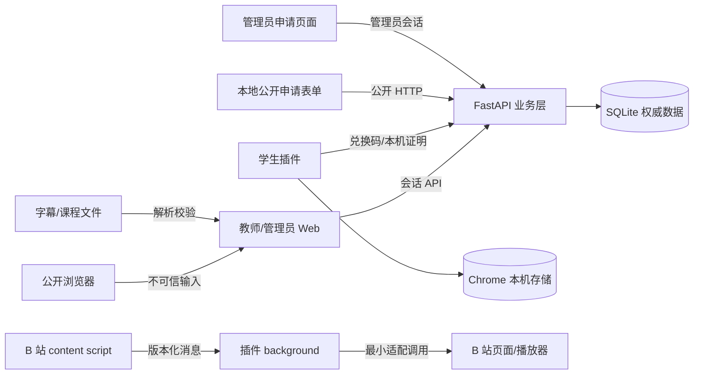

# 08 v1 安全与运维设计

文档版本：`1.3.0`

状态：已于 2026-08-22 通过人工审核；2026-08-27 按 `D-V1-018` 增补独立课程版本和版本级授权的安全边界；2026-09-01 按 `D-V1-027` 增补本地公开申请接口保护；2026-09-01 按 `D-V1-028` 增补埋点与技术日志边界；本文件把四类安全底线和第一阶段运行门禁落为最小可执行设计，不建设企业级安全平台

需求真源：[`../../requirements/v1/README.md`](../../requirements/v1/README.md)

前置设计：[`03-system-architecture.md`](03-system-architecture.md)、[`04-domain-data-model.md`](04-domain-data-model.md)、[`05-data-flow-lifecycle.md`](05-data-flow-lifecycle.md)、[`06-interface-contracts.md`](06-interface-contracts.md)

## 1. 目的与安全范围

第一阶段是测试原型和小规模业务闭环。安全设计只守住四条底线：

1. 管理员、教师、学生和不同教师工作空间不能互相越权；
2. 密码、会话、授权码和系统密钥不能通过普通查询、日志、导出或课程包泄露；
3. 网页消息、课程包、字幕和课程文件不能执行非预期行为或破坏最后有效数据；
4. 学生课程和学习状态保持当前机器边界，公开试用联系方式只按明确用途最小处理。

本文件同时规定 v1 测试及小规模交付的最低运维保护：安全配置、确定版本发布、健康检查、备份、恢复和故障
处置。它不承诺企业级合规认证、集中安全事件平台、复杂风控、多节点容灾、学生云同步或规模化滥用防护。

## 2. 信任边界与主要误用



默认不信任：浏览器表单、公开申请请求、URL 参数、页面消息、content script、网络响应、课程包、字幕文本、导入文件、旧本机
存储和公开申请请求。可信来源只包括服务端已验证会话、服务端数据库事务、已签名/摘要校验的发布构建和插件
后台的本机写入边界；“来自自己的前端”不是安全证明。

最小误用模型：

| 误用 | 目标 | 首要阻断点 |
| --- | --- | --- |
| 篡改角色、工作空间或对象 ID | 越权读取/写入教师数据 | 服务端会话和归属校验 |
| 猜测或重放授权码 | 越范围取得课程 | 不可预测码、摘要比较、窗口/范围校验、限速 |
| 窃取会话或本机证明 | 冒用管理员、教师或机器资格 | Cookie/证明不入日志，退出/停用失效 |
| 伪造插件消息 | 任意联网或覆盖本机课程 | background 白名单、版本、来源、配对校验 |
| 注入课程包/文件脚本 | 执行代码、路径越界或破坏数据 | 封闭 Schema、大小/结构校验、原子写入 |
| 调试或排障读取学生数据 | 隐私越界 | 单机边界、最小日志、支持权限隔离 |
| 部署错误版本或错误环境 | 版本混用、数据损坏 | 精确提交、候选验证、恢复点和回退 |

## 3. 身份、会话与工作空间访问

### 3.1 管理员和教师认证

- 管理员和教师使用独立入口、会话命名空间和服务端角色判定；客户端提交的 `role`、`teacherId` 或
  `workspaceId` 永远只是输入，不是授权依据。
- 密码使用成熟的不可逆密码验证算法保存；当前实现继续使用 Argon2 系列，具体参数由部署配置和升级记录管理，
  不把参数硬编码到课程或导出文件。
- 管理员可在已登录的管理界面提交当前密码、新密码和确认密码；服务端验证当前密码后更新 Argon2 哈希、递增凭据版本，
  并使该管理员的全部现有会话失效，页面提示使用新密码重新登录。
- 登录、重置、停用、恢复和退出均是明确动作；停用或密码重置会使受影响的旧会话失效，但不删除教师课程、
  发布或授权业务数据。
- 错误响应不区分“账号不存在”和“密码错误”到足以枚举账号；登录失败使用受控退避/限速，数值由后续真实
  基线确定，不在设计阶段虚构容量门槛。

### 3.2 会话

- 会话凭证由服务端生成，服务端只保存不可直接使用的安全验证值或等价安全表示；会话具有明确创建、过期、
  退出和撤销状态。
- 浏览器会话使用仅服务端可读、受安全传输保护、明确 SameSite 策略的 Cookie；不把会话放入 URL、课程包、
  普通页面正文、localStorage 导出或普通日志。
- 受保护 API 每次从服务端会话重新读取角色、教师和工作空间；会话失效时保留已确认业务数据并返回可恢复错误。
- 诊断只记录会话结果、角色类别和 `requestId`，不记录 Cookie、令牌或原始认证输入。

### 3.3 工作空间归属

所有课程、课节、草稿、发布、授权、课程文件和教师导出都先按当前会话确定工作空间，再校验目标对象归属。
归属无法确认时拒绝整个操作，不返回对象正文、不创建跨空间引用、不以“对象不存在”差异泄露其它工作空间的存在性。

管理员仅访问履行账号管理、最小支持和运维职责所需的摘要。需要读取课程正文或执行恢复时必须有单独授权、固定
范围和操作审计；管理员身份不自动获得教师编辑权限。

### 3.4 学生本机证明

学生不注册服务端账号。插件第一次运行生成：

- `localIdentityId`：用于建立 `Redemption` 关系的随机标识；
- `localProof`：仅保存在当前插件本机、用于后续免输授权码更新的高强度秘密。

服务端只保存 `localProof` 的不可反推摘要；普通日志、课程包、页面消息和学生可见界面不显示它。兑换码建立
关系时同时校验授权码和本机证明的格式；后续更新只接受本机证明，不接受普通 ID 单独恢复资格。证明丢失、扩展
存储被清除或换机时，建立新的本机状态，学生需要重新输入仍可领取的授权码。

这不是学生账号或跨设备身份系统；它只解决当前浏览器配置内的后续下载/更新证明问题。

## 4. 秘密、凭证与配置

### 4.1 分类

| 分类 | 示例 | 存储/传输规则 |
| --- | --- | --- |
| secret input | 密码、授权码原文、本机证明 | 只在必要请求/设置期间存在；不写普通日志、数据库正文或导出 |
| verification value | 密码验证值、授权码摘要、本机证明摘要、会话验证值 | 使用适合用途的不可逆/安全比较表示；按独立密钥和字段保护 |
| deployment secret | 授权码 HMAC 密钥、会话密钥、数据库凭证、部署令牌 | 环境或受限秘密注入；不进代码、Git、课程包、构建产物或备份公开目录 |
| public metadata | 授权尾号、版本、请求 ID、固定错误码 | 只暴露完成当前职责所需的最小字段 |

### 4.2 授权码

- 授权码使用高熵随机值，原文只在教师创建成功结果中显示一次以及学生输入请求的短暂生命周期内存在。
- 服务端使用持久、可轮换且与数据库分离的验证密钥计算不可反推摘要；密钥缺失或变更导致历史授权无法安全验证时，
  服务启动/授权操作必须明确失败，不自动生成临时新密钥掩盖问题。
- 查询接口只返回尾号、范围、窗口和状态；课程包、日志、导出和错误响应不包含授权码原文或摘要。
- 创建、终止和领取的审计只记录来源 ID、动作、结果、时间和安全关联字段。
- 教师侧接收人和备注属于受保护的管理元数据，只返回给该授权码所属教师；不进入学生兑换响应、课程包、
  本机标识或普通日志。
- 冻结、恢复、作废和批量状态操作必须重新校验教师归属，并记录固定动作、目标 ID、数量、结果和 `requestId`；
  批量作废不可恢复，但不物理删除授权记录或领取事实。

### 4.3 配置和密钥门禁

- 开发、测试和生产使用明确环境配置模板；仓库只保留无真实秘密的样例。
- 服务启动时检查必需密钥、数据库地址、来源白名单、Cookie 安全配置和运行环境；缺失、空值、弱默认值或环境
  不一致时在产生业务副作用前停止。
- 密钥轮换必须先确认旧数据的验证/迁移策略，并留下版本化操作记录；不能在重启时无条件随机替换导致全部历史
  授权失效。
- 真实账号、联系方式、授权码、数据库和生产配置不进入自动化测试固定项、截图、示例课程或 Git。

## 5. 不可信输入与数据完整性

### 5.1 统一输入管线

所有外部输入按以下顺序处理：

```text
接收 -> 解析边界/大小 -> Schema/类型 -> 业务归属/范围 -> 交叉引用/版本
     -> 内容安全展示 -> 生成影响摘要 -> 原子写入
```

任一必要步骤失败，拒绝整个输入，不执行其中脚本、不解析为路径、不写入部分对象，也不使用猜测默认值继续。

### 5.2 课程包、字幕和课程文件

- 课程包和教师课程文件只接受声明版本、封闭字段、允许节点类型、稳定身份、显式顺序和受支持视频引用。
- 字段中的文本按数据展示；不作为 HTML、JavaScript、模板、Shell 命令、SQL、文件路径或动态 import 执行。
- 字幕解析限制文件大小、编码、句数和时间戳，真实错误返回具体问题；解析失败不覆盖已有草稿。
- 课程包安装、更新、课程导入均使用 staging → 完整校验 → 学生/教师确认 → 原子提交；失败清理未提交候选，保留
  最近有效版本和其它课程。
- 课程包中的独立 `courseId`、`releaseId`、课节顺序、节点身份和视频引用必须互相一致；不能由客户端自行指定课程 ID
  扩大授权范围，也不能把一个版本的授权改指向同名或其它版本。

### 5.3 插件消息和响应

background 只处理已知 `operation`、协议版本、消息来源、`messageId` 配对和允许载荷。空响应、非对象、旧上下文、
未知操作、重复消息、超时或畸形网络结果都走统一可恢复失败；不能先读取未验证响应字段，也不能将消息数据当作
任意存储指令或 URL。

## 6. 隐私、本机数据与日志

### 6.1 学生单机边界

- 学生课程包、继续位置、回答草稿、正式尝试、节点结果和进度只保存在当前 Chrome 配置的本机存储。
- 领取/更新只发送完成授权所需的本机标识、证明和课程意图；服务端按 `course_id` 解析最新可交付版本；不发送完整字幕、课程运行状态、学生回答或学习
  进度。
- 教师预览使用临时绑定和独立本机状态，不写入学生课程库或生成学生学习记录。
- 服务端授权失效不远程删除已安装课程；本机删除是学生明确操作，并只影响当前机器。

### 6.2 公开试用联系方式

销售页说明收集用途、必填/可选字段和人工联系入口。KnownMap FastAPI + SQLite 是申请正文真源；申请正文只向获准
管理员开放，不进入普通日志、课程正文或学生数据，不因提交申请自动创建教师账号。

公开接口采用字段白名单、大小限制、HTTPS、限流和轻量隐藏字段防刷。限流/防刷只保护接口，不产生或修改申请事实；
被拦截的请求不显示成功。B 站课程链接可选，填写时只做 `bilibili.com`/`b23.tv` 简单格式校验，不请求或抓取 B 站内容。

### 6.3 日志和错误证据

关键动作记录固定字段：`requestId`、动作类型、对象类型/安全 ID、成功/失败、固定原因码、版本和必要耗时。禁止
记录密码、Cookie、授权码、本机证明、系统密钥、完整课程正文、字幕、学生回答或学习状态。

日志级别默认最小；临时提高诊断级别必须有范围和恢复方式。无法安全脱敏时不记录原文。发现秘密或学生数据进入日志、
测试产物或仓库时，立即停止继续分发，清理暴露位置并按秘密类别轮换或更换数据。

### 6.4 产品埋点与技术日志

产品分析事件和技术诊断日志是两个独立的数据流：

| 数据流 | 真源 | 允许字段 | 去向 | 失败处理 |
| --- | --- | --- | --- | --- |
| 产品分析事件 | 版本化 analytics Schema 与事件注册表 | 稳定事件名、版本、非个人化对象 ID、低基数枚举、结果摘要和耗时 | 老师 Web 的 Umami 或测试 Mock | 校验/发送失败只记录受控诊断日志，不影响业务 |
| 技术诊断日志 | 现有 `structlog` 动作封装 | `timestamp`、`level`、`module`、`action`、`event`、`request_id`、耗时、错误类型和脱敏摘要 | 标准输出/受控日志采集 | 失败动作保留可检索关联，不记录原始敏感输入 |

同一 API 动作可以同时产生两类记录：前端在真实路径结果明确后发产品事件，后端在动作边界记录结构化日志。二者可用内部
`event_id`/`request_id` 关联，但 `request_id`、`event_id`、会话标识和其它高基数字段不作为 Umami 分析维度。
Umami 适配器默认关闭自动 pageview、自动交互追踪和身份识别；学生插件、B 站 content script 和学生本机学习状态不进入
Umami 或 Session Replay。

产品事件只记录“发生了什么产品路径/结果”，不能成为课程、发布、授权或学习状态的业务真源；技术日志只记录“请求/任务由何处
以什么原因失败”，不能复制课程正文、字幕、学生回答或学习状态。Umami 暂不可用时，产品主流程必须继续，适配器只写
`analytics.adapter.failure` 及适配器、错误类型、耗时和安全关联字段。

## 7. 发布、依赖和供应链

### 7.1 发布门禁

发布候选必须来自已推送且可识别的唯一提交；Web、API、数据库迁移、课程包 Schema 和插件构建使用同一契约版本。
候选构建先在独立位置完成依赖安装、配置检查、契约检查、自动化测试和必要手工验证，再切换对外版本。

发布记录至少保留：提交 ID、构建时间、组件版本、依赖锁定摘要、产物摘要、目标环境、执行者、验证结果和回退目标。
固定 ZIP、插件产物、Web 资源和部署清单的 SHA-256 只用于完整性与版本追溯，不被误当作授权秘密。

### 7.2 依赖和仓库

- 依赖保持最小、锁定和可追溯，新增/升级前检查实际用途、来源、许可证和适用漏洞；无法处置的高风险依赖不进入候选。
- 仓库秘密扫描、课程包禁入字段扫描、依赖锁定检查和契约版本检查属于提交/发布门禁。
- 构建脚本不读取学生本机存储、生产数据库或未批准的外部 API；发布产物不携带 `.env`、调试 dump 或临时课程文件。
- Chrome 插件 v1 继续使用固定 ZIP、精确提交和手动更新；商店签名、自动升级和远程卸载留待规模化后独立决策。

## 8. 备份、恢复与故障处置

### 8.1 环境与权限

v1 测试及小规模交付目标为 knownmap.com、阿里云 ECS、Nginx、FastAPI 和 SQLite。公网只开放必要的 HTTPS 入口；
数据库、备份目录、内部管理端口、调试入口和运行密钥不公开。运行进程、发布账号、数据库账号和备份访问各自使用
完成职责所需的最小权限。

### 8.2 服务端恢复点

数据库迁移、大范围配置变化、发布和恢复前建立带时间、来源版本、范围、完整性结果和访问权限的服务端恢复点。
恢复点只覆盖服务端账号、工作空间、课程、草稿、发布、授权和审计等权威数据；不把学生本机课程和学习状态上传到
平台备份。

迁移先在脱敏或受控代表性副本演练，核对对象数量、工作空间归属、课程/发布/授权引用、重复执行和中断恢复；正式
执行前若范围、规则、不可迁移数据处置或验证结果不清，停止风险变更。

### 8.3 健康检查

健康检查分层显示：当前发布版本、进程可达、数据库可用、契约版本可识别、关键只读探针和公开试用入口状态。对外
响应只返回健康结论和版本关联，不暴露路径、SQL、秘密、课程正文或学生本机数据；无法确认时显示未知。

### 8.4 故障处理

确认核心故障后：

1. 停止继续发布、迁移或高风险写入；
2. 记录版本、时间、影响范围、脱敏日志关联和当前恢复点；
3. 使用已验证回退或恢复路径，不叠加未经验证的猜测性修复；
4. 验证账号、课程、发布、授权和关键领取/安装路径的一致性；
5. 记录处置结果、未恢复项和后续重开条件。

学生已安装课程、教师已确认草稿和不受影响工作空间不能因恢复一个对象而被清空或降级。

## 9. 安全与运维验收矩阵

| 边界 | 最低验收证据 |
| --- | --- |
| 角色/工作空间 | 管理员、教师、无会话、两个教师和篡改对象 ID 的交叉读写/发布/授权测试 |
| 秘密 | 密码、会话、授权码、本机证明、系统密钥在数据库、日志、导出、课程包和仓库中的禁入扫描 |
| 不可信输入 | 畸形/超大/未知版本/越界引用/脚本化文本/损坏包的全量拒绝和原子性测试 |
| 本机隐私 | 领取、预览、学习、更新、错误和支持路径的网络请求检查；确认无学习正文上传 |
| 发布供应链 | 精确提交、锁定依赖、构建摘要、契约版本、配置检查和错误版本拒绝 |
| 备份恢复 | 代表性副本迁移、隔离恢复、对象归属对账、中断恢复和原生产不变证据 |
| 故障处置 | 发布中断、数据库不可用、本地公开申请失败、B 站失配和插件更新失败的可见状态与恢复记录 |
| 埋点与日志 | 产品事件/技术日志分层、`request_id` 关联、适配器降级和敏感字段禁入测试 |

没有真实证据的项目记录为“未验证”，不能用“代码路径存在”“测试通过”或“健康接口返回 200”替代完整安全结论。

## 10. 需求与旧资料承接

### 10.1 冻结需求承接

本文件主要承接 `SEC-ACCESS-*`、`SEC-SECRET-*`、`SEC-TRUST-*`、`SEC-PRIV-*`、`OPS-ENV-*`、
`OPS-RELEASE-*`、`OPS-DATA-*`、`OPS-HEALTH-*`、`OPS-INCIDENT-*`，并回链 `DEV-DEP-*`、`DEV-LOG-*`、
`DEV-DOC-*`、`FR-GRANT-*`、`FR-LIB-*`、`INT-PACKAGE-*` 和 `DATA-LIFE-*`。

### 10.2 旧资料承接

| 来源 | 吸收内容 | 不继承内容 |
| --- | --- | --- |
| `SRC-025`、`SRC-028`、`SRC-030` | 授权、日志、精确提交、不可变目录、哈希、原子切换和回滚经验 | 当前发布集和生产版本直接等同 v1 已发布 |
| `SRC-031`、`SRC-032`、`SRC-033`、`SRC-063` | release JSON 禁入字段、ECS/Nginx/systemd/SQLite、固定 ZIP 和部署记录 | 旧路径、14 天保留和手工命令直接成为永久承诺 |
| `SRC-048`、`SRC-049`、`SRC-061` | 凭证清理、异步失败、授权码一次显示、查询不返原文和真实页面安全经验 | 测试账号、页面拦截和原型完成声明 |
| `SRC-056`、`SRC-071`、`SRC-072` | 消息桥校验、日志脱敏、浏览器失败和人工验证方法 | 未执行的公网安全/Chrome 结论 |

完整来源去向以 [`02-legacy-document-register.md`](02-legacy-document-register.md) 为准。

## 11. 本文件完成条件

本文件通过人工审核前，至少应确认：

1. 四类安全底线和五类运维门禁都有明确保护对象、信任边界、失败处置和验收证据；
2. 本机证明、授权码、会话和系统密钥的生命周期与 04–06 一致，且没有秘密进入日志、课程包或导出；
3. 不可信输入、原子写入、版本发布、备份恢复和故障处置可以转成开发/测试检查项；
4. 第一阶段的范围仍然是安全可用的小规模闭环，没有借安全名义引入复杂平台或云端学生数据；
5. `SRC-*` 承接与 02 登记一致。

通过后，下一份文档为 [`09-migration-cutover-design.md`](09-migration-cutover-design.md)，冻结旧数据保留、迁移、
切换、回滚和旧入口退役。
