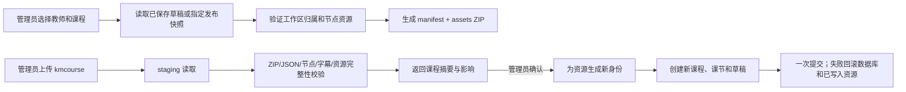

# 12 课程包格式与管理员导入导出设计

文档版本：`1.0.0`

状态：已接受，当前实现范围为管理员代目标教师导入/导出；教师类型能力策略预留，不在本阶段新增教师类型字段。

需求依据：`FR-PORT-001` 至 `FR-PORT-005`、`FR-ADMIN-001`、`FR-ADMIN-003`、`FR-ADMIN-006`、`DATA-PORT-002`、`DATA-PORT-003`、`INT-FILE-002`。

## 1. 目的与边界

课程包是给教师工作区迁移和管理员受控恢复使用的可携带文件，不是学生插件的课程交付包，也不是数据库备份。
文件扩展名为 `.kmcourse`，底层为 ZIP。当前管理员端可以选择目标教师后导出该教师的课程，或把课程包导入为该教师工作区中的新课程草稿。

课程包的媒体边界必须保持清晰：

| 内容 | 是否进入课程包 | 说明 |
| --- | --- | --- |
| 课程主视频 | 否 | 课程课节使用的 B 站视频，只保存 `platform`、BVID、`page`、`cid` 等引用；不下载、不代理、不重新托管 |
| 节点讲解视频 | 是 | 作为节点辅助资料保存到 `assets/`，并由节点正文引用 |
| 节点图片 | 是 | 作为节点辅助资料保存到 `assets/`，并由节点正文引用 |
| 节点音频 | 是 | 作为节点辅助资料保存到 `assets/`，并由节点正文引用 |
| 节点文字 | 是 | 保存为结构化节点 `content`、`interactionData`、`presentationHints` 等 JSON |
| 教师已保存字幕 | 是 | 按课节保存文件名、格式和完整文本；未保存页面输入不进入文件 |
| 学生回答、进度、授权码、会话和密码 | 否 | 属于其它边界，不能借课程包转移 |

## 2. ZIP 布局

```text
example.kmcourse
├── manifest.json
└── assets/
    ├── <portableAssetId-1>.bin
    └── <portableAssetId-2>.bin
```

规则：

1. ZIP 必须包含且只能包含一个 `manifest.json` 和 manifest 声明的 `assets/*.bin` 文件；禁止目录穿越、绝对路径、符号链接和未声明文件。
2. `manifest.json` 使用 UTF-8 JSON，顶层字段封闭，`schemaVersion` 为 `2`，`fileType` 为 `knownmap-course-package`。
3. `portableAssetId` 只在文件内部作为资源引用，导入时必须映射成目标教师工作区新生成的 `assetId`，不能直接成为数据库主键。
4. 每个二进制资源都必须按 manifest 的 MIME、字节数和 SHA-256 校验；任何资源缺失、超限或校验不一致都拒绝整个导入。
5. 当前实现沿用服务端节点资源限制：单个节点资源不超过配置的媒体上限；整个课程包和资源数量也有独立上限，超过即拒绝。

## 3. `manifest.json` 契约

顶层结构如下，未列字段不得出现：

```json
{
  "schemaVersion": 2,
  "fileType": "knownmap-course-package",
  "source": {
    "type": "draft",
    "courseId": "source-course-id",
    "releaseId": null,
    "releaseNumber": null
  },
  "course": {
    "title": "课程标题",
    "description": "课程说明",
    "lessons": [
      {
        "lessonId": "source-lesson-id",
        "sequence": 1,
        "title": "第一课",
        "videoRef": {
          "platform": "bilibili",
          "videoId": "BVxxxxxxxxxx",
          "page": 1,
          "cid": "123456"
        },
        "nodes": [],
        "assets": [],
        "subtitle": null
      }
    ]
  },
  "assets": [
    {
      "assetId": "portable-asset-id",
      "kind": "image",
      "mimeType": "image/png",
      "byteSize": 1234,
      "sha256": "64 位十六进制摘要",
      "sourceType": "uploaded",
      "path": "assets/portable-asset-id.bin"
    }
  ]
}
```

`course.lessons[*]` 的节点和字幕字段沿用教师草稿的已验证结构；`assets` 是对应课节使用的资源清单，节点正文中的
`assetId` / `posterAssetId` 必须能在该课节清单中找到。顶层 `assets` 是所有课节资源的去重清单，除 `path` 外使用与草稿资源相同的元数据字段。

`source` 只作来源提示和审计摘要，不作为目标身份、权限证明或导入后的版本关系。导入不复制发布历史，不创建授权，不把新课程标记为已发布。

## 4. 生成、预览与导入流程



导出失败不得返回删减后的“成功文件”；导入预览只读，不创建课程或资源。确认导入后，原课程、发布版本和授权不变。
导入后的节点 ID、资源 ID、课程 ID、课节 ID 都必须是新的平台身份；课程标题相同也不能覆盖原课程。

## 5. 权限与管理员界面

本阶段新增的是一个显式的管理员课程包管理区：管理员先选择目标教师，再查看该教师的课程摘要和发布版本摘要，最后执行下载或上传导入。
管理员课程包操作只允许 `require_admin` 会话，目标教师由服务端按 ID 查找并校验工作区归属；管理员 Cookie 不能被教师端点接受。

导出、导入预览和确认导入均写入操作审计，审计只记录管理员、目标教师、课程/新课程、来源类型、文件摘要、结果和 requestId，不记录完整课程正文、媒体内容、密码或授权码。

当前不新增 `teacher_type` 列，也不开放教师自助课程包入口。后续增加不同教师类型时，只需在服务端策略层把“课程包导入/导出”映射到可信的教师能力集合；前端按钮只能由服务端返回的能力决定，不能由浏览器自行声明权限。

## 6. 兼容与安全验收

- 学生交付包版本和本课程包版本独立演进，不能把 `.kmcourse` 直接发送给插件安装。
- B 站主视频在导出文件中只有引用，不存在 `assets/` 二进制，也不能由导入流程把它变成服务端托管视频。
- 节点图片、音频、辅助视频和文字在导出后重新导入，节点引用仍能解析，资源摘要与二进制一致。
- ZIP Slip、重复文件、未知字段、未知主版本、未声明资源、缺失资源、摘要不一致和内容超限均在写入前拒绝。
- 任一校验、资源写入或数据库写入失败，目标工作区不出现半门课程，已存在课程、发布和授权保持不变。
- 同一课程包重复导入得到独立的新草稿；导出未保存页面修改，导入不自动发布、不生成授权。
