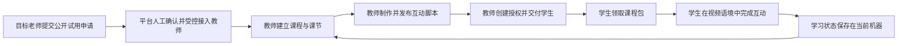

# 03 用户场景

文档版本：`1.0.2`

状态：全文已通过人工审核；2026-08-22 按 `D-V1-010` 修订课节内容重复与同视频多课节场景并重新冻结

上级索引：[`README.md`](README.md)

前置文档：[`01-product-scope.md`](01-product-scope.md)、[`02-domain-glossary.md`](02-domain-glossary.md)

## 1. 场景写法与总流程

用户场景描述角色为了什么目标，在什么条件下完成什么业务流程，以及用户能够观察到什么结果。场景不指定
页面布局、按钮名称、API 路径、数据库表或技术框架。后续功能需求必须引用稳定的 `SCN-*` 编号。

每个场景至少包含：主要角色、目标、前置条件、触发、主流程、异常分支和可观察结果。只写正常流程而没有
失败恢复的场景不能进入需求冻结。

本文件当前是一份覆盖九项产品范围的最小场景骨架，不宣称已经列尽真实使用中的全部场景。后续功能、
数据、接口、安全、部署或迁移需求只要暴露新的角色目标、业务分支或恢复路径，必须先新增或修订 `SCN-*`，
再接受对应需求；不得因为本骨架已经通过审核而把遗漏永久留在实现层。

## 2. 端到端核心场景

### SCN-E2E-01：一门真实课程完成闭环

- **主要角色**：教师、学生；平台管理员提供受控接入和必要支持。
- **目标**：不用课程专用代码，把老师的一门真实录播课程变成可交付、可学习、可查看证据的互动课程。
- **前置条件**：教师有权使用课程内容；视频来源可访问；教师账号和工作空间可用；学生环境受支持。
- **触发**：教师决定把一门现有课程交付给真实学生。
- **主流程**：
  1. 教师建立课程和至少一个课节，绑定正确视频引用并准备必要的时间依据；
  2. 教师制作互动脚本，完成真实预览后显式发布；
  3. 教师创建覆盖相应课程内容的授权码并交付学生；
  4. 学生在当前机器建立或恢复本机学习标识，领取并保存正确课程包；
  5. 学生打开匹配视频，在正确时间完成互动、获得反馈并继续学习；
  6. 课程与学习状态保存在当前机器，关闭或重新打开运行时后仍可继续；
  7. 教师根据课程制作和学生线下反馈调整课程或发布后续版本。
- **异常分支**：任何一步失败时保留已确认数据，显示失败对象、影响和可执行恢复动作；不得显示假成功。
- **可观察结果**：同一课程从制作到学生本机完成互动可以被另一名真实用户复现，不需要开发者修改代码或数据库。

## 3. 公开申请与平台管理员场景

### SCN-PUB-01：从公开销售页提交试用申请

- **主要角色**：目标老师；授权运营人员负责接收和人工跟进。
- **目标**：在没有教师账号的情况下了解真实产品能力，提交最小必要信息并进入受控试用接入流程。
- **前置条件**：公开销售页可访问；页面展示的能力与当前正式交付一致；飞书公开表单或明确人工联系恢复方式可用。
- **触发**：目标老师决定申请用一节真实课程试用 KnownMap。
- **主流程**：老师从销售页打开无需登录的正式表单；看到信息用途、第三方处理说明、必填与可选项；提交称呼、联系方式、视频状态、最想解决的教学问题和字幕情况，可选提交 B 站链接及产品验证问题；表单明确确认成功；授权运营人员取得申请并人工联系；确认接入后由管理员另行创建教师账号。
- **异常分支**：链接缺失、域名或路径不合法、表单不可访问、提交失败或无法确认结果时不显示成功；销售页提供明确人工联系入口，已填写信息的保留行为由外部表单能力如实说明。
- **可观察结果**：申请者能够区分“已提交申请”和“已获得教师账号”；未授权访问者不能看到其他申请，提交内容不会自动创建账号、工作空间、课程或授权。

### SCN-ADM-01：受控创建教师

- **主要角色**：平台管理员。
- **目标**：让经过确认的教师获得独立、可追溯的产品入口。
- **前置条件**：管理员已通过独立身份认证；教师接入信息满足当前受控邀请规则。
- **触发**：平台决定接入一名教师。
- **主流程**：管理员创建教师用户名和密码及必要业务标识；系统建立或准备独立工作空间；密码只通过允许渠道交付；教师可以直接使用用户名和密码登录并进入自己的业务边界。
- **异常分支**：登录名冲突、输入无效、凭证生成失败或工作空间建立失败时，操作整体失败或明确标记未完成，不留下无法登录的半成品账号。
- **可观察结果**：管理员和教师分别看到与自身职责一致的成功状态，关键操作进入审计记录。

### SCN-ADM-02：停用与恢复教师账号

- **主要角色**：平台管理员。
- **目标**：在安全、试用结束或运营需要时控制教师继续登录和操作，同时保留历史业务数据。
- **前置条件**：目标教师账号存在；管理员有权执行状态变更。
- **触发**：管理员确认停用或恢复账号。
- **主流程**：系统显示影响范围；管理员确认；账号状态改变；新的受限操作按状态拒绝；历史工作空间、课程、授权与学习证据按保留规则处理。
- **异常分支**：重复操作必须幂等或明确提示当前状态；恢复教师账号不得自动恢复已经终止的授权来源。
- **可观察结果**：账号状态、影响范围、操作者、时间和结果均可追溯。

### SCN-ADM-03：受控支持、排障与恢复

- **主要角色**：平台管理员或支持人员。
- **目标**：定位生产问题并恢复服务，同时保持最小数据访问。
- **前置条件**：存在明确故障或支持请求；支持人员身份、授权范围和操作入口可验证。
- **触发**：健康检查、告警或用户报告表明核心流程异常。
- **主流程**：支持人员使用版本、请求标识、固定错误字段和脱敏日志定位范围；执行经过批准的恢复、回滚或数据恢复步骤；验证受影响流程；记录处置结果。
- **异常分支**：需要访问课程正文、学生回答或其它敏感数据时，必须重新取得明确授权并留下审计，不得用共享账号或直接改库绕过流程。
- **可观察结果**：故障状态、恢复动作、验证证据和残余风险可追溯，未受影响数据保持不变。

### SCN-ADM-04：管理员登录、恢复会话并退出

- **主要角色**：平台管理员。
- **目标**：通过独立于教师和学生的入口安全进入管理范围，并在完成工作后结束访问。
- **前置条件**：管理员账号可用；管理入口和认证服务可访问。
- **触发**：管理员开始账号管理、支持或运营工作。
- **主流程**：管理员提交凭证；系统建立或恢复管理员会话；仅显示其管理权限允许的能力；管理员退出后当前会话立即失效。
- **异常分支**：凭证错误、会话过期、账号停用、重复退出或服务不可用时，不进入管理界面，不泄露账号是否存在，并给出安全重试路径。
- **可观察结果**：管理员身份不能被教师会话或本机学习标识替代；退出后的会话不能继续执行管理操作。

### SCN-ADM-05：重置教师密码

- **主要角色**：平台管理员；教师是凭证接收者。
- **目标**：在教师遗失密码或密码可能泄露时恢复合法访问，并终止旧密码与旧会话的继续使用。
- **前置条件**：管理员已经完成独立认证；目标教师存在；重置请求经过允许的身份核验流程。
- **触发**：教师提出恢复请求，或管理员确认凭证需要轮换。
- **主流程**：管理员确认目标和影响；系统生成或设置新的教师密码并通过允许渠道交付；旧密码和目标教师既有会话失效；教师直接使用用户名和新密码登录。
- **异常分支**：目标不存在、权限不足、并发重置、交付失败或教师账号已停用时，不恢复账号状态，不保留多组同时有效的新密码，并明确当前可执行动作。
- **可观察结果**：新密码可以直接用于普通登录，不强制再次更换；旧密码和旧会话不能继续访问；密码原文不进入日志、持久化页面或操作记录；课程等已保存业务数据保持不变。

## 4. 教师场景

### SCN-TCH-01：登录并进入自己的工作空间

- **主要角色**：教师。
- **目标**：安全进入自己的课程工作范围并继续上次任务。
- **前置条件**：教师账号可用，认证方式已经配置。
- **触发**：教师开始制作或管理课程。
- **主流程**：教师完成认证；系统恢复有效会话或建立新会话；只展示该教师有权使用的工作空间、课程和下一步动作。
- **异常分支**：凭证错误、会话过期、账号停用或服务不可用时，保留已经确认保存的课程等业务数据，并给出与原因相符的恢复路径，不泄露账号是否存在。
- **可观察结果**：退出、会话过期或重新登录不会删除课程；教师不会看到其他工作空间的数据，也不会进入内部测试或管理员界面。

### SCN-TCH-02：建立课程、课节与视频引用

- **主要角色**：教师。
- **目标**：把一门真实录播课程建立为可制作互动内容的结构。
- **前置条件**：教师已进入自己的工作空间；拥有必要内容权利；视频来源受支持且可访问。
- **触发**：教师开始改造一门已有课程。
- **主流程**：教师创建课程；添加并排序课节；为每个课节绑定视频引用；系统解析并回显可验证的视频标识；教师确认课程与视频匹配。
- **异常分支**：链接无效、来源不支持、视频不可访问或权利确认缺失时，不创建错误绑定，也不覆盖原有效绑定；课节内容相同或视频已被引用本身不是异常。
- **可观察结果**：课程、课节和视频引用具有独立稳定身份；老师可以在同一课程多次安排相同或相近内容，每次安排保持自己的顺序和学习状态。

### SCN-TCH-03：准备时间依据并制作互动脚本

- **主要角色**：教师。
- **目标**：在正确视频语境中加入可执行的教学互动。
- **前置条件**：课节和视频引用有效；教师具备字幕文档、已确认时间点或其它可靠制作依据。
- **触发**：教师打开某个课节进行设计。
- **主流程**：教师导入或选择时间依据；在时间线上添加四种基线节点之一；编辑触发、内容、学生动作和反馈；移动、复制或删除节点；保存脚本草稿。
- **异常分支**：字幕格式错误、时间越界、节点结构无效、保存失败或存在未保存修改时，保留原有效草稿并明确提示受影响内容，不静默修正业务语义。
- **可观察结果**：重新进入后能够恢复服务端已确认草稿；页面临时状态与已保存草稿有明确区别。

### SCN-TCH-04：真实预览并发布课程

- **主要角色**：教师。
- **目标**：确认学生实际体验后形成可交付发布版本。
- **前置条件**：课程至少有一个合法课节草稿；学生运行环境可用于真实预览。
- **触发**：教师准备交付或更新课程。
- **主流程**：教师启动指定草稿的真实预览；在匹配视频中检查节点触发、反馈和继续学习；返回教师端确认版本；执行发布；系统生成可唯一识别的发布版本。
- **异常分支**：预览环境缺失、视频不匹配、触发失败、草稿校验失败或发布事务失败时，不产生部分发布版本，也不改变学生当前可下载内容。
- **可观察结果**：教师能区分草稿、预览版本和最新发布版本；预览数据不进入真实学生统计。

### SCN-TCH-05：创建并交付课程授权

- **主要角色**：教师。
- **目标**：把明确范围的已发布课程交付给学生。
- **前置条件**：目标课程内容已发布；教师有权管理该课程；授权范围和有效时间可确认。
- **触发**：教师准备邀请学生学习。
- **主流程**：教师选择课程、课节或允许的内容范围；确认生效和到期规则；创建授权码；安全复制并交付学生；之后查看不泄露原文的授权记录。
- **异常分支**：范围跨越其他工作空间、目标尚未发布、范围为空、授权码生成失败或教师重复提交时，不产生越权或重复授权结果。
- **可观察结果**：授权码原文只在允许时出现；服务端保留可审计的授权项和状态，不把授权码当作学生身份。

### SCN-TCH-06：更新、归档或停止继续分发

- **主要角色**：教师。
- **目标**：修改课程交付而不破坏历史证据或制造虚假远程控制承诺。
- **前置条件**：课程已经发布或存在授权来源。
- **触发**：教师更新内容、归档课程或终止某个授权来源。
- **主流程**：教师保存并发布新版本，或查看状态变化的影响后确认归档/终止；系统停止相应的新领取、重新下载或更新资格；历史版本和领取记录按规则保留，未来学习证据不得被当前操作预先删除。
- **异常分支**：并发修改、重复终止、仍存在其它有效授权来源或学生设备离线时，系统不得错误删除其它资格或承诺收回本地内容。
- **可观察结果**：教师能够区分课程归档、账号停用、授权终止和学生本地已有版本。

### SCN-TCH-07：查看学习反馈、完成情况并导出学习证据（后续阶段候选）

本场景保留产品方向，不进入当前阶段功能需求、实现或发布验收。

- **主要角色**：教师。
- **目标**：了解真实学生的学习反馈以及课程、课节完成情况，并据此采取教学行动。
- **前置条件**：学生已经产生允许采集的学习记录；教师有权查看相应工作空间。
- **触发**：教师查看某门课程、课节或本机学习标识对应的学习情况。
- **主流程**：系统显示课程与课节完成情况、节点尝试、允许教师查看的学习反馈、发布版本和最后同步时间；教师按课程、课节或学习标识筛选；查看具体证据；导出有权使用的基础数据；记录后续教学决定。
- **异常分支**：数据未上传、同步失败、记录不完整或本机标识无法安全关联时，页面显示真实数据新鲜度，不用零值或完成状态填补缺失。
- **可观察结果**：未来页面与导出结果能回溯到同一学习标识、课程、课节和发布版本，且不包含其它工作空间数据；当前阶段不显示该报表。

### SCN-TCH-08：导出并重新导入课程配置

- **主要角色**：教师。
- **目标**：把自己已经保存的课程结构和互动配置保存为文件，并在需要时作为新课程草稿重新导入。
- **前置条件**：教师有权访问目标课程；导出对象是已保存草稿或明确发布版本。
- **触发**：教师选择导出课程，或选择一个 KnownMap 课程配置文件导入。
- **主流程**：教师确认导出课程和版本并下载文件；导入时系统先校验并展示课程摘要与影响；教师确认后建立新的课程草稿，不覆盖原课程，也不自动发布或创建授权。
- **异常分支**：文件损坏、格式版本不支持、内容越权或写入失败时，不建立部分课程，也不修改现有课程。
- **可观察结果**：重新导入后课程结构和互动语义保持一致，但新课程具有新的平台身份；文件不包含视频、密码、授权码或学生数据。

## 5. 学生场景

### SCN-STU-01：首次进入并领取课程

- **主要角色**：学生。
- **目标**：用老师提供的授权码取得正确课程，不需要理解内部授权模型。
- **前置条件**：学生使用受支持的桌面 Chrome 环境并已安装受信任的 KnownMap 运行时；授权码仍可领取。
- **触发**：学生收到老师交付的授权码。
- **主流程**：学生打开明确的课程入口；运行时在当前机器建立或恢复本机学习标识；学生输入授权码；服务端校验授权范围；学生确认课程名称和课节后把课程包保存到当前机器。
- **异常分支**：授权码无效、未生效、到期、已终止、范围无已发布内容、网络失败或课程包校验失败时，不覆盖学生课程库，表单在有限时间内恢复可操作。
- **可观察结果**：学生课程库出现经过校验的课程和课节，不显示内部 UUID 代替名称，也不下载视频文件。

### SCN-STU-02：在匹配视频中完成互动课节

- **主要角色**：学生。
- **目标**：在视频内容对应的时机完成互动并继续学习。
- **前置条件**：课程包已安装；视频仍可访问；当前视频与某个已安装课节精确匹配。
- **触发**：学生打开匹配视频并开始播放。
- **主流程**：运行时确定唯一匹配课节；若当前视频匹配多个合法课节，学生按课程和课节名称选择；系统锁定本次学习上下文，监听可信播放时间；节点到点后触发一次并按规则暂停；学生确认或作答；系统展示反馈；学生继续播放；完成状态写入该课节的本地学习状态。
- **异常分支**：刷新、前后跳转、B 站单页切换、播放器暂时缺失、多个课节匹配但学生未选择或运行时重新加载时，不猜选课节、不重复计入已完成节点，也不把 UI 留在错误视频页面。
- **可观察结果**：节点触发、回答、反馈和继续播放与课程包一致；未匹配视频保持无课程干预状态。

### SCN-STU-03：弱网、离线与恢复本机学习

- **主要角色**：学生。
- **目标**：网络短暂不可用或运行时重新打开后，继续使用当前机器已经保存的课程和学习状态。
- **前置条件**：课程包已安装；本地存储可用；学生已知晓课程和学习状态只保存在当前机器。
- **触发**：学习过程中网络中断、服务端暂时不可用，或学生关闭后重新打开浏览器和运行时。
- **主流程**：已经下载的课程继续按本地能力运行；新的学习状态写入当前机器；运行时重新打开后按本机学习标识恢复已安装课程和学习位置；网络恢复只用于需要在线重新下载或更新课程的动作。
- **异常分支**：本地存储写入失败、记录损坏或课程包不可用时，保留最后一个可确认状态并显示准确错误；不得声称数据已经上传或可以从其它机器恢复。
- **可观察结果**：学生能区分本机已保存和本机保存失败；同一机器重新进入可以继续，换机后按新机器重新下载且不出现原机器学习状态。

### SCN-STU-04：获取更新或保留已有版本

- **主要角色**：学生。
- **目标**：在有资格时取得课程新版本，同时保留仍可对应的学习状态。
- **前置条件**：学生课程库已有课程；老师已经发布新版本或授权状态发生变化。
- **触发**：学生主动检查更新或产品在允许时提示更新。
- **主流程**：系统根据全部有效授权来源计算更新资格；取得并校验新课程包；显示版本与影响；确认后原子更新；迁移仍由稳定课节和节点标识引用的本地状态。
- **异常分支**：没有更新资格、课程归档、某一授权来源失效、下载中断或新包不兼容时，保留最后一个有效本地版本和状态；其它有效授权来源继续生效。
- **可观察结果**：学生知道当前使用哪个发布版本；在线资格失效不伪装成已删除本地课程。

### SCN-STU-05：把课程及互动配置保存为本地文件（后续阶段候选）

本场景记录后续可携带能力，不进入当前阶段功能需求、实现或发布验收。

- **主要角色**：学生。
- **目标**：把当前机器中已安装的课程结构和互动配置保存为可识别的本地文件。
- **前置条件**：目标课程包完整有效；学生已经了解导出范围和本地文件保管责任。
- **触发**：学生在课程库中选择导出本地文件。
- **主流程**：系统展示课程、课节、发布版本和导出范围；学生确认；系统生成带格式版本的本地文件并通过浏览器下载；文件保留稳定课程、课节、节点和发布版本信息。
- **异常分支**：课程包损坏、格式不支持、生成失败、下载被取消或本机存储失败时，不产生伪成功文件，也不修改课程库；学生回答和学习进度在另行审核前不进入文件。
- **可观察结果**：成功文件能够辨认课程和发布版本，不包含第三方视频文件、授权码、会话、密码、完整字幕、学生回答或学习进度；当前阶段不提供该入口。

## 6. 跨角色异常与恢复场景

### SCN-ERR-01：输入、权限或业务状态不允许操作

- **适用角色**：平台管理员、教师、学生。
- **触发示例**：无效输入、会话过期、越权访问、状态不允许、重复提交、授权范围不合法。
- **要求**：系统在最接近事实真源的边界拒绝操作；不写入部分结果；保留失败前合法数据；提供稳定、不过度泄露内部信息的错误；必要时允许安全重试。
- **可观察结果**：界面不显示假成功，日志不包含密码、密钥、授权码原文、课程正文或学生回答。

### SCN-ERR-02：外部依赖、版本或数据发生故障

- **适用角色**：教师、学生、支持人员。
- **触发示例**：视频下架、宿主页面变化、扩展版本不兼容、API 不可用、课程包损坏、存储不足、发布或迁移失败。
- **要求**：系统区分外部不可用、本地数据问题、协议不兼容和服务端故障；停止可能破坏数据的后续动作；保留最后一个已确认状态；给出用户可执行动作和支持人员可追踪标识。
- **可观察结果**：恢复后可以从明确检查点继续；发布、回滚或重试不会静默覆盖较新的合法数据。

## 7. 跨场景共同规则

1. 所有写操作都必须区分“已发起”“服务端已确认”“本地已保存”和“最终可见结果”。
2. 登录、保存、发布、创建授权、领取和更新等重复操作必须有明确的幂等或冲突处理规则。
3. 任何角色只能访问其业务范围内的最小数据；支持和排障不是绕过授权的理由。
4. 失败路径必须保留此前有效状态，不能为了恢复界面而清空课程、授权或学习记录。
5. 涉及终止、归档、覆盖、导入、迁移或恢复的操作必须提前说明影响，并在高风险时再次确认。
6. 学生端不得因未匹配课程而干预普通视频浏览，也不得收集无关浏览行为。
7. 当前阶段的学习状态必须绑定本机学习标识、课程、课节、发布版本和发生时间，不得标记为已上传或跨设备可用。
8. 静态示意、示例课程、预览数据和管理员测试操作不得进入真实学生统计或市场成功证据。

## 8. 场景与产品范围追踪

| 产品范围 | 主要场景 |
| --- | --- |
| `SCOPE-01` 受控教师接入 | `SCN-ADM-01`、`SCN-ADM-02`、`SCN-ADM-04`、`SCN-ADM-05`、`SCN-TCH-01` |
| `SCOPE-02` 课程与课节 | `SCN-TCH-02`、`SCN-TCH-06` |
| `SCOPE-03` 互动课程制作 | `SCN-TCH-03`、`SCN-TCH-04` |
| `SCOPE-04` 授权领取与更新 | `SCN-TCH-05`、`SCN-TCH-06`、`SCN-STU-01`、`SCN-STU-04` |
| `SCOPE-05` 学生运行时 | `SCN-STU-02`、`SCN-STU-03` |
| `SCOPE-06` 单机学习标识与本地状态 | `SCN-STU-01`、`SCN-STU-02`、`SCN-STU-03`、`SCN-STU-04` |
| `SCOPE-07` 教师查看学习反馈与完成情况（后续候选） | `SCN-TCH-07`（不进入当前阶段验收） |
| `SCOPE-08` 平台运营 | `SCN-ADM-01`、`SCN-ADM-02`、`SCN-ADM-03`、`SCN-ADM-04`、`SCN-ADM-05` |
| `SCOPE-09` 数据可携带与恢复 | `SCN-TCH-08`、`SCN-ADM-03`、`SCN-STU-05`（后续候选）、`SCN-ERR-02`；学习证据导出随 `SCN-TCH-07` 推迟 |
| `SCOPE-10` 公开试用申请与人工接入 | `SCN-PUB-01`、`SCN-ADM-01` |

## 9. 尚未由场景决定的开放项

- `OPEN-02`：已由 `D-V1-004` 决定，v1 使用固定 ZIP 手动安装/更新；
- `OPEN-03`：已由 `D-V1-005` 决定，v1 先采用闭环门槛并记录市场价值观察信号，暂不设固定数值；
- `OPEN-04`：已由 `D-V1-006` 决定数据分层保留、导出与删除；
- `OPEN-05`：已由 `D-V1-007` 决定 v1 使用当前 knownmap.com、ECS、FastAPI 和 SQLite；
- `OPEN-06`：已由 `D-V1-002` 决定，v1 不允许 AI 辅助制作；
- `OPEN-07`：已由 `D-V1-008` 决定接入/发布前声明，争议时暂停处置；
- `OPEN-08`：已由 `D-V1-009` 决定仅支持实际测试过的桌面 Chrome/B 站组合，暂不设固定响应时限。

这些开放项沿用 [`01-product-scope.md`](01-product-scope.md) 第 7.2 节的状态。场景只声明不依赖具体答案的
用户目标和业务结果，不能被用来证明某个候选方案已经批准。

`OPEN-01` 已由 [`D-026`](../../archive/2026-08-22-pre-v1-rewrite/doc/DECISIONS.md#d-026-当前阶段采用单机本地学习标识并推迟学习数据上传)
回答：当前阶段采用本机学习标识，不提供学生登录、个人学习数据上传、跨设备恢复或身份合并。

## 10. 来源与完成条件

### 10.1 主要来源

- [`01-product-scope.md`](01-product-scope.md) 的已接受目标、角色、v1 范围、边界与开放问题；
- [`02-domain-glossary.md`](02-domain-glossary.md) 的正式术语和状态分离规则；
- 旧 [`doc/requirements.md`](../../archive/2026-08-22-pre-v1-rewrite/doc/requirements.md) 的真实课程端到端验证流程；
- [`教师平台生产与学生插件验收阶段需求`](../../archive/2026-08-22-pre-v1-rewrite/doc/requirements/teacher-platform-local-stage.md) 的当前教师、授权、学生运行和失败恢复事实；
- [`AI Learning Companion 产品功能说明 v0.2`](../../archive/2026-08-22-pre-v1-rewrite/doc/AI_Learning_Companion_Product_Function_Spec_v0.2.md)
  的教师管理、领取、学习同步和教师查看结果候选流程。

### 10.2 本文件完成条件

1. 每项 v1 产品范围至少有一个主要场景承接；
2. 每个场景包含前置条件、主流程、异常分支和可观察结果；
3. 场景不越权决定已标记开放的身份、分发、保留或技术方案；
4. 后续功能需求能够逐项引用 `SCN-*`，且正常与失败路径都有验收证据；
5. 人工审核确认当前骨架能够承接九项产品范围，但不把“骨架已接受”表述为“场景已经穷尽”；
6. 后续专项需求在冻结前发现的新增场景已补回本文件并同步第 8 节追踪表。

本文件通过后，下一份按索引进入 `04-functional-requirements.md`。
