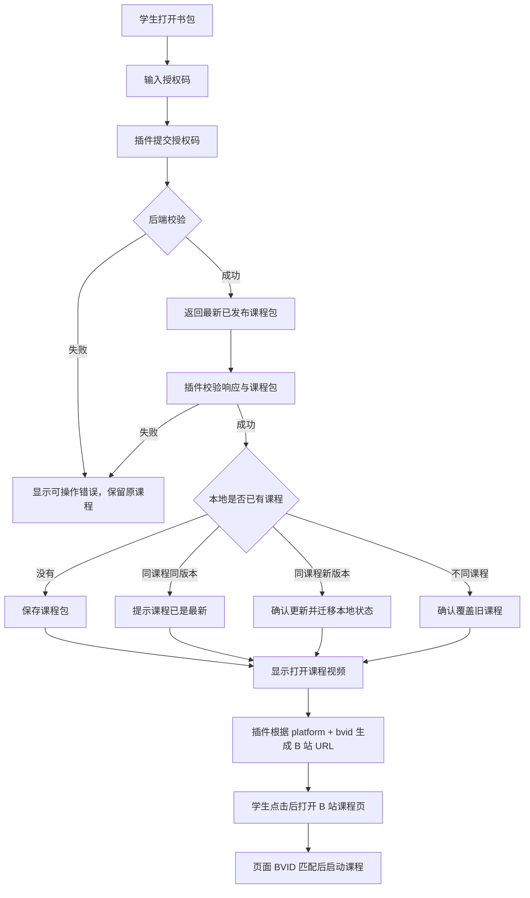

# 学生插件课程领取与本地学习设计

版本：0.1

日期：2026-08-18

状态：已确认产品设计，尚未实现

关联决策：`doc/decisions/2026-08-18-student-plugin-single-course-delivery.md`

## 1. 目标

测试阶段验证学生是否愿意持续使用 KnownMap 完成老师设计的课程。学生端不是独立学习平台，而是老师课程的交付端：

```text
老师发布课程
  -> 创建可重复使用的授权码
  -> 学生在插件中输入授权码
  -> 插件取得已发布课程包
  -> 课程进入学生书包
  -> 学生点击打开 B 站课程视频
  -> 插件在匹配视频上启动陪伴式小助手
  -> 执行老师设计的线性互动
  -> 本地记录有效学习与待复习事项
```

测试版只保存一门当前课程，不实现课程列表、多老师授权、学生账号、领取记录或学习数据上传。

## 2. 学生插件形态

插件采用三层界面：

1. **平时陪伴**：可拖动的小助手常驻 B 站页面边缘，响应播放和课程状态，不持续打扰。
2. **学习控制**：点击小助手后展开当前字幕句、上一句、下一句、播放/暂停、单次复听、固定三次复听和持续循环。
3. **打开书包**：展示授权码输入、当前课程、有效学习概览、待复习清单和设置。

键盘和可见按钮是测试版稳定主路径。声音控制、鼠标动作和触摸板手势只作为后续实验，不进入当前课程领取与运行的必要路径。

## 3. 授权码语义

测试版授权码是**可重复使用的课程下载凭证**：

- 一个授权码绑定一门已发布课程；
- 同一授权码可以重复提交和重复下载；
- 授权码不代表学生身份；
- 后端不记录“已使用”状态和学生领取记录；
- 教师发布新版本后，同一授权码可以取得最新版本；
- 授权码原文只在创建时返回，服务端长期只保存安全摘要；
- 授权码不远程删除学生已经保存到本地的课程。

## 4. 领取与打开课程流程



后端不返回任意跳转 URL。课程包只返回经过校验的 `platform`、`bvid` 和可选 `cid`，由插件生成标准 B 站地址。

## 5. 课程包

课程包是后端从教师领域数据转换出的学生运行格式，不是数据库记录原样导出。

```json
{
  "schemaVersion": 1,
  "packageId": "pkg_course_001_v3",
  "courseId": "course_001",
  "lessonId": "lesson_001",
  "version": 3,
  "publishedAt": "2026-08-18T08:00:00Z",
  "course": {
    "title": "英语面试表达课",
    "description": "围绕自我介绍和回答结构进行练习"
  },
  "video": {
    "platform": "bilibili",
    "bvid": "BV1WW4y1e7GL",
    "cid": null
  },
  "captions": [
    {
      "id": "caption_001",
      "start": 136.0,
      "end": 141.2,
      "text": "The first thing is to keep your answer relevant."
    }
  ],
  "nodes": [
    {
      "id": "node_001",
      "captionId": "caption_001",
      "triggerTime": 136.0,
      "type": "attention",
      "title": "保持回答相关",
      "content": "回答要围绕问题本身展开。",
      "review": {
        "recommended": true,
        "repeatCount": 3
      }
    }
  ]
}
```

### 5.1 字幕边界

为了支持按字幕句导航和复听，课程包包含经过校验的结构化字幕句：

- `id`
- `start`
- `end`
- `text`

插件不下载原始 SRT/VTT 文件，不保留教师工作台草稿或字幕来源信息。字幕必须按时间排序，不得重叠到无法确定当前句，文本和数量必须受 schema 上限约束。

### 5.2 互动节点

测试版节点仍为老师设计的固定线性流程：

- 重点提示；
- 选择题；
- 填空题；
- 开放问答。

AI 不生成节点、不决定触发时间、不改变学习路径。选择题和填空题答错后显示老师预设反馈，学生可以重试或继续；开放问答只显示老师预设参考反馈。

## 6. 插件本地数据

课程内容与学生数据分开保存。

### 6.1 当前课程

```json
{
  "installedCourse": {
    "packageId": "pkg_course_001_v3",
    "courseId": "course_001",
    "lessonId": "lesson_001",
    "version": 3,
    "installedAt": "2026-08-18T08:10:00Z",
    "package": {}
  }
}
```

### 6.2 学习状态

```json
{
  "learningState": {
    "schemaVersion": 1,
    "courseId": "course_001",
    "courseVersion": 3,
    "effectiveSessionCount": 3,
    "nodeProgress": {
      "node_001": {
        "status": "completed",
        "attempts": 1,
        "lastAnswer": null
      }
    },
    "captionReplayCounts": {
      "caption_001": 3
    },
    "reviewQueue": [
      {
        "id": "review_001",
        "source": "teacher_focus",
        "captionId": "caption_001",
        "nodeId": "node_001",
        "status": "pending"
      }
    ]
  }
}
```

学习状态默认只保存在学生本机，不上传后端，不进入教师报告。

## 7. 有效学习与复习清单

### 7.1 有效学习

测试版使用简单、可解释的近似指标：

```text
一次主动学习达到 5 分钟
  -> 记录为 1 次有效学习
```

主动学习可包含视频实际播放、学生主动复听和互动卡片作答。页面仅在后台打开、长时间无播放无操作或插件面板闲置不计入。

该指标只表示学生发生过一次达到门槛的学习活动，不表示知识掌握程度。

### 7.2 待复习清单

待复习事项由固定规则产生，不由 AI 自由推荐：

- 选择题或填空题答错；
- 老师把重点节点标记为需要复习；
- 学生跳过或未完成互动；
- 后续确认的其它确定性规则。

每项必须显示来源、课程位置和建议动作，例如“答错，建议重做一次”或“老师重点，建议复听三次”。

## 8. 单课程覆盖与版本更新

插件只能保存一门当前课程：

- 没有课程时直接安装；
- 同课程同版本时不重复覆盖；
- 同课程新版本时先确认更新；
- 不同课程时明确提示当前课程将被替换；
- 学生取消时原课程和学习状态完整保留；
- 新课程不得继承旧课程学习状态。

同一课程更新时，稳定节点 ID 和字幕 ID 对应的学习状态可以保留。新版本已删除或改变语义的 ID 不继续作为当前进度，应标记为历史或从当前复习清单移除。迁移失败时保留旧课程，不得留下半更新状态。

## 9. API 边界

测试版学生领取端点：

```http
POST /api/v1/public/course-download
Content-Type: application/json

{
  "authorizationCode": "KM-7A4Q-91"
}
```

成功响应：

```json
{
  "package": {},
  "courseId": "course_001",
  "version": 3,
  "contentHash": "sha256:..."
}
```

失败至少区分：

- `INVALID_AUTHORIZATION_CODE`
- `COURSE_NOT_FOUND`
- `COURSE_NOT_PUBLISHED`
- `PACKAGE_INVALID`
- `SERVICE_UNAVAILABLE`

错误响应不得泄露授权码摘要、数据库 ID 关系、教师凭证或内部堆栈。

## 10. 校验与安全

插件保存课程前必须验证：

1. 响应 envelope；
2. 课程包 schema 版本；
3. `platform`、BVID 和 CID；
4. 字幕 ID、文本、时间范围和排序；
5. 节点 ID、类型、触发时间和字幕引用；
6. 四种节点的必要字段；
7. `contentHash` 与实际包内容；
8. 包大小和数组数量上限。

任何校验失败都不能覆盖原课程。日志不得记录授权码原文、字幕全文、题目正文或学生答案。

## 11. 当前非目标

- 多课程书包；
- 多老师授权和授权并集；
- 学生账号、Google 登录和设备绑定；
- 授权码停用、过期、人数限制和一次性使用；
- 领取记录和学生关系；
- 学习数据上传和教师报告；
- AI 动态教学；
- 声音控制正式交付；
- 鼠标或触摸板手势正式交付；
- B 站以外的平台和手机端。

## 12. 验收方向

1. 有效授权码能够重复取得最新已发布课程包；
2. 无效授权码和未发布课程默认拒绝；
3. 课程包包含匹配视频、结构化字幕句和四种节点；
4. 插件校验成功后才原子替换本地课程；
5. 领取成功后学生可以点击打开标准 B 站课程页；
6. 只在匹配 BVID 上启动小助手和课程；
7. 字幕上一句、下一句、一次、三次和持续复听可用；
8. 学习状态与课程包分开保存；
9. 有效学习和复习清单按固定规则产生；
10. 不上传学生本地学习数据，不在日志记录敏感原文。
