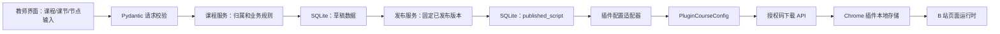
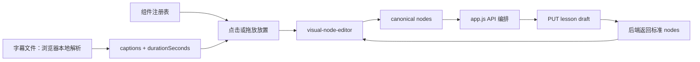

# KnownMap 教师平台本地阶段架构

版本：0.1

更新时间：2026-08-18

状态：当前开发架构。后端和教师端节点 1–7 已验证；插件授权码下载和课程运行尚未实现。

## 1. 架构目标

本阶段把现有教师界面和 Chrome 插件连接到一个本地 FastAPI 服务，完成教师发布课程、创建授权码、插件按授权码下载课程配置的闭环。

```text
teacher-web/
  ├─ 教师登录、课程编辑和发布
  └─ HTTP JSON API
       ↓
backend/app/
  ├─ FastAPI 路由
  ├─ 业务服务
  ├─ Pydantic schema
  ├─ SQLAlchemy 数据访问
  └─ SQLite
       ↑
Chrome 插件
  ├─ B 站页面授权码输入（节点 8 待实现）
  ├─ 下载课程配置（节点 8 待实现）
  ├─ chrome.storage.local（已有课程存储适配器，待接下载流程）
  └─ 现有固定 Demo 运行时（待改为读取下载课程）
```

前端只负责页面、交互和请求编排。后端负责认证、课程归属、草稿/发布状态、授权码校验、配置转换和数据访问。插件只接收已经通过服务端校验的插件课程配置，不直接读取教师数据库。

## 2. 技术选型

### 2.1 当前本地环境

- Python 3；
- FastAPI；
- Pydantic；
- SQLAlchemy 2；
- Alembic；
- SQLite；
- pytest、pytest-asyncio、httpx；
- structlog；
- `uv` 管理 Python 依赖和锁文件。

采用 SQLAlchemy 和 Alembic 的原因是保持 SQLite 与未来 PostgreSQL 的迁移边界，不把数据库访问写成只能在本机文件上工作的实现。

### 2.2 未来公网约束

本阶段不配置公网服务器、域名、TLS 或生产监控，但代码必须满足：

- 数据库 URL 从环境变量读取；
- CORS 来源从环境变量读取；
- 会话密钥和授权码摘要密钥从环境变量读取；
- 不依赖 `localhost` 写死的业务逻辑；
- 迁移命令可以在空数据库上重建 schema；
- API 路径和响应结构不依赖静态文件目录；
- 日志可以切换为 JSON 输出。

## 3. 目录边界

计划新增以下目录：

```text
backend/
  pyproject.toml
  uv.lock
  .env.example
  app/
    main.py
    config.py
    db.py
    logging.py
    middleware.py
    models/
      teacher.py
      teacher_session.py
      course.py
      lesson.py
      published_script.py
      access_code.py
    schemas/
      auth.py
      course.py
      lesson.py
      script.py
      access_code.py
      public_download.py
    api/
      deps.py
      v1/
        auth.py
        teacher_courses.py
        teacher_lessons.py
        teacher_scripts.py
        teacher_access_codes.py
        public_download.py
    services/
      auth_service.py
      course_service.py
      script_service.py
      access_code_service.py
      download_service.py
    repositories/
      teacher_repository.py
      teacher_session_repository.py
      course_repository.py
      lesson_repository.py
      script_repository.py
      access_code_repository.py
    adapters/
      plugin_course_config.py
    migrations/
  tests/
    unit/
    integration/
    e2e/
```

现有目录继续承担：

- `teacher-web/`：教师界面。当前可视化节点编辑器由 `node-plugin-registry.js`、`timeline-model.js`、
  `visual-node-editor.js` 和 `editor-logger.js` 分别承担组件注册、纯时间轴计算、DOM 交互和前端诊断日志；
- `src/shared/`：插件课程配置和既有消息契约；
- `src/background/`：插件本地存储；
- `src/content/`：现有 B 站固定 Demo 运行时；插件内授权码入口和下载课程运行由节点 8 实现。

## 4. 后端模块职责

### 4.1 路由层

路由层只做：

- 接收 HTTP 参数；
- 调用认证依赖；
- 调用服务层；
- 映射业务异常为稳定 HTTP 错误；
- 返回 Pydantic response model。

路由层不直接写 SQL，不生成密码哈希，不拼装课程节点。

### 4.2 服务层

服务层负责一个可验收的业务动作：

- `login_teacher`；
- `create_course`；
- `create_lesson`；
- `save_lesson_draft`；
- `publish_lesson`；
- `create_access_code`；
- `download_published_course`。

每个动作要有明确输入、输出、失败条件和结构化日志事件。

### 4.3 数据访问层

Repository 只负责所属实体的查询、写入和事务边界：

- 教师 repository 只读写教师账号；
- 课程 repository 只读写课程；
- 课节 repository 只读写课节；
- 脚本 repository 只读写草稿和发布版本；
- 授权码 repository 只读写授权码摘要和课程关联。

服务层负责跨实体业务规则，例如“发布脚本前课程和课节必须存在”。

## 5. 业务数据归属

```text
Teacher
  └─ Workspace（当前每个教师自动拥有一个）
       └─ Course
            └─ Lesson
                 ├─ Draft Script
                 └─ Published Script

AccessCode
  └─ Course
```

当前不创建 Student、Redemption、LearningEvent 或 Attempt 数据表。

课程配置的领域数据归属于后端数据库；插件运行配置归属于 `PluginCourseConfig` 输出适配器和插件本地存储。两者不能通过共享数据库表耦合。

## 6. 认证和权限

### 6.1 教师认证

- 登录名和密码；
- 密码使用 Argon2id 或 bcrypt 慢哈希；
- 登录成功后创建服务端会话，浏览器只保存 HttpOnly、SameSite 的随机会话 token；
- 数据库只保存会话 token 摘要、教师 ID、过期时间和撤销时间；
- 测试账号通过 seed 命令从环境变量读取，不把测试密码写入代码；
- 会话密钥从环境变量读取；
- 受保护教师 API 必须从服务端会话推导教师 ID；
- 前端传入的 `teacher_id`、`workspace_id` 或角色字段不参与授权判断。

当前只实现教师 Owner 权限。手工预建账号直接绑定一个工作空间。

### 6.2 插件下载权限

插件下载端点使用授权码作为当前阶段的唯一业务凭证：

- 授权码标准化后计算摘要；
- 服务端按摘要查找授权码；
- 授权码必须绑定已发布课程；
- 不接受客户端传入的课程 ID 作为最终授权依据；
- 失败默认拒绝；
- 返回课程配置时只返回插件需要的字段。

## 7. 课程发布数据流



关键规则：

1. 草稿保存不改变已发布内容。
2. 当前外部只提供课程发布端点；该端点在事务中发布课程下唯一课节的草稿，成功后才返回发布结果。
3. 未发布脚本不能通过下载端点返回。
4. 插件配置适配器删除数据库内部字段，只输出运行所需结构。
5. 节点结构先通过服务端 schema 校验，再转换为插件契约。

教师编辑器内部的数据流：



`visual-node-editor.js` 不直接访问 FastAPI。点击和拖放都调用同一创建动作，组件来源只作为
前端诊断字段；后端仍只接收既有 `config.nodes` schema。字幕是本地 raw 输入和前端 context，
不进入 `ScriptDraft.config_json`。

## 8. 错误和日志

错误响应统一为：

```json
{
  "error": {
    "code": "COURSE_NOT_FOUND",
    "message": "课程不存在或不可访问。",
    "request_id": "..."
  }
}
```

不向客户端返回 SQL、堆栈、文件路径、密码哈希、授权码摘要或数据库原文。

关键日志动作：

- `auth.login.start/success/failure`
- `course.create.start/success/failure`
- `lesson.draft.save.start/success/failure`
- `script.publish.start/success/failure`
- `access_code.create.start/success/failure`
- `course.download.start/success/failure`

日志必须包含 `request_id`、模块、动作、事件、耗时和脱敏输入摘要。授权码原文、密码、课程正文和节点正文不写入日志。

教师编辑器的未提交操作使用浏览器端分级诊断日志：

- 本地开发/测试默认 `debug`：组件选择、放置、拖动、弹窗打开和取消；
- 正常运行默认 `info`：草稿保存、发布和失败；
- 不记录字幕正文、节点正文、密码、cookie、会话 token 或授权码原文；
- 前端诊断日志不替代后端 `OperationLog`，也不新增每次临时拖动的持久化审计端点。

## 9. 本地运行形态

计划提供：

```bash
cd backend
uv sync
cp .env.example .env
uv run alembic upgrade head
uv run uvicorn app.main:app --reload --port 8000
```

教师网页会按页面主机名选择 `http://localhost:8000` 或 `http://127.0.0.1:8000`，保证 SameSite 会话 Cookie 主机一致。插件 API Base URL 将在节点 8 通过配置模块接入；插件仍按现有 MV3 方式加载解压目录。

日志配置：

```text
development/test: LOG_LEVEL=DEBUG，控制台可读格式
production:       LOG_LEVEL=INFO，结构化 JSON 格式
```

运行日志输出到标准输出；业务操作另外写入 SQLite 的 `operation_logs` 表，便于后续后台查询。

## 10. 主要风险

| 风险 | 处理 |
| --- | --- |
| 现有教师页仍是固定 Demo 状态 | 先建立 API 合约和 adapter，再逐步替换静态状态 |
| 现有插件课程契约只表达单课程 | 服务器领域模型与插件输出模型分离，保持 adapter |
| 授权码是敏感凭证 | 只存摘要，原文只在创建响应中返回 |
| 本地 cookie 跨端口联调 | 明确 CORS、SameSite 和本地 origin；集成测试覆盖 |
| 后续扩展多课节/学生数据 | 现在保留 Course/Lesson/PublishedScript 边界，不提前增加学生表 |
| 本地 SQLite 与未来 PostgreSQL 差异 | 使用 SQLAlchemy、Alembic、参数化查询和集成测试 |
