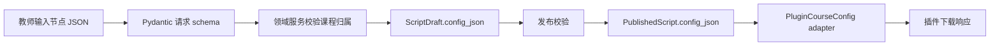

# KnownMap 教师平台本地阶段数据规范

版本：0.1

更新时间：2026-08-18

状态：当前数据实现说明；教师、会话、工作空间、课程、单课节、脚本草稿、发布版本、授权码和操作日志已实现验证。插件下载后的课程和本地学习状态仍待节点 8 实现。

## 1. 数据分层

本阶段采用四层：

```text
raw       = 教师表单、节点 JSON、授权码输入
canonical = Teacher、Workspace、Course、Lesson、ScriptDraft
published = PublishedScript 和可下载课程配置
output    = API response、PluginCourseConfig、插件本地存储
```

本阶段不建立学生学习事件和统计派生层。

## 2. 核心实体

### 2.1 Teacher

| 字段 | 类型 | 必填 | 规则 | 敏感级别 |
| --- | --- | --- | --- | --- |
| `id` | UUID | 是 | 服务端生成，稳定不变 | internal |
| `login_name` | string | 是 | 唯一，长度 3-80 | internal |
| `password_hash` | string | 是 | Argon2id/bcrypt，不返回 API | secret |
| `display_name` | string | 是 | 非空，长度不超过 120 | internal |
| `status` | enum | 是 | `active` / `disabled` | internal |
| `created_at` | UTC datetime | 是 | 服务端生成 | internal |
| `updated_at` | UTC datetime | 是 | 服务端生成 | internal |

### 2.2 Workspace

| 字段 | 类型 | 必填 | 规则 | 敏感级别 |
| --- | --- | --- | --- | --- |
| `id` | UUID | 是 | 服务端生成 | internal |
| `owner_teacher_id` | UUID | 是 | 当前唯一 Owner | internal |
| `name` | string | 是 | 当前可由 seed 生成 | internal |
| `created_at` | UTC datetime | 是 | 服务端生成 | internal |

当前一个教师只自动拥有一个工作空间，前端不提供切换。

### 2.3 TeacherSession

| 字段 | 类型 | 必填 | 规则 | 敏感级别 |
| --- | --- | --- | --- | --- |
| `id` | UUID | 是 | 服务端生成 | internal |
| `teacher_id` | UUID | 是 | 关联教师账号 | internal |
| `token_digest` | string | 是 | 随机会话 token 的安全摘要，唯一索引 | secret |
| `expires_at` | UTC datetime | 是 | 过期后拒绝 | internal |
| `revoked_at` | UTC datetime/null | 否 | 退出登录时写入 | internal |
| `created_at` | UTC datetime | 是 | 服务端生成 | internal |

浏览器 cookie 只保存随机 token，数据库不保存 token 原文。退出登录后撤销当前会话。

### 2.4 Course

| 字段 | 类型 | 必填 | 规则 | 敏感级别 |
| --- | --- | --- | --- | --- |
| `id` | UUID | 是 | 服务端生成 | internal |
| `workspace_id` | UUID | 是 | 归属工作空间 | internal |
| `title` | string | 是 | trim 后非空，≤200 字符 | internal |
| `description` | string/null | 否 | ≤2000 字符 | internal |
| `status` | enum | 是 | `draft` / `published` | internal |
| `created_at` | UTC datetime | 是 | 服务端生成 | internal |
| `updated_at` | UTC datetime | 是 | 服务端生成 | internal |

当前 UI 只创建一门课程，但 API 不使用固定课程 ID。

### 2.5 Lesson

| 字段 | 类型 | 必填 | 规则 | 敏感级别 |
| --- | --- | --- | --- | --- |
| `id` | UUID | 是 | 服务端生成 | internal |
| `course_id` | UUID | 是 | 必须属于当前教师课程 | internal |
| `title` | string | 是 | trim 后非空，≤200 字符 | internal |
| `sort_order` | integer | 是 | 当前默认为 0 | internal |
| `video_ref` | object | 是 | `platform=bilibili`，合法 BVID | internal |
| `status` | enum | 是 | `draft` / `published` | internal |
| `created_at` | UTC datetime | 是 | 服务端生成 | internal |
| `updated_at` | UTC datetime | 是 | 服务端生成 | internal |

当前每门课程只有一个课节；`sort_order` 为后续多课节保留。

数据库将 `video_ref` 拆为 `platform` 和 `video_id` 两列，API 使用 `{platform, video_id}` 对象；两层映射由 `LessonPublic` schema 固定。

### 2.6 ScriptDraft

| 字段 | 类型 | 必填 | 规则 | 敏感级别 |
| --- | --- | --- | --- | --- |
| `id` | UUID | 是 | 服务端生成 | internal |
| `lesson_id` | UUID | 是 | 一个课节只有一个当前草稿 | internal |
| `schema_version` | integer | 是 | 当前为 1 | internal |
| `config_json` | JSON | 是 | 通过节点 schema 校验 | internal |
| `updated_at` | UTC datetime | 是 | 服务端生成 | internal |

`config_json` 保存工作台需要的课节和节点结构，不作为插件最终输出。

草稿节点当前支持 `attention + notice`、`practice + choice`、`practice + blank` 和
`followup + free_text` 四种严格组合；节点 ID 唯一，并按 `timeSeconds`、ID 升序保存。

### 2.7 PublishedScript

| 字段 | 类型 | 必填 | 规则 | 敏感级别 |
| --- | --- | --- | --- | --- |
| `id` | UUID | 是 | 服务端生成 | internal |
| `lesson_id` | UUID | 是 | 归属课节 | internal |
| `version` | integer | 是 | 从 1 单调递增 | internal |
| `config_json` | JSON | 是 | 发布前完成完整校验 | internal |
| `published_at` | UTC datetime | 是 | 服务端生成 | internal |
| `published_by` | UUID | 是 | 当前教师 ID | internal |

草稿修改不得覆盖已发布 JSON。插件下载只读取最新已发布版本。

发布时由 adapter 生成并再次校验 `PluginCourseConfig`，其中 `courseId` 从平台和 BVID
派生，`updatedAt` 固定为 UTC 毫秒格式。每次发布新增一行，不覆盖旧版本。

### 2.8 AccessCode

| 字段 | 类型 | 必填 | 规则 | 敏感级别 |
| --- | --- | --- | --- | --- |
| `id` | UUID | 是 | 服务端生成 | internal |
| `course_id` | UUID | 是 | 绑定课程 | internal |
| `code_digest` | string | 是 | HMAC-SHA256，唯一索引 | secret |
| `code_hint` | string | 是 | 仅用于教师确认，不可还原原文 | internal |
| `created_at` | UTC datetime | 是 | 服务端生成 | internal |

当前没有 `revoked_at`、`expires_at`、`max_redemptions` 或学生关联字段。

授权码格式为 `KM-XXXXX-XXXXX-XXXXX-XXXXX`，字符集为 Base32 大写字母和数字 2–7。
查找时对规范化后的授权码计算 HMAC-SHA256；授权码原文不写数据库和日志。

### 2.9 OperationLog

| 字段 | 类型 | 必填 | 规则 | 敏感级别 |
| --- | --- | --- | --- | --- |
| `id` | integer | 是 | 自增主键 | internal |
| `timestamp` | UTC datetime | 是 | 服务端生成 | internal |
| `request_id` | string | 是 | 关联一次 HTTP 请求 | internal |
| `actor_type` | string | 是 | `teacher` / `plugin` / `system` / `anonymous` | internal |
| `actor_id` | string/null | 否 | 当前阶段没有学生 ID | internal |
| `module` | string | 是 | 业务模块名 | internal |
| `action` | string | 是 | 原子业务动作名 | internal |
| `target_type` | string/null | 否 | 目标对象类型 | internal |
| `target_id` | string/null | 否 | 目标对象 ID | internal |
| `result` | enum | 是 | `success` / `failure` | internal |
| `error_code` | string/null | 否 | 失败时的稳定错误码 | internal |
| `duration_ms` | integer/null | 否 | 动作耗时 | internal |

运行日志和操作日志分开：运行日志输出技术细节，操作日志只保存可审计的结构化动作摘要，不保存密码、token、授权码原文或课程正文。

## 3. 节点结构

当前节点沿用 `src/shared/course-contract.js` 的四种合法组合：

```text
attention + notice
practice  + choice
practice  + blank
followup  + free_text
```

后端领域 schema 必须与现有共享课程契约保持语义一致。后端可增加课程、课节和发布版本包装字段，但发送给插件前必须经过 `PluginCourseConfig` adapter。

节点公共必填字段：

- `id`
- `enabled`
- `family`
- `interaction`
- `trigger`
- `display`
- `evaluation`
- `effects`

新增节点类型只能通过新增明确的 schema 分支和运行时处理器进入，不允许用任意 JSON 字段绕过校验。

## 3.1 教师编辑器临时投影

教师编辑器在浏览器中维护以下临时状态，不写入 `ScriptDraft.config_json`：

| 字段 | 类型 | 来源 | 用途 | 是否持久化 |
| --- | --- | --- | --- | --- |
| `captions` | `Caption[]` | 教师导入的 SRT/VTT | 时间定位和选中节点上下文 | 否 |
| `durationSeconds` | number | 字幕结束时间计算 | 时间轴长度和坐标换算 | 否 |
| `selectedNodeId` | string/null | 页面交互 | marker 和弹窗选中状态 | 否 |
| `armedPluginId` | enum/null | 页面交互 | 点击组件后等待时间轴放置 | 否 |
| `dirty` | boolean | 编辑器状态 | 显示草稿是否有未保存修改 | 否 |

`captions` 的字段只用于前端：

```json
{
  "id": "caption-2",
  "startSeconds": 35,
  "endSeconds": 51,
  "time": "00:35",
  "text": "A strong answer needs a specific example."
}
```

节点创建或移动时，前端从 `timeSeconds` 找到最近字幕并写入 `trigger.captionId`。后端仍按
既有 schema 校验 `captionId` 格式和节点字段；字幕正文不随草稿提交。

点击添加和拖放添加的差异只保存在前端诊断日志的 `source` 字段（`click` / `drag`），
不进入节点 JSON，因此两种入口的 canonical 输出完全相同。

## 4. 插件下载输出

授权码下载成功时返回：

```json
{
  "course": {
    "schemaVersion": 1,
    "courseId": "bilibili:BV1WW4y1e7GL",
    "videoRef": {
      "platform": "bilibili",
      "videoId": "BV1WW4y1e7GL"
    },
    "nodes": [],
    "updatedAt": "2026-08-18T00:00:00.000Z"
  }
}
```

插件最终接收的字段必须符合现有共享课程契约。`password_hash`、`workspace_id`、授权码摘要、数据库 ID 映射信息和草稿状态不得进入输出。

## 5. 数据流校验



失败规则：

- schema 不合法：返回 `VALIDATION_ERROR`，不写库；
- 课程或课节不属于当前教师：返回 `RESOURCE_NOT_FOUND`，避免泄露资源存在性；
- 草稿为空或没有节点：不能发布；
- 发布配置不符合插件契约：发布事务回滚；
- 授权码不存在：返回统一 `INVALID_ACCESS_CODE`；
- 课程未发布：返回 `COURSE_NOT_AVAILABLE`；
- 数据库错误：事务回滚并返回 `INTERNAL_ERROR`，详细异常只写日志。

## 6. 字段和输出规则

- 所有时间使用 UTC ISO 8601；
- ID 使用 UUID；
- JSON 配置使用结构化 schema 校验；
- 课程标题、课节标题和节点文案 trim 后校验；
- 动态文案在教师网页和插件中都使用安全文本 API 渲染；
- API 错误不回显课程正文、节点正文或授权码原文；
- 日志只记录实体 ID、节点数量、版本、错误码和 request ID。
