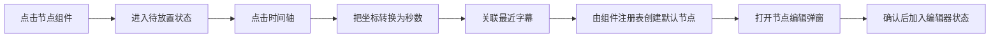
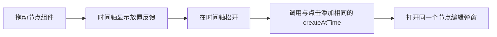
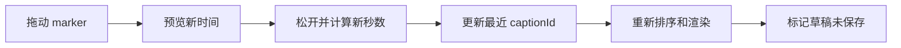
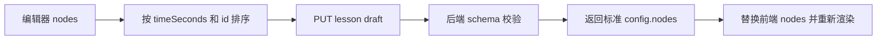

# KnownMap 教师可视化节点编辑器设计

版本：0.1

更新时间：2026-08-18

状态：已确认，待实现验证

关联文档：

- 当前需求：`doc/requirements/teacher-platform-local-stage.md`
- 当前总计划：`doc/teacher-platform-dev-plan.md`
- 实施计划：`doc/plans/teacher-visual-node-editor.md`
- 架构：`doc/teacher-platform-architecture.md`
- 数据：`doc/teacher-platform-data-spec.md`
- 决策：`doc/DECISIONS.md#d-016-教师编辑器采用组件注册和可视化时间轴`
- 视觉参照：`teacher-web/forsales.html`

## 1. 要解决的问题

节点 7 已经完成教师登录、课程创建、草稿保存、发布和授权码等 API 接入，但当前
`teacher-web/editor.html` 仍以“纵向字幕列表 + 右侧表单”为主要编辑方式。老师看不到
完整课节里节点的分布，也不能像组合教学组件一样直接在时间线上加入节点。

`teacher-web/forsales.html` 已经展示了正确的产品方向：

```text
节点组件栏
→ 横向课节时间轴
→ 节点图标和摘要
→ 选中节点时显示字幕上下文
→ 弹窗编辑节点属性
```

销售页中的节点仍是静态示例，组件按钮也没有真实添加能力。正式工作台不能复制静态数据，
而要把这套表达变成由真实草稿和字幕驱动的编辑器。

## 2. 设计目标

1. 节点成为时间轴上的一级可视化对象，而不是字幕行的附属标签。
2. 四种节点使用统一的组件注册协议，后续增加节点类型时不改写整个编辑器。
3. 点击放置和拖放创建共享同一个领域动作。
4. 编辑器内部始终使用后端节点 schema，不维护第二套只能在页面使用的数据格式。
5. 字幕负责提供定位和上下文，不上传服务器，也不成为节点编辑器的主列表。
6. 已有登录、课程、草稿、发布和授权码 API 保持不变。

## 3. 页面结构

### 3.1 顶部课程操作

保留：

- 返回课程；
- 课程和课节标题；
- 草稿状态；
- 打开 B 站视频；
- 保存草稿；
- 发布课程；
- 发布后创建和复制授权码。

### 3.2 节点组件栏

在时间轴上方提供四个可操作组件：

| 组件 ID | 显示名称 | 后端组合 |
| --- | --- | --- |
| `attention` | 重点标注 | `attention + notice` |
| `choice` | 选择题 | `practice + choice` |
| `blank` | 填空题 | `practice + blank` |
| `qa` | 问答题 | `followup + free_text` |

组件支持：

- 单击：进入待放置状态；
- Enter/Space：键盘等价选择；
- 拖动：携带组件 ID 进入时间轴；
- 再次单击当前组件或按 Escape：退出待放置状态。

### 3.3 横向时间轴

时间轴长度来自当前字幕最后一个结束时间；没有有效结束时间时，使用最后一个字幕开始时间，
最低时长为 1 秒，避免除零。

```text
positionPercent = clamp(timeSeconds / durationSeconds, 0, 1) * 100
```

时间轴包含：

- 起点和终点；
- 按课节时长生成的刻度；
- 节点 marker；
- 节点标题摘要；
- 放置状态和拖放状态；
- 当前选中节点；
- 空状态。

节点摘要按时间顺序交替进入上下轨道。相邻节点过近时继续分配可用轨道，避免标题覆盖。

### 3.4 字幕上下文

右侧字幕栏只展示当前选中节点附近的字幕：

- 中心字幕根据 `captionId` 或最近时间确定；
- 中心字幕高亮；
- 上下文使用已有 `subtitle-context.js` 的选择逻辑；
- 字幕文本只用 `textContent` 渲染；
- 没有字幕时显示明确空状态，但时间节点仍可显示和编辑。

### 3.5 节点编辑弹窗

创建节点后立即打开弹窗。编辑现有节点时，双击 marker、右键或 Enter 都可打开。

公共字段：

- 时间点；
- 节点类型；
- 标题。

类型字段：

- 重点标注：提醒内容；
- 选择题：题目、两个选项、正确答案、答案解释；
- 填空题：题目、可接受答案、答案解释；
- 问答题：问题、教师参考反馈。

操作：

- 保存节点；
- 删除节点；
- 取消；
- 存在未保存修改时确认放弃。

类型切换时按目标组件默认值补齐字段，不把旧类型的无效字段带入节点。

## 4. 交互流程

### 4.1 点击添加



如果老师在编辑弹窗中取消，新节点不进入草稿状态。

### 4.2 拖放添加



拖放只负责提供组件 ID 和目标坐标，不维护第二套创建逻辑。

### 4.3 移动现有节点



拖动距离不足点击阈值时按选择处理，不误改时间。

### 4.4 保存与恢复



保存失败时不替换本地状态；发布继续执行“先保存草稿，再发布课程”。

## 5. 前端模块边界

| 文件 | 单一职责 |
| --- | --- |
| `teacher-web/node-plugin-registry.js` | 四种组件定义、默认节点创建、类型转换、字段读取与节点校验前置 |
| `teacher-web/timeline-model.js` | 时长、坐标和时间换算、最近字幕、节点排序、轨道分配、节点移动 |
| `teacher-web/visual-node-editor.js` | 组件栏、时间轴、marker、字幕栏、弹窗和鼠标/键盘事件 |
| `teacher-web/editor-logger.js` | 环境分级的结构化前端诊断日志和脱敏 |
| `teacher-web/app.js` | 登录、课程、字幕导入、API 状态、保存、发布和授权码编排 |
| `teacher-web/api-client.js` | FastAPI 请求和稳定错误映射 |

`visual-node-editor.js` 通过回调通知 `app.js` 节点状态变化，不直接调用 FastAPI。

## 6. 状态和不变量

编辑器状态：

```text
nodes
captions
durationSeconds
selectedNodeId
armedPluginId
dialogDraft
dirty
```

不变量：

1. `nodes` 中 ID 唯一。
2. `timeSeconds` 为非负数且不超过当前时间轴时长。
3. 有字幕时，非空 `captionId` 必须引用当前字幕集合。
4. 节点按 `timeSeconds`、ID 升序发送后端。
5. 同一字幕可以关联多个节点。
6. 弹窗取消新建时不产生节点；取消编辑时不修改原节点。
7. 只有保存草稿成功后才把页面状态标记为已保存。

## 7. 日志设计

前端日志不替代后端 `OperationLog`：

- 后端继续审计登录、课程、草稿保存、发布、授权码创建和下载等已提交业务动作；
- 前端只记录尚未提交的编辑器诊断事件，帮助测试和定位交互问题。

级别：

| 环境 | 默认级别 | 事件示例 |
| --- | --- | --- |
| 本地开发/自动化测试 | `debug` | 组件选择、创建入口、拖动开始/结束、弹窗打开/取消 |
| 正常运行 | `info` | 草稿保存请求、保存成功/失败、发布成功/失败 |

字段：

```text
timestamp, level, module, action, event, node_id, plugin_id,
time_seconds, source, result, error_code
```

禁止记录字幕正文、节点正文、密码、cookie、会话 token 和授权码原文。

## 8. 可访问性和响应式

- 组件按钮可获得焦点并支持 Enter/Space。
- marker 使用按钮语义，支持 Enter 编辑和 Delete 请求删除。
- 时间轴放置模式支持 Escape 取消。
- 弹窗打开后聚焦标题，关闭后焦点回到来源组件或 marker。
- 桌面使用完整横向时间轴。
- 小屏不把时间轴降级回字幕列表；时间轴区域保持稳定最小宽度并允许局部横向滚动。
- 页面本身不得产生整体横向溢出，固定工具栏和弹窗不得遮挡主要操作。
- `prefers-reduced-motion` 下关闭非必要动画。

## 9. 当前非目标

- 新节点类型；
- AI 生成节点；
- 视频播放器内嵌和播放头实时同步；
- 多课节切换；
- 撤销/重做历史；
- 多人协作和冲突合并；
- 自动保存；
- 上传字幕到服务器；
- 为每次未保存的拖动新增后端审计 API。

## 10. 完成定义

1. 四种组件均可通过点击放置和拖放创建。
2. 两种创建入口生成相同 schema。
3. 节点按真实时间显示，支持选择、编辑、移动和删除。
4. 多节点临近时仍能识别和操作。
5. 字幕上下文随选中节点更新。
6. 草稿保存、刷新恢复、发布和授权码闭环保持可用。
7. 自动化测试覆盖组件注册、时间换算、最近字幕、排序、移动和页面结构。
8. 浏览器手动验证覆盖桌面、375px 小屏、鼠标拖放和键盘入口。
9. 浏览器控制台无未处理异常，日志不包含正文和凭证。
