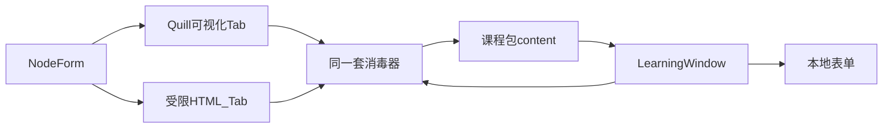

# 互动学习窗口：可调外观与类网页正文

状态：已实现结构化内容契约、草稿/发布保存与插件复验；资源上传/CDN 交付另行实现

日期：2026-08-26

## 背景

学生在 B 站看到的互动窗由内容脚本 `LearningWindow` 画出，不是浏览器工具栏 popup。当前窗口是右下角固定小卡片；编辑器将所有节点正文保存为结构化 `content`，题型数据保存为 `interactionData`，并允许选择窗口大小和样式。

产品要求：

1. 外观可调：编辑节点时选择大小和样式。
2. 排版接近 HTML 页面：颜色、链接、图片。
3. 选择题、填空题、问答题同一套页面，下面再加可提交的表单。答案已写在节点里，本机判分，不新增与教师后端的判分交互。

## 已确认事实与边界

- 弹窗定义在 `v1/extension/content/window.ts` 的 `LearningWindow`，样式在 `v1/extension/content/window.css`，宿主 id 为 `knownmap-learning-window`，Shadow DOM 挂到 `document.body`（全屏时挂到全屏元素）。
- 开关窗与暂停归属在 `v1/extension/content/runtime.ts`；判分状态机在 `v1/extension/runtime/session.ts`。本次不改这两处。
- 互动节点正文由 `RichPageDocument` 保存；教师端 HTML 编辑表示与插件安全渲染器都只处理有限排版标签，媒体只接受 `assetId`。
- 练习题提交已经在本机 `evaluate()`；`attempt` 只写入插件本机存储。不新增教师 API 判分。
- 图片上传与 IndexedDB 本机资源库不在本次范围，见 `doc/插件文件资源管理.md`。
- 禁止课程包携带任意 CSS 或脚本。大小和样式只用命名预设。

容易认错的窗口（本次都不改职责）：

- `v1/extension/content/companion.ts`：右下角学生助手。
- `v1/extension/content/picker.ts`：同一视频多课节时的选择器。
- `v1/extension/popup/`：点插件图标打开的课程库。

## 方案选择

### 正文编辑器

方案 A：继续扩展自制 `execCommand` 编辑器。无成熟源码 Tab，图片支持差，API 已弃用。放弃。

方案 B：TinyMCE。能力全，体积大，v7 许可更紧，源码模式也不是两个并列 Tab。放弃。

方案 C：Quill 2 做可视化 Tab，旁边自建受限 HTML Tab，保存与切 Tab 时走同一套消毒器。选此方案：依赖小、两个 Tab 与需求一致、许可宽松。

图片这一轮只允许引用已登记的 `assetId`，不做上传；外部 URL 不是节点媒体的持久化格式。

### 大小和样式

方案 A：老师写自定义宽高和 CSS。课程包会变成可执行样式。放弃。

方案 B：节点 `presentationHints` 上的命名预设。缺省等于现在的右下角小卡片。选此方案。

- `windowSize`：`s` 约 380px（现状）/ `m` 约 560px / `l` 约 720px / `overlay` 居中铺开并带浅遮罩。
- `windowStyle`：`card` 现奶油卡片 / `document` 白底、更大字号与留白。

非法或缺失时，插件回退为 `s` + `card`。教师下拉框只提供上述枚举。

### 页面与表单

富文本只描述「这一页讲什么」。选项、填空、问答输入仍是结构化字段，不写进 HTML。否则无法本机判分，也容易把表单控件从课程包带进页面。

学生看到的结构：

1. 标题
2. 消毒后的 `.km-rich-text` 页面
3. 仅练习节点：选择题 radios / 填空 input / 问答 textarea
4. 底部按钮（重点标注「确认并继续」；练习题「跳过」+「提交」）



## 设计

### 数据

节点内容与展示提示：

- 当前实现阶段所有节点都使用 `content: RichPageDocument` 作为唯一正文来源，不保留普通 `body`、`richBody` 或 HTML 回退。
- 练习题的题干、选项、答案规则和反馈仍是结构化数据；不能把表单控件或答案写进正文 HTML。
- 题型的题干也来自同一个 `content`；选项、答案和解析进入 `interactionData`，不再复制为 `prompt`。
- `windowSize`、`windowStyle` 为可选枚举；后端拒绝非法值。

内容文档设块数、文本量和资源数上限，避免撑满 `chrome.storage.local`。服务器、课程包校验器和各客户端都要执行同一份公开契约；不能只依赖某一个插件的运行时消毒。

### 消毒规则

教师保存与插件渲染必须使用同一份允许名单，避免两套逻辑再分叉。实现以 `v1/extension/content/richText.ts` 为真源，教师编辑器改为引用它，或抽到双方都能 import 的纯 TypeScript 模块。

允许标签：`p`, `h2`, `h3`, `blockquote`, `ul`, `ol`, `li`, `br`, `div`, `span`, `strong`, `b`, `em`, `i`, `u`, `a`, `img`。

允许属性：

- `a[href]`：仅 `http:` / `https:` / `mailto:`，强制 `target=_blank rel=noreferrer noopener`
- `span[style]`：仅 `color`，且为 `#hex` 或 `rgb/rgba`
- `img[src][alt]`：`src` 仅 `http:` / `https:`，禁止 `javascript:` / `data:` / `blob:`

其余标签和 `on*` 一律丢弃。正文仍用 DOM 节点写入，不把未消毒字符串赋给 `innerHTML` 后直接展示。

### 跨客户端内容持久化（必须补充）

“节点内容能够单独保存”需要区分两个层次：

1. **节点级保存**：每个节点保留稳定的 `node.id`，草稿和发布快照都按节点记录保存。编辑器保存整份草稿时仍可使用原子提交，但节点内容必须能按 `node.id` 独立定位、比较和恢复；节点排序或触发时间变化不能改变这个 id。
2. **跨客户端复用**：不能把 HTML 字符串作为长期唯一内容模型。HTML 是当前学习窗口的渲染格式，不是移动端、桌面端或其他平台都必须理解的内容真源。

下一版课程包应将节点内容抽象为有版本的、平台中立的富文档，并让各客户端分别渲染：

```ts
type RichPageDocument = {
  schemaVersion: 1;
  blocks: Array<
    | { type: 'paragraph' | 'heading' | 'quote'; children: Inline[]; level?: 2 | 3 }
    | { type: 'list'; ordered: boolean; items: Array<{ children: Inline[] }> }
    | { type: 'image'; assetId: string; alt: string; width?: number; height?: number }
  >;
};

type Inline = {
  text: string;
  marks?: Array<'strong' | 'em' | 'underline'>;
  color?: string;
  link?: { href: string };
};
```

当前教师端可以继续提供可视化/HTML 编辑体验，但保存时应以这个文档模型为真源；HTML 只能作为当前插件的编译结果或临时编辑表示，不能与文档模型形成两份可独立修改的正文。当前明确不保留普通 `body` 回退字段。

节点的建议边界是：

```ts
type PortableNode = {
  id: string;
  interaction: 'notice' | 'choice' | 'blank' | 'free_text';
  anchor: { kind: 'time_cross'; timeSeconds: number; captionId?: string | null };
  content: RichPageDocument;
  interactionData: Record<string, unknown> | null;
  presentationHints?: { windowSize?: 's' | 'm' | 'l' | 'overlay'; windowStyle?: 'card' | 'document' };
};
```

其中 `content` 负责“页面上讲什么”，`interactionData` 负责选项、答案规则和反馈，`presentationHints` 只提供客户端可忽略的外观建议。不要把窗口大小、颜色主题或 Shadow DOM 类名混入内容模型。

HTML 仅作为当前编辑器的输入/输出适配层；结构化文档、资源引用和版本号写入公开课程包契约，其他客户端无需依赖 Quill 或 HTML。

### 还需要一并确定的跨客户端问题

- **资源**：图片不要只保存易失的外链 URL。至少需要稳定的 `assetId`、`alt`、MIME、尺寸、校验摘要、来源/授权信息和离线失败策略；上传、CDN 或资源代理可后续实现，但内容模型现在就应使用资源引用。
- **版本与能力**：课程包版本、文档版本、节点交互版本和客户端能力要分开。客户端不支持某个块或节点时，应按能力协商、降级为明确的不可用状态或拒绝安装，不能静默丢内容。
- **发布与编辑冲突**：草稿可变，发布包必须不可变；节点 id 保持稳定，节点内容变更可被 diff。若未来需要单节点协作或复用，再增加 `contentId`/节点级 API 和冲突版本，不要先把整份 HTML 当作可合并文本。
- **可访问性与本地化**：标题必须保留语义层级，图片必须有替代文本，链接要有可理解的名称；文档应预留语言、文字方向、换行和日期/数字格式信息，避免其他平台只能看到视觉结果。
- **安全与隐私**：服务器校验、课程包校验和运行时渲染要共享同一套规则；外链图片可能泄露学习者 IP 或失效，链接/图片策略需要明确是否代理、是否提示离站和是否允许追踪参数。
- **测试与迁移**：需要用同一份节点夹具验证教师保存、后端发布、课程包安装、插件渲染和未来客户端渲染；同时覆盖未知块、缺失资源、超长内容、非法协议、旧文档版本和重复节点 id。

### 学生窗

`LearningWindow` 给 `.km-panel` 加上 `km-size-*` 与 `km-style-*`。`overlay` 时另加遮罩节点。练习题与重点标注都走 `appendRichText`，再按类型画表单。图片 CSS 限制 `max-width: 100%`。删除已无对应 DOM 的 `.km-notice-*` 规则。

新节点教师侧默认 `windowSize: 'm'`、`windowStyle: 'document'`。空字段检查仍看富文本转纯文本后是否为空。

### 教师编辑

`NodeForm` 顶部两个下拉框：窗口大小、窗口样式。四类节点共用重写后的 `RichTextEditor`：顶栏 Tab「可视化 / HTML」。练习题的选项、正确答案、解析、可接受答案、参考答案保持现有结构化表单，放在编辑器下面。Quill 2 只加到 `@v1/web-teacher`。

示例课至少一处重点标注带链接或图片，并设为 `l` + `document`，便于肉眼验收。

### 明确不改

- `v1/extension/runtime/session.ts` 判分状态机
- `v1/extension/content/runtime.ts` 暂停与续播
- `v1/extension/popup/` 工具栏课程库
- 图片上传与本机资源库

## 测试

- 消毒器：放行安全链接与 `https` 图片；剥掉 `javascript:`、`data:`、未知标签和 `on*`。
- 插件：非法 `windowSize` 回退 `s` + `card`；缺少结构化正文或资源时明确拒绝。
- 后端：枚举非法被拒；旧 `display/body/prompt` 结构不再作为保存格式。
- 内容契约：节点 id 稳定、每个节点可独立取出并回放；文档版本、未知块、资源缺失和课程包往返校验都有明确结果。
- 教师页：可视化插入颜色、链接和已登记的 `assetId`，切到 HTML Tab 能看到临时 HTML 表示，保存时转换为结构化文档。
- 重建插件后在 B 站示例课：小卡片与「铺开」两档可见；重点标注可点链接、可见图片；选择题提交仍本机给出「答对了 / 再想想」，不请求教师判分 API。

## 假设与重开条件

- B 站页面允许学习窗加载 `https` 外链图片。若内容安全策略挡住图片，应改为本机资源方案，而不是放开 `data:` 或 `blob:`。
- 「类似 HTML 页面」指消毒后的文档排版加可选铺开尺寸，不是让老师在节点里写完整站点或自定义 CSS。
- 若后续要做图片上传，按 `doc/插件文件资源管理.md` 重开，不在本设计里加上传入口。

## 影响

- 代码：`v1/extension/content/window.ts`、`window.css`、`richText.ts`；`v1/web/teacher` 的 `NodeForm`、`RichTextEditor`、`nodes.ts`；`v1/backend/app/modules/authoring_release/application_service.py`；示例课 `v1/extension/background/example-course.ts`。
- 数据：课程包 v3 使用节点 `content`、`interactionData`、`presentationHints` 和顶层 `assets`；普通 `body`、`richBody`、`prompt` 不作为公共正文真源。
- 文档：本设计记录。不改插件分发、本机存储根结构或教师判分 API。
- 验证：扩展与教师端测试、后端 pytest，以及重建插件后的 B 站示例课肉眼验收。
## 2026-08-26 实施锁定补充

本文件前面的探索性段落曾使用 `display.richBody`、`prompt` 作为过渡描述；实施时以本节和课程包 v3 契约为准：节点正文统一保存为 `content: RichPageDocument`，题型数据统一保存为 `interactionData`，窗口配置统一保存为 `presentationHints`。不保留普通 `body` 回退，也不保留 HTML 作为第二份可编辑真源。

互动节点内的图片、音频和视频通过 `assetId` 引用课程资源；课节的 B 站播放视频仍只由 `videoRef` 引用，绝不进入节点资源下载流程。当前阶段完成结构化契约、草稿/发布快照保存和资源元数据校验；上传、CDN、源站回源和 IndexedDB 二进制缓存由后续资源交付阶段实现。
